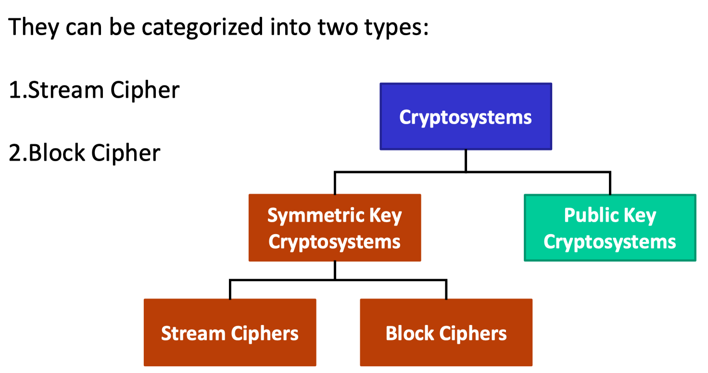
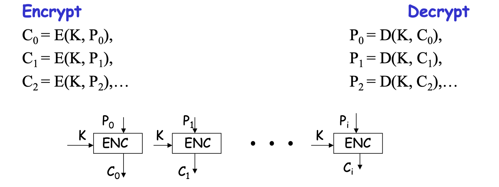
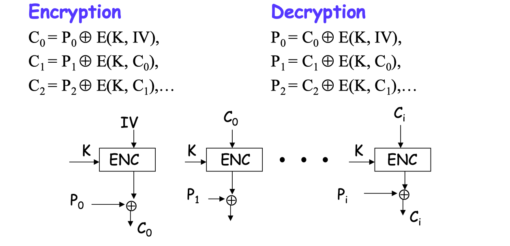

# CS5285

## Lecture 1 - Introductory Security Concepts

### What is a ‘security’?

We also design a secure system based on two things:

-   What security (service) do we need?
-   How powerful an attacker to we want to defend against?

安全级别：

-   理论安全：几乎不可能
-   计算安全：无法暴力破解，考虑计算cost

### protection measures:

-   **Prevention**: prevent your assets from being damaged.
-   **Detection**: detect when you assets have been damaged, by whom and how.
-   **Reaction/Recovery**: recover your assets, or recover from the damage to your assets.

>   Are we really preventing an attack or are with only detecting it？

### Basic Security Goals - CIA

-   **Confidentiality 保密性**: prevention of unauthorised disclosure of information.
-   **Integrity 完整性**: prevention of unauthorised modification of information.
-   **Availability 可用性**: prevention of unauthorised withholding of information or resources.

### Security Services and Mechanisms

区分二者：

-   Security Services: 为防范这些威胁而设立的保护措施
-   Security Mechanism: 是具体实现这些保护措施的工具或方法

**Example** Security Services(Mechanisms): 

-   **Confidentiality** ( encryption ) 
    机密性（加密）
-   **Integrity** (MAC/digital signature) 
    完整性（MAC/数字签名）
-   **Availability** (redundancy) 
    可用性（冗余）
-   **Non-repudation** (digital signature) 
    不可抵赖性（数码签署）

-   **Entity Authentication** (authentication protocol) 
    实体认证（认证协议）
    -   在特定时间点验证所声称身份的真实性
    -   通常在连接开始时使用
    -   防止冒充（假冒身份）和重放攻击，即防止攻击者假装成合法用户或重放先前的身份验证数据
-   **Origin Authentication**(MAC/digital signature) 
    源认证（MAC/数字签名）
    -   验证数据的来源是否真实可靠
    -   不能防止重放攻击或传输延迟引发的攻击
-   **Access Control** (Access control model) 
    访问控制（访问控制模型）

### Threats

**Threats can be classified as**:

-   deliberate 蓄意 (e.g. hacker penetration 黑客入侵);

-   accidental 意外 (e.g. a sensitive file being sent to the wrong address 敏感文件被发送到错误的地址).

**CIA**对应的危险有：

-   Confidentiality 保密性 - **Exposure of data 数据泄露**
-   Integrity 完整性 - **Tampering with data / modification 篡改数据**
-   Availability 可用性 - **Denial of service 拒绝服务**

**Adversaries** 对手:

-   对手可以来自内部和外部
-   对手的破坏可以是有意和无意的

### Standards

#### How to use standards?

-   **Using the standard as a guide**：We can read it, try and understand what the experts meant and then go off and do your own thing. Simply use the standard as starting point for a solution
    **作为指导使用标准**：我们可以阅读它，试着理解专家的意思，然后走出去做自己的事情。简单地使用标准作为解决方案的起点
-   **Compliance**：You take the standard, and implement the solution exactly as described therein. At the end you have implemented the standard exactly as stated to the best of your ability and you are thus complying with the standard.
    **遵循标准（合规性）**：您采用标准，并完全按照其中的描述实现解决方案。最后，您已经完全按照所述尽您的能力实现了标准，因此您遵守了标准。
-   **Certification**：You implement the standard to the best of your ability. You then get a neutral third party in to check what you have done and that you have done it as in the standard. This third party, who is generally trusted in this area, then attests to the fact that you have implemented that standard correctly.
    **认证**：你尽你最大的能力来执行这个标准。然后你找一个中立的第三方来检查你做了什么，你是否按照标准做了。该第三方在该领域通常是受信任的，然后证明您已经正确实现了该标准。

#### Why not standards?

-   **Consensus decisions imply compromise.**
    **共识决策带来的妥协**：标准通常由多个成员协商一致后决定，由于每个人的意见不同，标准往往要通过妥协才能达成一致。这意味着标准可能会包含一些附加内容或妥协选项，导致实施成本增加或变得更加复杂。
-   **Documents can be inconsistently implemented.**
    **文件可能被不一致地执行**：标准虽然是书面文件，但由于编写人员和使用人员对其理解的不同，可能会产生错误或歧义。这种模棱两可的表述会影响标准的实施效果。
-   **Commercial pressure can lead to partial implementation.**
    **商业压力可能导致部分实现**：公司可能因为商业压力，选择只实现标准的一部分功能。这些公司仍然声称符合标准，但不同的公司可能实现不同的功能子集，导致它们之间的系统不兼容，尽管它们都声称合规。
-   **Aggressive market strategies by companies who adapt or extend standards can undermine their usefulness.**
    **市场策略影响标准的有效性**：一些大公司可能通过调整或扩展标准来推广自己的专有版本，从而影响原标准的作用。这些公司可能声称自己符合标准，但实际上依赖于自己的专有技术，最终削弱了原始标准的有效性。
-   一旦标准存在漏洞，大量系统都会受到影响
-   一旦标准出现问题，修正它需要时间，而广泛使用的标准更难迅速纠正

## Tutorial 1

2.   a) Availability is seen as a basic security service. Briefly explain what this service does and give an example of the type of behavior it prevents in e-commerce.

     It tries to preserves authorised access to services.
     In **e-commerce**, the main threat is **Denial of Service (DoS)** or **Distributed Denial of Service (DDoS)**,

3.   You are hired to work for an online newspaper as IT security advisor. They have several problems: At the moment they use a username and password to allow paying subscribers to view the news content, but they have found that some of their customers have shared their passwords and **unauthorized people are viewing content**; some criminals, **listening to network traffic has obtained customer payment data** during the subscription process; and a **rival newspaper has been modifying the content** between their servers and the client causing some customers to leave. Explain to your new employer what authentication, confidentiality and integrity are and tell them which of these concepts apply to each of the problems they are having.

     -   Authentication - entity authentication prevents unauthorised viewers

     -   Confidentiality - prevent unauthorised disclosure of payment data

     -   Integrity - prevent unauthorised modification of news between vour server and clients

4.   a) You are working for a software vendor. Customer purchase and then download the software from your company. Recently the company has been losing customers as they do not trust the downloaded software. They say it is possible that **hackers could change the software** after it is sent from your server and that they **need proof that the software they received has not been modified**. What security service do you need? What mechanism could you use?
     -   Service: Integrity
     -   Mechanism: MAC/digital signature

4.   b) Customers start to falsely claim that they have not received software and want their money back! What security service do you need? What mechanism could you use?
     -   Service: Non-repudation
     -   Mechanism: digital signature

6.   a) You are asked to implement a new security mechanism to provided confidentiality for online-chat messages. How could you **use standards** in building your solution?

## Lecture 2

### Crypto introduction

**Cryptology（密码学）**：是制作和破解“密文”的艺术和科学的统称。

**Cryptography（加密学）**：是指制作“密文”，也就是通过某种方式将明文（M）和密钥（K）结合起来生成密文（C）。公式为：

-   C = M ⊕ K（这里“⊕”可能代表某种运算，比如异或运算）
-   ychrpyaprtgo 是加密后的示例字符串。

**Cryptanalysis（密码分析）**：指的是破解“密文”。即通过分析破译加密的内容，比如“ychrpyaprtgo”通过某种手段被破解成明文，QED（即证毕，表明已完成推理过程）。

**Crypto**：总称密码学，包含了上述所有内容，并且还包括更多的领域，例如：

-   关于不可否认性（签名）、身份验证、身份识别、零知识证明、承诺等更多内容。
-   推荐参考书目：布鲁斯·施奈尔的《应用密码学》、《应用密码学手册》以及《现代密码学导论》

#### categotized

### Old Symmetric Key Encryption

“Symmetric Key” - The same key is used for encrypting and decrypting

#### Cryptanalysis

Basic Assumptions: Kerckhoffs 原则：该原则表明，即使攻 击者了解加密系统的所有细节，只要密 钥保密，系统仍然应该是安全的。

攻击者的目标

-   确定加密文本的秘钥

-   或者（或）不使用秘钥，恢复加密文本的原始文本

#### Caesar Cipher / Shift Cipher 凯撒密码

轮换

#### Simple Substitution 简单替换

每个平文字母都被一个不同的密文字母代替

Total number of possible permutations： $26!$

#### Cracking substitution ciphers

-   Letter frequencies
    相对字母频率在加密过程中不变
-   Pairs of letters frequency analysis

#### Beating frequency analysis

-   省略空格
-   右移错写
-   无意义字符
-   替换

#### Vigenère cipher

Plus版凯撒密码，选择key作为凯撒轮换的起始字符

#### One-time Pad Encryption

Encryption: $Plaintext \oplus Key = Ciphertext$

### Stream Ciphers

A kinds of Symmetric Key Encryption

#### 

流式加密器使用一项加密函数和密钥生成 keystream，其长度与原文相同，可以是任意长度。然后，keystream 与原文通过XOR运算形成密文。

这意味着该函数不需要逆向，它只需要生成良好的不可预测的 keystream。您不需要逆转函数，实际的加密和解密组合是XOR运算。

#### RC4

Key Space: RC4 40-2048 bits

### Block Ciphers

Another kinds of Symmetric Key Encryption

The key is reused for different plaintext blocks

加密块密码（Block Ciphers）取一个固定大小的文本输入（块大小，如果没有足够的文本则需要补充填充，直到达到所需的块大小）。然后生成一个固定大小的块密码。

加密块密码的加密函数实际上是对文本进行操作（例如，分组交换、替换等）来产生密文。**因此，加密块密码函数必须是可逆的**。

#### DES

searching for DES? 2^55

#### AES

128位块 128-256 位密钥 比 3DES 在某些指定平台上的速度更快

searching for AES (128-bit key version)? 2^127

### Modes of Operation

#### ECB Mode

独立地对文本块进行加密

Alice Hates ECB Mode:

Same plaintext block -> same ciphertext!

#### CBC Mode

Error:

#### CTR Mode

Error:

1 位错误在传输中？会导致 1 位错误的解密文本。

1 块丢失？接收器 IV 计数现在落后了一个，所有数据都会解密错误

#### CFB Mode

Error:

## Lecture 3

### Mod

性质：

-   $(a + b) \mod n = [(a \mod n) + (b \mod n)] \mod n$
-   $(a \times b) \mod n = [(a \mod n) \times (b \mod n)] \mod n$
-   $(a^b) \mod n = [(a \mod n)^b] \mod n$
-   $(a \times (b + c)) \mod n = [(a \times b) \mod n + (a \times c) \mod n] \mod n$

### Square-and-Multiply method

**平方-乘法算法**（Square-and-Multiply Method）是一种快速计算模幂的方法，通常用于处理大指数次幂的运算，在数论和密码学中非常常见。这个算法通过一系列的“平方”和“乘法”步骤来高效计算幂。

**算法步骤：**（求 $41^Y \mod 18865$）

1.  **将指数转换为二进制**： 首先，将指数（即题目中的 Y）转换为二进制表示形式。
2.  **初始化结果为1**： 开始时，将计算结果初始化为1。
3.  **遍历二进制指数的每一位**：
    -   从二进制指数的最高位（即最左边的位）开始逐位处理：
        -   **平方**：将当前结果平方。
        -   如果当前位是1，则进行**乘法**：将结果乘以底数（即题目中的41）。
4.  **重复平方和乘法步骤**： 对二进制指数的每一位重复该过程，直到处理完所有位。
5.  **取模**： 每次平方或乘法之后，进行模运算，以避免结果过大。

### GCD

最大公约数

若 GCD(a,b)=1 则互为素数 relatively prime (co-prime)

#### Euclidean Algorithm 欧几里得算法

$gcd(a, b) = gcd(a,\ b \mod a)$

#### Modular Inverse 模逆

A is the modular inverse of B mod n if

$AB \mod n = 1$.

A is denoted as $ B^{ -1} \mod n$.

#### Extended Euclidean Algorithm

Euclidean Algorithm的逆过程, 可以求模逆

理论基础

$ax + by = gcd(a, b)$

when: $gcd(a,b)=1$

$ax+by\mod b=a(x\mod b)=1$

$(x\mod b)$就是$a$的逆元

### The Euler phi Function 欧拉函数 

#### Fact 1.

$\phi(n)$ 表示[1,n] 中素数的数

$\text{if }gcd(m, n) = 1\text{, then } \phi(mn) = \phi(m) * \phi(n)$

即如果m n 互质, 积的$\phi$函数等于$\phi$ 的积

#### Fact 2.

对于任何正整数 $n$，如果知道其素数分解为：

$n = p_1^{e_1} \times p_2^{e_2} \times \dots \times p_k^{e_k}$

$\phi(n) = p_1^{e_1 - 1} (p_1 - 1) \cdot p_2^{e_2 - 1} (p_2 - 1) \cdot \dots \cdot p_k^{e_k - 1} (p_k - 1)$

#### 求 $\phi(n)$ 的步骤

1.   将 $n$ 质因数分解，通常使用 2 3 5 7 11 13等去试
2.   套入 $\phi(n)$ 的公式

# Notes

计算题 one pad Lecture2 48

CBF模式 Lecture2 101

计算题

-   Square-and-Multiply Algorithm **Lecture3 21**
-   The Euler phi Function 求$\phi(n)$  **Lecture3 17** / Tutorial4_sol 10
-   RSA 加密数据 **Lecture4 11**
-   ElGamal Encryption Scheme  **Lecture4 18**
-   Diffie-Hellman **Lecture4 23**

MAC 

-   Non-repudiation **Lecture4 30**
    MAC does not provide non-repudiation because both the sender and receiver share the same key, allowing either party to generate or modify the MAC, whereas digital signatures rely on a private key only the sender possesses.

DES AES

-   RSA works **Tutorial4_sol 16**
-   RSA Encrypt / sign / verify **Tutorial 5 Sol 5**
-   a good hash function？ **Tutorial 5 Sol 9**
-   Can you encrypt M when it is larger than n？ **Tutorial4_sol 16**
