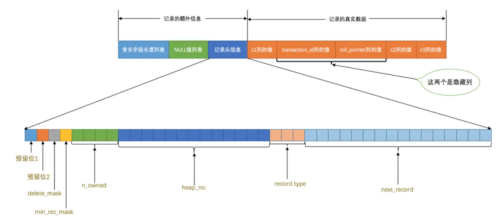
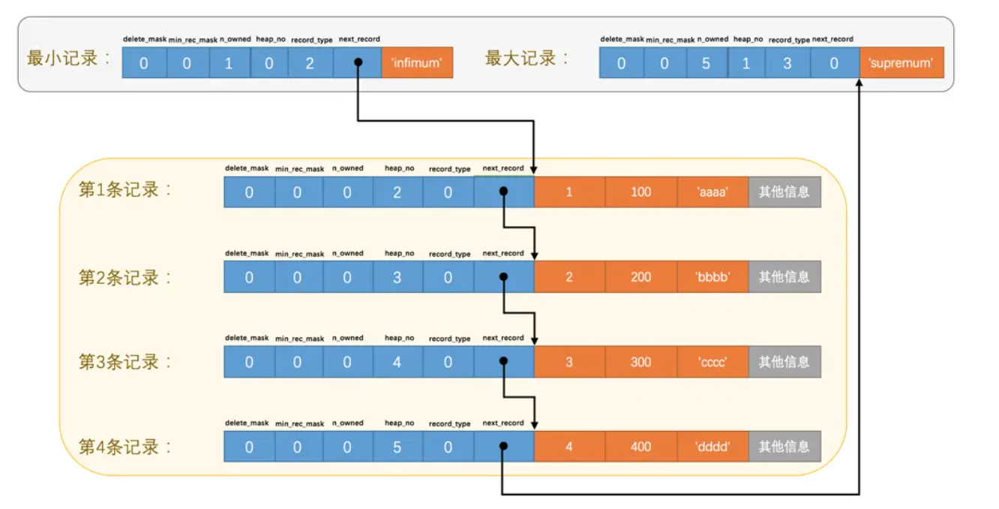
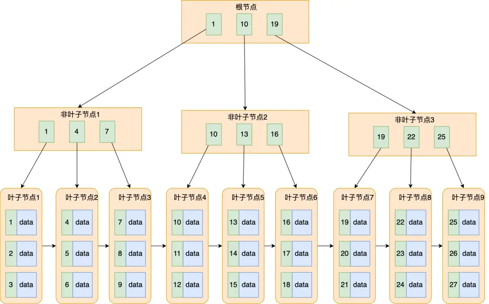

# Mysql是怎么运行的？

## Innodb页

### 基本信息

-   数据结构


-   InnoDB 数据页是 InnoDB 存储引擎存储表中数据的基本单元
-   每个页的大小通常为 16KB

### File Header

File Header是站在更高的层级管理页的元信息的，用于管理页在**整个表空间中**的位置、页类型、页的完整性校验等全局性的元信息。

-   **FIL_PAGE_SPACE_OR_CHKSUM**：
    校验和或空间 ID，用于与File Trailer的CHKSUM进行比较，验证页数据的完整性
-   **FIL_PAGE_OFFSET**：
    页在表空间中的偏移量，用于定位页的位置
-   **FIL_PAGE_PREV / FIL_PAGE_NEXT**：
    前后页的偏移量，用于页之间的**双向链表**结构
-   **FIL_PAGE_LSN**：
    该页最后一次被修改时的日志序列号（LSN）
-   **FIL_PAGE_TYPE**：
    页的类型（数据页、索引页、系统页等）

### Page Header

Page Header 用于存储**与页内记录有关**的元数据，如记录数量、空闲空间信息、页的状态等。

固定的`56`个字节，专门存储各种状态信息

-   **PAGE_N_DIR_SLOTS**
    在页目录中的Slot槽数量，见Page Directory

-   **PAGE_HEAP_TOP**
    还未使用的空间最小地址

-   **PAGE_N_HEAP**
    本页中的记录的数量（包括最小和最大记录以及标记为删除的记录）

-   **PAGE_FREE**
    第一个 已经标记为删除的 可用的 记录地址
    各个已删除的记录通过`next_record`也会组成一个单链表，这个单链表中的记录可以被重新利用

-   **PAGE_N_RECS**
    该页中记录的数量（不包括最小和最大记录以及被标记为删除的记录）

-   **PAGE_DIRECTION**

    假如新插入的一条记录的主键值比上一条记录的主键值大，我们说这条记录的插入方向是右边，反之则是左边。用来表示最后一条记录插入方向的状态就是`PAGE_DIRECTION`

-   **PAGE_N_DIRECTION**

    假设连续几次插入新记录的方向都是一致的，`InnoDB`会把沿着同一个方向插入记录的条数记下来，这个条数就用`PAGE_N_DIRECTION`这个状态表示。当然，如果最后一条记录的插入方向改变了的话，这个状态的值会被清零重新统计。

### Infimum / Supremum 记录

对于每个页来说，都拥有`虚拟记录` ，分别为`最小记录 Infimum Record`和`最大记录 Supermum Recode`，存储在`Infimum + Supremum `区域中

### 记录与页

页中储存记录，使用Free Space区域分配的空间，直到用光为止


### 记录头与页

**对于每个记录，都需要有一个记录头**，这个记录头不仅仅记录当前记录的元信息，还记录着在页中的信息

```
mysql> CREATE TABLE page_demo(
    ->     c1 INT,
    ->     c2 INT,
    ->     c3 VARCHAR(10000),
    ->     PRIMARY KEY (c1)
    -> ) CHARSET=ascii ROW_FORMAT=Compact;
Query OK, 0 rows affected (0.03 sec)
```



```
mysql> INSERT INTO page_demo VALUES(1, 100, 'aaaa'), (2, 200, 'bbbb'), (3, 300, 'cccc'), (4, 400, 'dddd');
Query OK, 4 rows affected (0.00 sec)
Records: 4  Duplicates: 0  Warnings: 0
```



-   **delete_mask**
    这个属性标记着当前记录是否被删除，占用1个二进制位，值为`0`的时候代表记录并没有被删除，为`1`的时候代表记录被删除掉了。
    这些被删除的记录之所以不立即从磁盘上移除，是因为移除它们之后把其他的记录在磁盘上重新排列需要性能消耗，所以只是打一个删除标记而已，所有被删除掉的记录都会组成一个所谓的`垃圾链表`，在这个链表中的记录占用的空间称之为所谓的`可重用空间`，之后如果有新记录插入到表中的话，可能把这些被删除的记录占用的存储空间覆盖掉。

-   **heap_no**

    这个属性表示当前记录在本`页`中的位置

    -   0 代表一个`虚拟记录` -> 最小记录
    -   1 代表一个`虚拟记录` -> 最大记录
    -   **`虚拟记录`**被单独放在一个称为`Infimum + Supremum`的部分

-   **record_type** (important!)
    这个属性表示当前记录的类型，一共有4种类型的记录

    -   `0`表示普通记录
    -   `1`表示B+树非叶节点记录
    -   `2`表示最小记录
    -   `3`表示最大记录

-   **next_record**
    它表示从**当前记录的真实数据**到**下一条记录**的**真实数据**的地址偏移量（注意不是到下一条记录的记录头），依次形成一个**单向链表**
    这也解释为什么`Compact`的行格式是逆序存储列信息的：对于偏移量 $x$ , 第 $n$ 个信息，元信息存储的位置就是在$x-n$ 中，真实的数据存储在 $x+n$ 中；
    换言之：向左读取就是记录头信息，向右读取就是真实数据
    删除某个记录会同步修改上个记录的偏移量，与链表删除元素同理
    
-   **n_owned**
    请见Page Directory的工作原理

### Page Directory

页目录是在每个页中的一个小型索引，用于加速记录的检索，它存储了记录的偏移地址。这个目录可以帮助快速找到特定的记录，从而提高查询效率。

**通常，页目录通过二分法查找快速定位记录。**

>   如果不使用Page Directory， 需要从从，`Infimum`记录（最小记录）开始，沿着链表一直往后找，效率非常低

#### Page Directory的工作原理

-   Page Directory 多个记录，记录着一些`记录`的偏移地址，记作Slot槽，将`Slot`指向的`记录`记作`*Slot`
-   对于每个`*Slow`，利用`n_owned`记录该`记录`到下一个`*Slot`的个数，换言之，每个`Slow`之间为一个组，组内中第一个`记录`中的`记录头`记载着到下一组的距离（个数）

#### `n_owned`的限制与Page Directory的构建逻辑

-   对于最小记录所在的分组只能有 ***1*** 条记录
    因为不能比小更小了
-   最大记录所在的分组拥有的记录条数只能在 ***1~8*** 条之间
-   剩下的分组中记录的条数范围只能在是 ***4~8*** 条之间

为什么这样设计，主要考虑Page Directory的构建逻辑：

在连续增加数据的时候，会直接加入最大分组；当分组数到达8的时候，将最大分组**切分**，中间的`记录`加入到`Slot`中，故`Slot`中间的组范围从4开始；若在`Slot`组内增加元素也类似，到达8后进行**切分**

### File Trailer

File Trailer 的主要功能是用于数据完整性检查，通过存储一些校验值，InnoDB 可以在读取数据时确认页的数据是否被损坏或篡改。InnoDB 使用写前日志（Write-Ahead Logging, WAL）机制保证事务的持久性和一致性，而 File Trailer 提供额外的保护来避免页损坏。

当页从磁盘加载到内存中时，InnoDB 会使用 File Trailer 中的 LSN 信息与日志文件进行比对，以检查页的数据是否一致。如果发现不一致的情况，InnoDB 可以通过崩溃恢复机制，从日志中恢复丢失或损坏的数据。

-   **FIL_PAGE_END_LSN (8 bytes)**：
    页最后一次修改时的日志序列号（Log Sequence Number, LSN）
    用于检查页的修改状态是否与日志文件一致，确保数据的完整性和一致性。

前4个字节代表页的**校验和**：每当一个页面在内存中修改了，在同步之前就要把它的校验和算出来，因为`File Header`在页面的前边，所以校验和会被首先同步到磁盘，当完全写完时，校验和也会被写到页的尾部，**如果完全同步成功，则页的首部和尾部的校验和应该是一致的**。

后4个字节代表页面被最后修改时对应的日志序列位置（LSN）

### 总结

InnoDB 数据页是 InnoDB 存储引擎中用于存储表中数据的基本单元，通常每个页的大小为 16KB。每个数据页包含多个结构部分，用于管理和存储数据的元信息。

1. **File Header**: 页的全局元信息，负责管理页在表空间中的位置、页类型、完整性校验等内容。它包含空间ID、偏移量、前后页指针、日志序列号（LSN）等。

2. **Page Header**: 页内记录的元数据存储区，包括记录的数量、空闲空间信息、页的状态等，用于管理记录和空闲空间。

3. **Infimum/Supremum 记录**: 每个页都包含虚拟的最小记录（Infimum）和最大记录（Supremum），用于辅助记录排序和管理。

4. **记录与页结构**: 页中存储实际数据记录，并为每个记录分配记录头。记录头包含记录的元信息、标记、偏移量、记录类型和链接信息等。

5. **Page Directory**: 页目录用于加速记录检索。它存储记录的偏移地址，利用二分法查找来提高检索效率。页目录的分组逻辑使得大规模数据存储时性能更高。

6. **File Trailer**: 页尾的File Trailer用于数据完整性检查，包含页的最后修改日志序列号（LSN）和校验和，用于保证数据页在写入时不被篡改或损坏。

注意数据结构的差别：各个`数据页`之间可以组成一个**双向链表**，而每个`数据页`中的`记录`会按照主键值从小到大的顺序组成一个**单向链表**，每个`数据页`都会为存储在它里边儿的`记录`生成一个`页目录`，在通过主键查找某条记录的时候可以在页目录中使用**二分法**快速定位到对应的槽，然后再遍历该槽对应分组中的记录即可快速找到指定的记录


## B+索引

**若在页内进行查找，按照Page Directory的二分进行查找；若在不同页之间查找，则需要利用`索引`**

由于索引项和普通的`记录`的数据结构没有本质差别，InnoDB采用复用`记录`的方法进行：即`索引记录`存储在`页`中，其`记录`中的`record_type`为`1`


利用Record Header中的`min_rec_mask`字段，标记每个页中实际最小数据存在的地方，即当这个索引记录会指向改页中最小的记录，这个字段为`1`

索引页也会形成上层的索引页：**实际数据都存在于叶子结点中**（聚簇索引），其余存储`目录项/索引项`的都是非叶子结点/内结点，最上的节点为`根节点` 

规定实际数据为第`0` 层，一次往上增加索引的层数；一般来说B+数不会超过4层(包括叶子结点)

>   如果叶子节点能容纳$M$条数据，非页节点可以容纳$N$条数据，有P层(包括叶子结点)
>
>   实际最多能容纳的数据为：$M*N^{P-1}$

### 索引构架构建方案

1.   先形成一个根节点，此时这个根节点并不是索引页
2.   表中插入`记录`时，把记录存储到根节点
3.   后续可用空间用完以后，将new一个页a，将根节点的数据copy到新的页a中，由于a页已满，继续分裂页b，此时原始的根节点将升级成索引页

>   是否是索引页与页的性质无关，只与页中存储的`记录`的`record_type`有关：
>
>   -   `record_type`为`1` ： 索引页
>   -   `record_type`为`0`： 数据页（一定是叶子节点）

### 索引方案

#### Clustered index 聚簇索引

特点：

-   使用主键值的大小进行记录或页的排序
-   B+树的子节点存储着完整的`记录`

聚簇索引就是数据的储存方式，不需要我们利用index来显式建立索引

#### Secondary/Nonclustered indexes 二级索引 / 联合索引

聚簇索引在主键的时候才能发挥作用

区别是：

-   在叶子节点中，值不再是完整的`记录`，而是对应记录的`主键`
-   如果需要查找对应完成的记录，必须需要**回表**查询

由于非主属性可能出现重复的现象，如果同一值出现过多而横跨两个页，可能会出现同一值有多个`索引记录`，指向不同的页；

为了解决这种问题，在**二级索引的索引页的所有`记录`都需要存储主键的值**，即使设置了`UNIQUE INDEX`**，索引页中仍然会包含主键值**：

>    这是 InnoDB 引擎的设计，二级索引中永远会存储主键值，无论该列是否唯一

联合索引利用多个字段进行排序，原理和二级索引相同，排序按照**最左匹配原则**


### MyISAM的索引方案

对于MyISAM来说，`记录`是存储在单独的数据文件中，顺序写，并没有大小排序，所以我们不能直接对数据文件进行二分查找

MyISAM的索引存储在单独的索引文件中，索引文件采用`主键+行号`的数据结构构建，所以当需要的到完整的记录是**必须**通过`行号`进行**回表**操作，意味着`MyISAM`中建立的索引相当于全部都是`二级索引`！

### 总结

-   页面利用Page Directory二分查找，页之间形成B+数查找
-   InnoDB使用主键构建聚簇索引，叶节点包含完整的记录，非页节点记录`主键+页号`
-   二级索引利用`key/index` 创建，包含`索引列+主键值+页号(非叶节点)`，必须回表查询
-   B+数中每层都使用双向链表连接，每个页内使用单链表从小到大连接

## B+索引的使用

例：有联合索引`idx_name_birthday_phone_number`

### 索引代价

-   空间：每个索引至少都需要一个页，一个页就是16KB，在很大的B+索引中空间代价较大
-   时间：索引可以极大加快查找的效率，但是可能会降低增删改的效率。对于B+树的增删改来说，其对应的索引都需要进行重新调整，包括记录移位、页面分裂、页面回收

### 索引适用条件

#### 全值匹配

使用联合索引的时候，需要按照定义的联合索引顺序添加条件，否则不会走该联合索引

>   由于优化器的存在，在书写sql的时候不必按照顺序，只需要保证联合索引“顺序”存在

#### 字符串匹配

对于字符串索引项，按照字典序进行排序

可以进行索引的语句

```sql
SELECT * FROM person_info WHERE name LIKE 'As%';
```

不能进行索引的语句

```sql
SELECT * FROM person_info WHERE name LIKE '%As%';
```

技巧：如果我们要匹配后缀怎么办？将字符串倒序存放和查询，例如：

```
+----------------+
| url            |
+----------------+
| moc.udiab.www  |
| moc.elgoog.www |
| nc.vog.www     |
| ...            |
| gro.otw.www    |
+----------------+
查找com的“后缀”： ... WHERE url LIKE 'moc%'
```

#### 匹配范围值

由于索引的建立，索引内的数据都是`由小到大`存放的，我们可以利用索引来求范围值

具体来说：
```sql
SELECT * FROM person_info WHERE name > 'Asa' AND name < 'Barlow';
```
查询步骤：
1. 先在非聚簇索引中查询`最小值`，查到最小值对应的主键，并经过回表获得聚簇索引记录给客户端
2. 根据找到的`最小值`，在非聚簇索引中根据链表依次往下遍历，判断是否到达`最大值`，如果仍然符合范围条件，则依次回表返回给客户端
3. 重复，直到到达`最大值`

如果对多个列同时进行范围查找的话，只有对联合索引**最左边的那个列**进行范围查找的时候才能用到`B+`树索引，例如：
```sql
SELECT * FROM person_info WHERE name > 'Asa' AND name < 'Barlow' AND birthday > '1980-01-01';
```
- `name > 'Asa' AND name < 'Barlow'` 可以使用索引进行返回查询
- 在范围查询的结果中使用`birthday > '1980-01-01'`过滤

#### 精准匹配+范围匹配

对于联合索引来说，如果在左侧索引进行精准匹配，右侧的索引可以进行范围查找，此时也可利用B+树

例如：
```sql
SELECT * FROM person_info WHERE name = 'Ashburn' AND birthday > '1980-01-01' AND birthday < '2000-12-31' AND phone_number > '15100000000';
```
查询步骤：
- 使用索引查找到`name = Ashburn`的开始的位置
- 继续使用索引查找到`最小值`，即`name = 'Ashburn' AND birthday = '1980-01-01'`
- `phone_number > '15100000000'`无法利用索引，只能依次向后遍历`最小值`，过滤，直到到达最大值，即`name = 'Ashburn' AND birthday = '2000-12-31'`

```sql
SELECT * FROM person_info WHERE name = 'Ashburn' AND birthday = '1980-01-01' AND phone_number > '15100000000';
```
此时全部字段都可以走索引

我们可以知道：当在联合索引需要进行精准匹配+范围匹配时，联合索引左边的项需要依次是`精确匹配`，右边`范围匹配`的第一项可以使用索引，后续的任意字段都不可以使用索引

#### 用于排序

由于B+树索引本身是按照规则排好序的，所以当`ORDER BY`中的循序**必须**按照联合索引定义的顺序，此时，可能直接利用索引，例如：
```sql
SELECT * FROM person_info ORDER BY name, birthday, phone_number LIMIT 10;
```
> 注意由于ORDER BY出现的顺序会影响结果，所以必须按照联合索引定义的顺序

> `ORDER BY name, birthday 也可以使用索引

可以先进行全值匹配再进行排序

```sql
SELECT * FROM person_info WHERE name = 'A' ORDER BY birthday, phone_number LIMIT 10;
```

如果同时使用ASC和DESC，此时无法用索引

排序列包含非同一个索引的列也会导致无法用索引

#### 用于分组

当分组正好为联合索引的元素的时候，此时可以利用联合索引

```sql
SELECT name, birthday, phone_number, COUNT(*) FROM person_info GROUP BY name, birthday, phone_number
```

### 回表的代价

在查询索引中使用顺序查询，此时目标值基本都在相邻的页中，可以利用顺序IO一次读取多个索引记录；而对非聚簇索引记录进行回表时，由于不同索引项对应的主键id可能分布在不同的页区域，导致顺序IO退化为随机IO，此时效率会非常慢

所以需要回表的记录越多，使用非聚簇索引的效率就越低，有时甚至会慢与全表扫描

优化器的功能就是分析预估回表的数据量，如果可能出现过多的数据需要回表

 **使用`SELECT *`的的代价是很大的，优化器会倾向于使用全表扫描的方式**

**我们可以使用`LIMIT N`减少结果数量，让优化器倾向使用索引+回表的方式查询**

#### 覆盖索引

覆盖索引可以避免回表，核心思想：在查询列表中只包含索引列
```sql
SELECT name, birthday, phone_number FROM person_info WHERE name > 'Asa' AND name < 'Barlow'
```

因为我们只查询`name`, `birthday`, `phone_number`这三个索引列的值，所以在通过`idx_name_birthday_phone_number`索引得到结果后就不必回表到`聚簇索引`中再查找记录的剩余列

`ORDER BY` 也可以使用覆盖索引
```sql
SELECT name, birthday, phone_number  FROM person_info ORDER BY name, birthday, phone_number;
```

### 索引的使用原则

#### 只为用于搜索、排序或分组的列创建索引

只为出现在`WHERE`子句中的列、连接子句中的连接列，或者出现在`ORDER BY`或`GROUP BY`子句中的列创建索引。而出现在查询列表中的列就没必要建立索引

```sql
SELECT birthday, country FROM person_name WHERE name = 'Ashburn';
```

#### 优先为基数大的列创建索引

`列的基数`指的是某一列中不重复数据的个数，比方说某个列包含值`2, 5, 8, 2, 5, 8, 2, 5, 8`，虽然有`9`条记录，但该列的基数却是`3`

对于基数小的列创建索引效率是很低的，索引无法利用B+树排序并有效区分不同记录，任然需要对大量相同值进行遍历

#### 索引字符串值的前缀

这是字符串索引的一个技巧：如果B+树索引的字符串很长，会导致字符串在索引中占用很大的空间，并且在对比字符串需要耗费更大的资源

我们可以只对字符串的前缀进行索引
```sql
CREATE TABLE person_info(
    name VARCHAR(100) NOT NULL,
    birthday DATE NOT NULL,
    phone_number CHAR(11) NOT NULL,
    country varchar(100) NOT NULL,
    KEY idx_name_birthday_phone_number (name(10), birthday, phone_number)
);    
```

在索引时利用`name(10)`截取10长度的前缀构建索引

但是此时`name`在`ORDER BY`的索引会失效
```sql
SELECT * FROM person_info ORDER BY name LIMIT 10;
```

#### 让索引列在比较表达式中单独出现

假设表中有一个整数列`my_col`，我们为这个列建立了索引。下边的两个`WHERE`子句虽然语义是一致的，但是在效率上却有差别：

1. `WHERE my_col * 2 < 4`
2. `WHERE my_col < 4/2`

`my_col * 2` 这种表达式会先遍历所用的记录（全表扫描），计算是不是小于4；而`my_col < 4/2`可以利用索引定位判断

#### 主键插入顺序

如果一个主键是以非递增的形式插入数据库，会导致数据页的频繁调整，进而导致数据损耗

这就是为什么需要使用`AUTO_INCREMENT`，或者在生成全局分布式ID需要按照时间递增

#### 冗余和重复索引

```sql
KEY idx_name_birthday_phone_number (name(10), birthday, phone_number), 
KEY idx_name (name(10))
```

对于联合索引`idx_name_birthday_phone_number`可以实现`idx_name`的全部功能，`idx_name`属于冗余索引

```sql
CREATE TABLE repeat_index_demo (
    c1 INT PRIMARY KEY,
    c2 INT,
    UNIQUE uidx_c1 (c1),
    INDEX idx_c1 (c1)
);  
```

主键本身就是`UNIQUE`，并且默认会生成聚簇索引，`uidx_c1`和`idx_c1`属于冗余索引

### 总结

**最左匹配原则是指 在使用联合索引时，查询必须从索引的最左列开始，按照索引定义的顺序，连续地使用索引列，才能有效地利用索引进行查询优化。**

最左匹配原则的使用：
1. 进行全值匹配时，需要按照*索引定义顺序*存在筛选条件
2. 进行范围匹配时，可以先按照*索引定义顺序*进行全值匹配，紧接*顺序*进行范围匹配，后续其他索引列无法使用索引
3. 进行排序或分组时，可以先按照*索引定义顺序*进行全值匹配或范围匹配，紧接*顺序*进行排序或分组


## 数据结构

### 二分查找树

将不同数据构建成不同节点，保证**左子树的所有节点都小于这个节点，右子树的所有节点都大于这个节点**

需要注意的是，每个节点既保存实际的`value` ， 也保留**索引**指针`left/right`

### 平衡二叉查找树（AVL 树）

为了解决*二叉查找树*会在极端情况下退化成链表的问题，增加了一些条件约束：**每个节点的左子树和右子树的高度差不能超过 1**

查询操作的时间复杂度就会一直维持在 O(logn)

### B树 B-tree (B-树)

自平衡二叉树虽然能保持查询操作的时间复杂度在O(logn)，但是因为它本质上是一个二叉树，每个节点只能有 2 个子节点，那么当节点个数越多的时候，树的高度也会相应变高，这样就会增加磁盘的 I/O 次数，从而影响数据查询的效率

B 树不再限制一个节点就只能有 2 个子节点，而是允许 $M$ 个子节点 (M>2)和$M-1$个数据，从而降低树的高度

假设 M = 3，那么就是一棵 3 阶的 B 树，特点就是每个节点最多有 2 个（$M-1$个）数据和最多有 3 个（$M$个）子节点，超过这些要求的话，就会分裂节点，比如下面的的动图：

 
**但是 B 树的每个节点都包含数据（索引+记录`value`）**，而用户的记录数据的大小很有可能远远超过了索引数据，这就需要花费更多的磁盘 I/O 操作次数来读到「有用的索引数据」

### B+树



 B+ 树与 B 树差异的点，主要是以下这几点：

- 叶子节点才会存放实际数据（索引+记录），非叶子节点只会存放索引；
	- 非叶结点可以存储更多的数据，磁盘IO的次数更少
- **非叶子节点的索引也会同时存在在子节点中（冗余），并且是在子节点中所有索引的最大（或最小）**；
	- 加快插入和删除的效率
- 叶子节点**之间**构成一个有序**链表**；
	- 方便范围查询
- 非叶子节点中有多少个子节点，就有多少个索引，换言之，每个**非叶节点**记录 1 个**索引**指针？；

## 数据目录

数据目录就是mysql在文件系统中实际存储的位置

```sql
mysql> SHOW VARIABLES LIKE 'datadir';
```
 用于查看数据目录的位置

在数据目录下，除了`information_schema`这个系统数据库外，其他的数据库在`数据目录`下都有对应的子目录

进入对应的数据库目录中，每个表都对应表文件，其中有
- 表定义文件：`表名.frm`
- 表空间文件：`表名.ibd`

在MySQL 8.0中，`.frm` 文件已被移除，表的元数据不再存储于这些文件中。

此前，`.frm` 文件用于存储表的结构信息，但这种基于文件的元数据存储方式存在一些问题，如文件扫描开销大、易受文件系统相关错误影响、处理复制和崩溃恢复状态的代码复杂，以及缺乏扩展性等。为了解决这些问题，MySQL 8.0引入了全新的**数据字典**，将元数据存储在数据库内部的**系统表**中，而非独立的文件中

此外，MySQL 8.0还引入了序列化字典信息（Serialized Dictionary Information，SDI），将表的元数据嵌入到 `.ibd` 文件中。这意味着每个表的结构信息现在都包含在其数据文件中，进一步简化了元数据的管理

### 表空间

每一个`表空间`可以被划分为很多很多很多个`页`，我们的表数据就存放在某个`表空间`下的某些页里

表空间具有不同的类型

##### 系统表空间（system tablespace）

这个所谓的`系统表空间`可以对应文件系统上一个或多个实际的文件

默认情况下，`InnoDB`会在`数据目录`下创建一个名为`ibdata1`、大小为`12M`的文件，**所有表的数据和索引**都会存储在系统表空间中，通常是名为 `ibdata1` 的文件中

系统表空间的大小会随着数据的增加而增长，但即使删除了表或数据，其大小也不会自动缩小

##### 独立表空间(file-per-table tablespace)

如果参数 innodb_file_per_table 被启用（在 MySQL 5.6 及以上版本中默认启用），`InnoDB`并不会默认的把各个表的数据存储到系统表空间中，而是为每一个表建立一个独立表空间 `test.ibd`，用来存储 `test` 表中的**数据和索引**


## Innodb 表空间


## 单表访问

