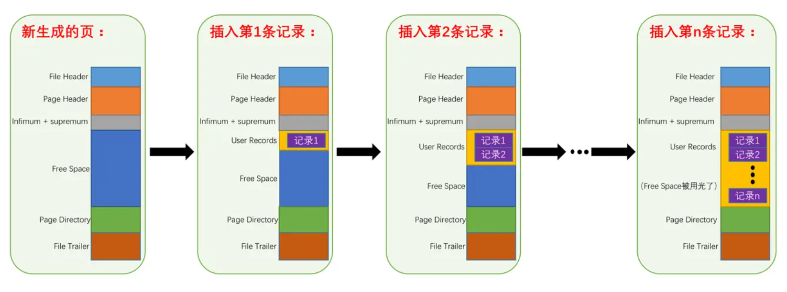
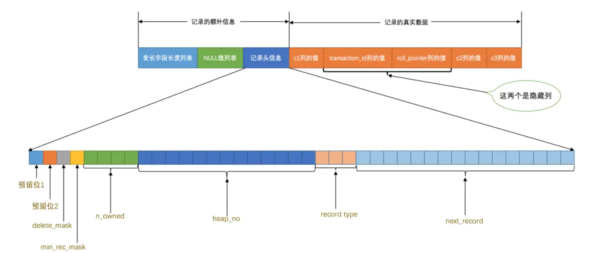
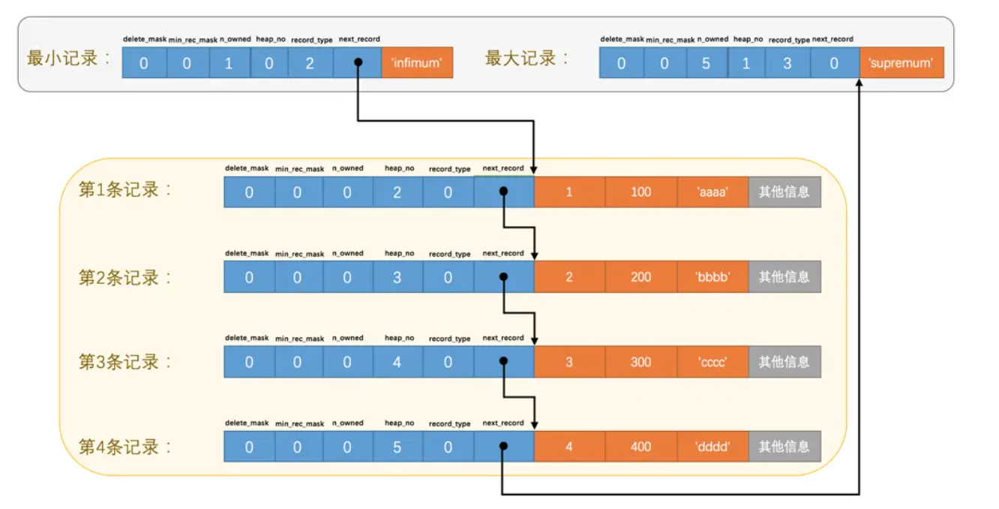
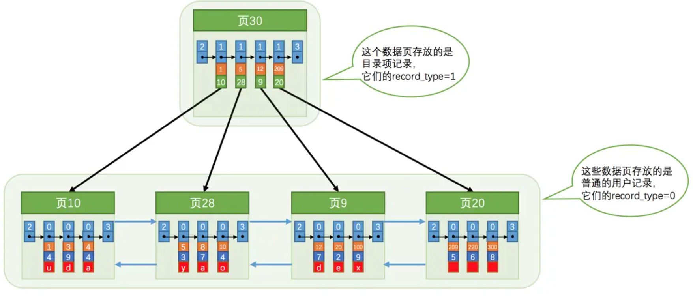
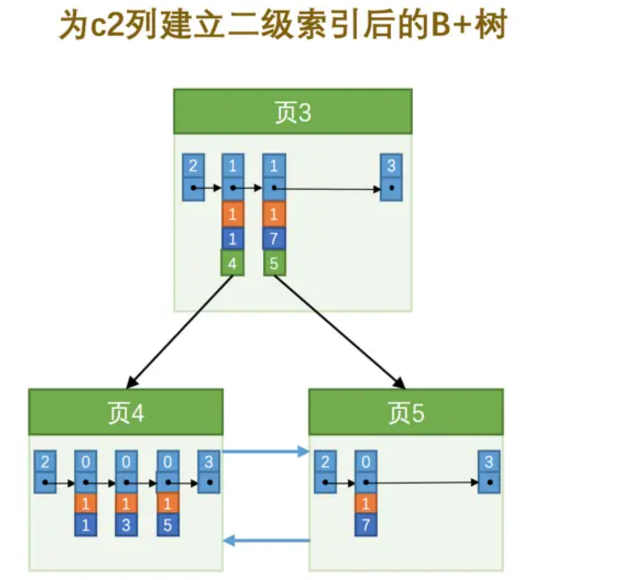

# Mysql是怎么运行的？

## Innodb页

### 基本信息

-   数据结构


-   InnoDB 数据页是 InnoDB 存储引擎存储表中数据的基本单元
-   每个页的大小通常为 16KB

### File Header

File Header是站在更高的层级管理页的元信息的，用于管理页在**整个表空间中**的位置、页类型、页的完整性校验等全局性的元信息。

-   **FIL_PAGE_SPACE_OR_CHKSUM**：
    校验和或空间 ID，用于与File Trailer的CHKSUM进行比较，验证页数据的完整性
-   **FIL_PAGE_OFFSET**：
    页在表空间中的偏移量，用于定位页的位置
-   **FIL_PAGE_PREV / FIL_PAGE_NEXT**：
    前后页的偏移量，用于页之间的**双向链表**结构
-   **FIL_PAGE_LSN**：
    该页最后一次被修改时的日志序列号（LSN）
-   **FIL_PAGE_TYPE**：
    页的类型（数据页、索引页、系统页等）

### Page Header

Page Header 用于存储**与页内记录有关**的元数据，如记录数量、空闲空间信息、页的状态等。

固定的`56`个字节，专门存储各种状态信息

-   **PAGE_N_DIR_SLOTS**
    在页目录中的Slot槽数量，见Page Directory

-   **PAGE_HEAP_TOP**
    还未使用的空间最小地址

-   **PAGE_N_HEAP**
    本页中的记录的数量（包括最小和最大记录以及标记为删除的记录）

-   **PAGE_FREE**
    第一个 已经标记为删除的 可用的 记录地址
    各个已删除的记录通过`next_record`也会组成一个单链表，这个单链表中的记录可以被重新利用

-   **PAGE_N_RECS**
    该页中记录的数量（不包括最小和最大记录以及被标记为删除的记录）

-   **PAGE_DIRECTION**

    假如新插入的一条记录的主键值比上一条记录的主键值大，我们说这条记录的插入方向是右边，反之则是左边。用来表示最后一条记录插入方向的状态就是`PAGE_DIRECTION`

-   **PAGE_N_DIRECTION**

    假设连续几次插入新记录的方向都是一致的，`InnoDB`会把沿着同一个方向插入记录的条数记下来，这个条数就用`PAGE_N_DIRECTION`这个状态表示。当然，如果最后一条记录的插入方向改变了的话，这个状态的值会被清零重新统计。

### Infimum / Supremum 记录

对于每个页来说，都拥有`虚拟记录` ，分别为`最小记录 Infimum Record`和`最大记录 Supermum Recode`，存储在`Infimum + Supremum `区域中

### 记录与页

页中储存记录，使用Free Space区域分配的空间，直到用光为止



### 记录头与页

**对于每个记录，都需要有一个记录头**，这个记录头不仅仅记录当前记录的元信息，还记录着在页中的信息

```
mysql> CREATE TABLE page_demo(
    ->     c1 INT,
    ->     c2 INT,
    ->     c3 VARCHAR(10000),
    ->     PRIMARY KEY (c1)
    -> ) CHARSET=ascii ROW_FORMAT=Compact;
Query OK, 0 rows affected (0.03 sec)
```



```
mysql> INSERT INTO page_demo VALUES(1, 100, 'aaaa'), (2, 200, 'bbbb'), (3, 300, 'cccc'), (4, 400, 'dddd');
Query OK, 4 rows affected (0.00 sec)
Records: 4  Duplicates: 0  Warnings: 0
```



-   **delete_mask**
    这个属性标记着当前记录是否被删除，占用1个二进制位，值为`0`的时候代表记录并没有被删除，为`1`的时候代表记录被删除掉了。
    这些被删除的记录之所以不立即从磁盘上移除，是因为移除它们之后把其他的记录在磁盘上重新排列需要性能消耗，所以只是打一个删除标记而已，所有被删除掉的记录都会组成一个所谓的`垃圾链表`，在这个链表中的记录占用的空间称之为所谓的`可重用空间`，之后如果有新记录插入到表中的话，可能把这些被删除的记录占用的存储空间覆盖掉。

-   **heap_no**

    这个属性表示当前记录在本`页`中的位置

    -   0 代表一个`虚拟记录` -> 最小记录
    -   1 代表一个`虚拟记录` -> 最大记录
    -   **`虚拟记录`**被单独放在一个称为`Infimum + Supremum`的部分

-   **record_type**
    这个属性表示当前记录的类型，一共有4种类型的记录

    -   `0`表示普通记录
    -   `1`表示B+树非叶节点记录
    -   `2`表示最小记录
    -   `3`表示最大记录

-   **next_record**
    它表示从**当前记录的真实数据**到**下一条记录**的**真实数据**的地址偏移量（注意不是到下一条记录的记录头），依次形成一个**单向链表**
    这也解释为什么`Compact`的行格式是逆序存储列信息的：对于偏移量 $x$ , 第 $n$ 个信息，元信息存储的位置就是在$x-n$ 中，真实的数据存储在 $x+n$ 中；
    换言之：向左读取就是记录头信息，向右读取就是真实数据
    删除某个记录会同步修改上个记录的偏移量，与链表删除元素同理
    
-   **n_owned**
    请见Page Directory的工作原理

### Page Directory

页目录是在每个页中的一个小型索引，用于加速记录的检索，它存储了记录的偏移地址。这个目录可以帮助快速找到特定的记录，从而提高查询效率。

**通常，页目录通过二分法查找快速定位记录。**

>   如果不使用Page Directory， 需要从从，`Infimum`记录（最小记录）开始，沿着链表一直往后找，效率非常低

#### Page Directory的工作原理

-   Page Directory 多个记录，记录着一些`记录`的偏移地址，记作Slot槽，将`Slot`指向的`记录`记作`*Slot`
-   对于每个`*Slow`，利用`n_owned`记录该`记录`到下一个`*Slot`的个数，换言之，每个`Slow`之间为一个组，组内中第一个`记录`中的`记录头`记载着到下一组的距离（个数）

#### `n_owned`的限制与Page Directory的构建逻辑

-   对于最小记录所在的分组只能有 ***1*** 条记录
    因为不能比小更小了
-   最大记录所在的分组拥有的记录条数只能在 ***1~8*** 条之间
-   剩下的分组中记录的条数范围只能在是 ***4~8*** 条之间

为什么这样设计，主要考虑Page Directory的构建逻辑：

在连续增加数据的时候，会直接加入最大分组；当分组数到达8的时候，将最大分组**切分**，中间的`记录`加入到`Slot`中，故`Slot`中间的组范围从4开始；若在`Slot`组内增加元素也类似，到达8后进行**切分**

### File Trailer

File Trailer 的主要功能是用于数据完整性检查，通过存储一些校验值，InnoDB 可以在读取数据时确认页的数据是否被损坏或篡改。InnoDB 使用写前日志（Write-Ahead Logging, WAL）机制保证事务的持久性和一致性，而 File Trailer 提供额外的保护来避免页损坏。

当页从磁盘加载到内存中时，InnoDB 会使用 File Trailer 中的 LSN 信息与日志文件进行比对，以检查页的数据是否一致。如果发现不一致的情况，InnoDB 可以通过崩溃恢复机制，从日志中恢复丢失或损坏的数据。

-   **FIL_PAGE_END_LSN (8 bytes)**：
    页最后一次修改时的日志序列号（Log Sequence Number, LSN）
    用于检查页的修改状态是否与日志文件一致，确保数据的完整性和一致性。

前4个字节代表页的**校验和**：每当一个页面在内存中修改了，在同步之前就要把它的校验和算出来，因为`File Header`在页面的前边，所以校验和会被首先同步到磁盘，当完全写完时，校验和也会被写到页的尾部，**如果完全同步成功，则页的首部和尾部的校验和应该是一致的**。

后4个字节代表页面被最后修改时对应的日志序列位置（LSN）

### 总结

InnoDB 数据页是 InnoDB 存储引擎中用于存储表中数据的基本单元，通常每个页的大小为 16KB。每个数据页包含多个结构部分，用于管理和存储数据的元信息。

1. **File Header**: 页的全局元信息，负责管理页在表空间中的位置、页类型、完整性校验等内容。它包含空间ID、偏移量、前后页指针、日志序列号（LSN）等。

2. **Page Header**: 页内记录的元数据存储区，包括记录的数量、空闲空间信息、页的状态等，用于管理记录和空闲空间。

3. **Infimum/Supremum 记录**: 每个页都包含虚拟的最小记录（Infimum）和最大记录（Supremum），用于辅助记录排序和管理。

4. **记录与页结构**: 页中存储实际数据记录，并为每个记录分配记录头。记录头包含记录的元信息、标记、偏移量、记录类型和链接信息等。

5. **Page Directory**: 页目录用于加速记录检索。它存储记录的偏移地址，利用二分法查找来提高检索效率。页目录的分组逻辑使得大规模数据存储时性能更高。

6. **File Trailer**: 页尾的File Trailer用于数据完整性检查，包含页的最后修改日志序列号（LSN）和校验和，用于保证数据页在写入时不被篡改或损坏。

注意数据结构的差别：各个`数据页`之间可以组成一个**双向链表**，而每个`数据页`中的`记录`会按照主键值从小到大的顺序组成一个**单向链表**，每个`数据页`都会为存储在它里边儿的`记录`生成一个`页目录`，在通过主键查找某条记录的时候可以在页目录中使用**二分法**快速定位到对应的槽，然后再遍历该槽对应分组中的记录即可快速找到指定的记录


## B+索引

若在页内进行查找，按照Page Directory的二分进行查找；若在不同页之间查找，则需要利用`索引`

由于索引项和普通的`记录`的数据结构没有本质差别，InnoDB采用复用`记录`的方法进行：即`索引记录`存储在`页`中，其`记录`中的`record_type`为`1`



利用Record Header中的`min_rec_mask`字段，标记每个页中实际最小数据存在的地方，即当这个索引记录会指向改页中最小的记录，这个字段为`1`

如果有多个索引页，则索引页也会形成上层的索引页：**实际数据都存在于叶子结点中**（聚簇索引），其余存储`目录项/索引项`的都是非叶子结点/内结点，最上的节点为`根节点` 

规定实际数据为第`0` 层，一次往上增加索引的层数；一般来说B+数不会超过4层(包括叶子结点)

>   如果叶子节点能容纳$M$条数据，非页节点可以容纳$N$条数据，有P层(包括叶子结点)
>
>   实际最多能容纳的数据为：$M*N^{P-1}$

#### 索引构架构建方案

1.   先形成一个根节点，此时这个根节点并不是索引页
2.   表中插入`记录`时，把记录存储到根节点
3.   后续可用空间用完以后，将new一个页a，将根节点的数据copy到新的页a中，由于a页已满，继续分裂页b，此时原始的根节点将升级成索引页

>   是否是索引页与页的性质无关，只与页中存储的`记录`的`record_type`有关：
>
>   -   `record_type`为`1` ： 索引页
>   -   `record_type`为`0`： 数据页（一定是叶子节点）

### 索引方案

#### Clustered index 聚簇索引

特点：

-   使用主键值的大小进行记录或页的排序
-   B+树的子节点存储着完整的`记录`

聚簇索引就是数据的储存方式，不需要我们利用index来显式建立索引

#### Secondary/Nonclustered indexes 二级索引

聚簇索引在主键的时候才能发挥作用

区别是：

-   在叶子节点中，值不再是完整的`记录`，而是对应记录的`主键`
-   如果需要查找对应完成的记录，必须需要**回表**查询

由于非主属性可能出现重复的现象，如果同一值出现过多而横跨两个页，可能会出现同一值有多个`索引记录`，指向不同的页；

为了解决这种问题，在**二级索引的索引页的所有`记录`都需要存储主键的值**，即使设置了`UNIQUE INDEX`**，索引页中仍然会包含主键值**：

>    这是 InnoDB 引擎的设计，二级索引中永远会存储主键值，无论该列是否唯一



#### 联合索引

利用多个字段进行排序，原理和二级索引相同，排序按照**最左匹配原则**

### MyISAM的索引方案

对于MyISAM来说，`记录`是存储在单独的数据文件中，顺序写，并没有大小排序，所以我们不能直接对数据文件进行二分查找

MyISAM的索引存储在单独的索引文件中，索引文件采用`主键+行号`的数据结构构建，所以当需要的到完整的记录是必须通过`行号`进行**回表**操作，意味着`MyISAM`中建立的索引相当于全部都是`二级索引`！

