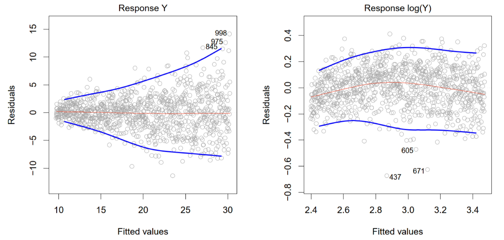

### SDSC5001

## Exploration

### Types of Data and Variables

Data Types

-   **Data Matrix**: Often structured as an $n \times p$ matrix, where $n$ is the number of objects and $p$ represents variables. Each row corresponds to an object, and each column to a variable.
-   **Other Data Forms**: Text, image, audio, video, transaction, and graph data.

Variable Types

-   **Continuous Variables** (e.g., height, time)
-   **Nominal Variables** 名义变量(e.g., gender, eye color)
-   **Ordinal Variables** 序数变量(e.g., satisfaction levels like “dislike,” “neutral,” “like”)
    和 **Nominal Variables** 不同，有顺序
-   **Interval Variables** (e.g., temperature)

### Data Quality

-   **Quality Issues**: Include noise, outliers, missing values, and sampling bias.
    数据噪声Noise指的是原始值的扰动，而异常值outliers则是与其他观察值相比显著不同的观察值
-   **Handling Missing Values**: Strategies such as imputation or using partial information.

## Overview

### General Model and Error

If we have some samples, we assume the data are generated from
$$
Y=f(x)+\epsilon
$$

-   $f$ is some unknown function 
    -   Parametric models 参数估计
        -   Linear/polynomial regression model
        -   Deep learning
    -   Nonparametric models 无参数估计
        -   **classification and regression tree**
        -   SVM
        -   Smoothing
-   $\epsilon$ is a random error with a mean of 0 and independent of X

>   Why $\epsilon$ needs mean equal 0?
>
>   1.   保证无偏估计
>   2.   简化分析

Prediciton can be represented by: $\hat{Y}=\hat{f}(X)$

### Prediction and Inference

-   **Inference**: Understanding **how** and **why** variables relate to each other.
    我们更加关系内在的逻辑关系

-   **Prediction**: Using data to **forecast** future outcomes.
    我们只关心是否能预测到正确的结构，不关心Relationship是怎么样的

For example, deep learning is actually more **focused on prediction than inference**. We only care about whether we can predict the right outputs.

### Model Assessment for Regression

MSE（均方误差）被定义为对 \(X\) 和 \(Y\) 的期望：

$$
MSE(f) = E[(Y - f(X))^2]
$$
 $\frac{1}{n} \sum_{i=1}^{n} (y_i - f(x_i))^2 $是基于样本均方误差Training Error，是**估计量**

The MSE can be written as the sum of the [variance](https://en.wikipedia.org/wiki/Variance) of the estimator and the squared [bias](https://en.wikipedia.org/wiki/Bias_of_an_estimator) of the estimator, providing a useful way to calculate the MSE and implying that in the case of unbiased estimators, **the MSE and variance are equivalent**.
MSE 可以写成估计值的方差和估计值的平方偏差之和，提供了一个计算 MSE 的有用的方法，并表明在无偏估计值的情况下，**MSE 和方差是等价的**, 见Bias-Variance Decomposition
$$
\text{MSE}(\hat{\theta}) = \text{Var}_{\theta}(\hat{\theta}) + \text{Bias}(\hat{\theta}, \theta)^2
$$

### Bias-Variance Decomposition

在很多模型中，我们假设输出 \(Y\) 由以下关系生成：

$$
Y = f(X) + \epsilon
$$
在偏差-方差分解中，我们的目标是分析模型预测值 $\hat{f}(X)$ 和真实值 \(Y\) 之间的误差：

$$
E[(Y - \hat{f}(X))^2]
$$
利用 $Y = f(X) + \epsilon$ 这一事实，我们将误差分解为：

$$
E[(Y - \hat{f}(X))^2] = E[(f(X) + \epsilon - \hat{f}(X))^2]
$$
展开这个平方项：

$$
E[(f(X) - \hat{f}(X))^2] + E[\epsilon^2] + 2E[(f(X) - \hat{f}(X))\epsilon]
$$
因为 $\epsilon$ 和 $X$ 是独立的，$E[\epsilon] = 0$，最后一项消失，于是我们得到：

$$
E[(Y - \hat{f}(X))^2] = E[(f(X) - \hat{f}(X))^2] + \text{var}(\epsilon)
$$
由于MSE可以写成估计值的方差和估计值的平方偏差之和，其将误差分解：
$$
E[(Y - \hat{f}(X))^2] = \text{Bias}(\hat{f}(X)) + \text{var}(\hat{f}(X)) + \text{var}(\epsilon)
$$
**偏差与方差的解释**

-   **偏差** $\text{Bias}(\hat{f}(X))$ ：表示由于**近似真实函数 f 引入的误差**。例如，如果我们用简单的线性模型去拟合非线性的数据，偏差会很大。

-   **方差** $\text{var}(\hat{f}(X))$ ：反映模型在不同数据集上的变化。如果我们使用一个非常复杂的模型，尽管它在训练数据上表现很好，但**在不同的数据集上可能会表现得非常不同**，即方差会很大。

-   **噪声项** $\text{var}(\epsilon)$：这是不可避免的噪声，对所有模型来说都是一样的，不能通过改进模型来减小。

### **模型复杂度对偏差和方差的影响**

一般来说，当我们使用更**复杂的模型**时：

-   **偏差会减小**，因为模型能够更好地拟合训练数据。

-   **方差会增加**，因为复杂模型更容易受到训练数据中噪声的影响，从而导致过拟合。

最终，我们需要在偏差和方差之间找到平衡，以最小化总体误差。

### Test Error in Practice

1. **挑战**：

    -   **测试集不可用**：在实际中，可能缺乏足够的数据来划分出独立的测试集。

2. **解决方法**：

    -   调整训练误差估计测试误差
        -   **AIC（Akaike Information Criterion 赤池信息准则）**：考虑模型拟合度和复杂度。
        -   **BIC（Bayesian Information Criterion 贝叶斯信息准则）**：对模型复杂度施加更强的惩罚。
        -   **协方差惩罚**（Covariance Penalty）：通过惩罚项调整模型的复杂度。

    -   **通过训练集划分估计测试误差 Validation Set Approach**

### Validation Set Approach

将数据集简单分为训练集和验证集

**优点 (Advantages):**

1.  **Simple idea**
2.  **易于实现 (Easy to implement):**

**缺点 (Disadvantages):**

1.  **验证集的均方误差 (MSE) 可能高度不稳定 (Validation MSE can be highly variable):** 验证集的 MSE 取决于数据集的划分，不同的划分可能导致误差波动较大，尤其在样本量较小时。
2.  **仅使用部分数据拟合模型 (Only a subset of observations are used to fit the model):** 只有一部分数据用于训练，可能导致欠拟合，因为模型未能利用全部数据来发现潜在模式。

>   Cross-validation is used to estimate how a model generalizes to an unseendataset.

### LOOCV

留一法交叉验证 (Leave-One-Out Cross Validation, LOOCV) 基本思想：对于大小为 $n$ 的数据集，每次留出一个数据点作为验证集，其余 $n - 1$ 个数据点用于训练。

**LOOCV 的步骤**

-   **划分数据集:**

    -   **训练集**：大小为$n - 1$

    -   **验证集**：大小为 1

-   **训练模型并计算 MSE**

-   **重复 $n$ 次：**每次留出不同的数据点

-   **计算平均 MSE：**所有 $n$ 次实验的 MSE 平均值作为模型的最终误差估计

**优点:**

-   **使用几乎全部的数据进行训练：**避免了因数据划分导致的误差波动
-   **更好地估计模型在新数据上的表现：**每次仅留出一个数据点用于验证

**缺点:**

-   **计算成本高 (Computationally intensive)：**需要训练 $n$ 次模型，计算量大。
-   **方差较大：**验证集非常小，可能导致**高方差**，尤其在数据有噪声的情况下。

#### LOOCV vs. Validation Set Approach

**留一法交叉验证（LOOCV）**和**验证集方法（Validation Set Approach）**的优缺点

1. **LOOCV 的优点**：

- **偏差较小（Less bias）**：
  - 由于 LOOCV 的训练集包含了 \( n - 1 \) 个数据点（几乎是整个数据集），因此训练集非常接近整个数据集。这使得模型能够更充分地学习数据，因此它的偏差比验证集方法更小。

- **产生更少的均方误差波动（Less variable MSE）**：
  - LOOCV 进行 \( n \) 次验证，每次留一个数据点做验证，这意味着它能够很好地评估模型的性能，减少验证误差的波动性。相比之下，验证集方法使用单一划分进行验证，因此验证误差波动更大。

2. **LOOCV 的缺点**：

- **计算量大（Computationally intensive）**: LOOCV 的主要缺点是计算量非常大。因为它需要对每个数据点都训练一个模型，重复 \( n \) 次，因此当数据集较大时，LOOCV 会消耗大量计算资源。这是它的一个主要劣势，尤其在处理大数据集时显得不太实用。

### K-Fold CV

**概述：**将数据集分成 $K$ 个折，每次用其中 $K-1$ 个折训练，剩下的一个折验证，重复 $K$ 次

**优势：**相比 LOOCV，K 折交叉验证在保持较高准确度的同时，计算效率更高，是实际应用中常用的方法。

#### LOOCV vs. K-Fold CV

- **LOOCV 偏差小，K-Fold CV偏差大**：LOOCV 每次使用 \( n-1 \) 个样本进行训练，几乎是整个数据集，因此它的**偏差较小**，反之K-Fold CV偏差较大
- **LOOCV 方差大，K-Fold CV偏差大**：LOOCV每次只用一个数据点作为验证集，模型的表现可能在不同的数据点上有较大波动。相比之下，K-Fold CV 使用较大的验证集，因此方差较小。
- 在选择使用 LOOCV 还是 K-Fold CV 时，需要在**偏差**和**方差**之间进行权衡。
- 经验表明，5 折或 10 折交叉验证可以提供合理的测试误差估计，且计算效率相对较高，成为实践中的常用方法。

## Linear Regression

Linear regression model assumes that
$$
f(x) = \beta_0 + \beta_1 x
$$
**Minimize the least square error**
$$
(\hat{\beta}_0, \hat{\beta}_1) = \arg\min_{\beta_0, \beta_1} \sum_{i=1}^{n} (y_i - \beta_0 - \beta_1 x_i)^2
$$

利用求导解，**Solution is**

$$
\hat{\beta}_1 = \frac{\sum_{i=1}^{n} (x_i - \bar{x})(y_i - \bar{y})}{\sum_{i=1}^{n} (x_i - \bar{x})^2}
$$

$$
\hat{\beta}_0 = \bar{y} - \hat{\beta}_1 \bar{x}
$$

$$
\hat{y}_i = \hat{\beta}_0 + \hat{\beta}_1 x_i \quad \text{are the fitted values.}
$$

$$
e_i = y_i - \hat{y}_i \quad \text{are the residuals.}
$$

### Point Estimation

在[统计学](https://zh.wikipedia.org/wiki/统计学)中，点估计（point estimation）是指以[样本](https://zh.wikipedia.org/wiki/样本)数据来估计[总体](https://zh.wikipedia.org/wiki/总体)[参数](https://zh.wikipedia.org/wiki/母數)， 估计结果使用一个点的数值表示“最佳估计值”，因此称为点估计。由样本数据估计总体分布所含未知参数的真实值，所得到的值，称为估计值。

通过最小二乘法（OLS）和误差项的正态性假设：

Assume that

$$
y_i = \beta_0 + \beta_1 x_i + \epsilon_i
$$

where $\epsilon_i$'s are i.i.d. from $N(0, \sigma^2)$.

It can be shown that

$$
\hat{\beta}_1 \sim N\left(\beta_1, \frac{\sigma^2}{\sum_i (x_i - \bar{x})^2}\right)
$$

$$
\hat{\beta}_0 \sim N\left(\beta_0, \left(\frac{1}{n} + \frac{\bar{x}^2}{\sum_i (x_i - \bar{x})^2}\right) \sigma^2\right)
$$

### Confidence Interval

### Residual Properties

### $R^2$ for Regression

- The **coefficient of multiple determination** is

  $$
  R^2 = \frac{SSR}{SSTO} = 1 - \frac{SSE}{SSTO}
  $$

  which measures the proportionate reduction of total variation in $Y$ associated with the use of $X$.

  这里：

  -   $SSR$ 表示解释变异（由模型解释的因变量 $Y$ 的变异）

  $$
  SSR=\sum_{i=1}^n(\hat{y}-\bar{y})^2
  $$

  -   $SSTO$ 表示总变异（因变量 $Y$ 的总变异）

  $$
  SSTO=\sum_{i=1}^n(y_i-\bar{y})^2
  $$

  -   $SSE$ 表示误差变异（模型未能解释的变异）

  $$
  SSE=\sum_{i=1}^n(y_i-\hat{y})^2
  $$

  - $y_i$ 是第 $i$ 个观测值的实际值
  - $\hat{y}_i$ 是第 $i$ 个观测值的预测值
  - $\bar{y}$ 是因变量 $Y$ 的均值
  - $n$ 是样本量

- $R^2$ is not a good measure for comparing different models, as it always increases with more variables in the model.
    在比较不同模型时，$R^2$ 并不是理想的衡量标准，因为引入更多变量通常会导致 $R^2$ 增加，哪怕这些变量并不显著提高模型的解释能力。为了解决这个问题，引入了 **调整后的 $R^2$**。

- The **adjusted $R^2$** accounts for the effects of multiple predictors
  它通过修正 $R^2$ 中的“自由度”来弥补新增变量的影响，提供了一个更公正的模型评价指标：
  $$
  R^2_a = 1 - \frac{\frac{SSE}{n - p - 1}}{\frac{SSTO}{n - 1}} = 1 - \frac{n - 1}{n - p - 1} \frac{SSE}{SSTO}
  $$

### Non-constancy of Error Variance (Heteroscedasticity)

误差方差不恒定（异方差性）: 在回归分析中，如果误差的方差随预测值变化而变化，就称为**异方差性**。理想情况下，模型的残差（$e_i$）的方差应该是恒定的（同方差性），即在所有拟合值 $\hat{y}_i$ 上，残差的分布应大致相同。

如果误差方差不恒定（存在异方差性），模型的预测可能会有偏差，影响回归系数的显著性检验

残差 $e_i$ 与拟合值 $\hat{y}_i$ 的散点图: 

-   在左侧图中，残差随拟合值的增大而呈现“漏斗形”分布，即误差方差在拟合值较大时增加。这种模式表明误差方差不恒定，存在异方差性

-   右侧图通过对 $Y$ **取对数变换**后，残差分布更加均匀，减少了方差膨胀的问题，这可能是对异方差性的一种有效调整

### Multicollinearity (Collinearity)

-   理想情况：在多元回归分析中，理想状态下，所有自变量（预测变量）之间应该是相互独立的，即不存在线性关系或高度相关性。
-   多重共线性（共线性）: 当自变量之间存在高度相关性时，称为**多重共线性**。

**示例**：

-   $Y \sim X_1 (\text{weight}) + X_2 (\text{BMI}) + \text{others}$：在这种情况下，体重和BMI可能高度相关。
-   $Y \sim X_1 (\text{credit rating}) + X_2 (\text{credit limit}) + \text{others}$：信用评分和信用额度也可能高度相关。

**问题**：

-   多重共线性会导致严重的问题，例如导致回归系数估计的不稳定、标准误的增大，从而影响回归模型的解释性和预测能力。
-   在出现多重共线性的情况下，可能难以确定哪些自变量对因变量有显著影响，因为它们的影响可能互相抵消。

#### VIF

**方差膨胀因子（Variance Inflation Factor, VIF）**，用于检测多重共线性问题
$$
(VIF)_j=\frac{1}{1-R^2_j}
$$
其中，$R_j^2$ 是当第 $j$ 个自变量对其他 $p-1$ 个自变量进行回归时得到的决定系数。$R_j^2$ 越高，表示第 $j$ 个自变量和其他自变量之间的相关性越强。

