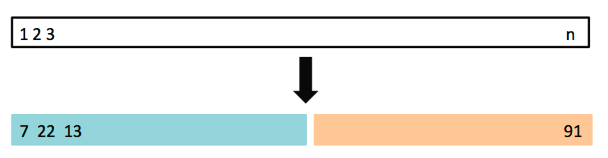
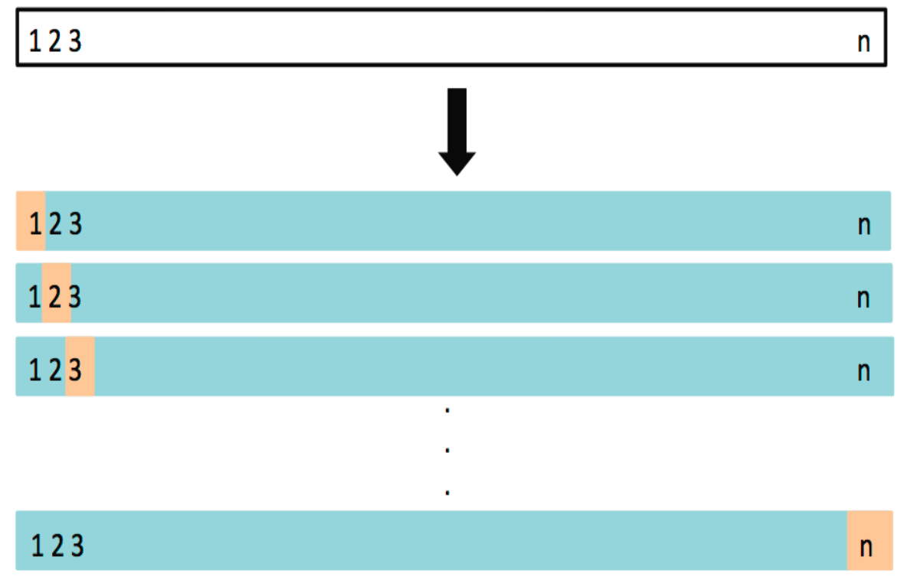

# SDSC5001

## Overview of Statistical Machine Learning

### General Model and Error

If we have some samples, we assume the data are generated from
$$
Y=f(x)+\epsilon
$$

-   $f$ is some unknown function 
    -   Parametric models 参数估计
        -   Linear/polynomial regression model
        -   Deep learning
    -   Nonparametric models 无参数估计
        -   **classification and regression tree**
        -   SVM
        -   Smoothing
-   $\epsilon$ is a random error with a mean of 0 and independent of X

>   Why $\epsilon$ needs mean equal 0?
>
>   1.   保证无偏估计
>   2.   简化分析

Prediciton can be represented by: $\hat{Y}=\hat{f}(X)$

### Prediction and Inference

-   **Inference**: Understanding **how** and **why** variables relate to each other.
    我们更加关系内在的逻辑关系

-   **Prediction**: Using data to **forecast** future outcomes.
    我们只关心是否能预测到正确的结构，不关心Relationship是怎么样的

For example, deep learning is actually more **focused on prediction than inference**. We only care about whether we can predict the right outputs.

### Model Assessment for Regression

MSE（均方误差）被定义为对 \(X\) 和 \(Y\) 的期望：

$$
MSE(f) = E[(Y - f(X))^2]
$$
 $\frac{1}{n} \sum_{i=1}^{n} (y_i - f(x_i))^2 $是基于样本均方误差Training Error，是**估计量**

The MSE can be written as the sum of the [variance](https://en.wikipedia.org/wiki/Variance) of the estimator and the squared [bias](https://en.wikipedia.org/wiki/Bias_of_an_estimator) of the estimator, providing a useful way to calculate the MSE and implying that in the case of unbiased estimators, **the MSE and variance are equivalent**.
MSE 可以写成估计值的方差和估计值的平方偏差之和，提供了一个计算 MSE 的有用的方法，并表明在无偏估计值的情况下，**MSE 和方差是等价的**。
$$
\text{MSE}(\hat{\theta}) = \text{Var}_{\theta}(\hat{\theta}) + \text{Bias}(\hat{\theta}, \theta)^2
$$

### Bias-Variance Decomposition

在很多模型中，我们假设输出 \(Y\) 由以下关系生成：

$$
Y = f(X) + \epsilon
$$
在偏差-方差分解中，我们的目标是分析模型预测值 $\hat{f}(X)$ 和真实值 \(Y\) 之间的误差：

$$
E[(Y - \hat{f}(X))^2]
$$
利用 $Y = f(X) + \epsilon$ 这一事实，我们将误差分解为：

$$
E[(Y - \hat{f}(X))^2] = E[(f(X) + \epsilon - \hat{f}(X))^2]
$$
展开这个平方项：

$$
E[(f(X) - \hat{f}(X))^2] + E[\epsilon^2] + 2E[(f(X) - \hat{f}(X))\epsilon]
$$
因为 $\epsilon$ 和 $X$ 是独立的，$E[\epsilon] = 0$，最后一项消失，于是我们得到：

$$
E[(Y - \hat{f}(X))^2] = E[(f(X) - \hat{f}(X))^2] + \text{var}(\epsilon)
$$
由于MSE可以写成估计值的方差和估计值的平方偏差之和，其将误差分解：
$$
E[(Y - \hat{f}(X))^2] = \text{Bias}(\hat{f}(X)) + \text{var}(\hat{f}(X)) + \text{var}(\epsilon)
$$
**偏差与方差的解释**

-   **偏差** $\text{Bias}(\hat{f}(X))$ ：表示由于近似真实函数 f 引入的误差。例如，如果我们用简单的线性模型去拟合非线性的数据，偏差会很大。

-   **方差** $\text{var}(\hat{f}(X))$ ：反映模型在不同数据集上的变化。如果我们使用一个非常复杂的模型，尽管它在训练数据上表现很好，但在不同的数据集上可能会表现得非常不同，方差会很大。

-   **噪声项** $\text{var}(\epsilon)$：这是不可避免的噪声，对所有模型来说都是一样的，不能通过改进模型来减小。

**模型复杂度对偏差和方差的影响**

一般来说，当我们使用更复杂的模型时：

-   偏差会减小，因为模型能够更好地拟合训练数据。

-   但是方差会增加，因为复杂模型更容易受到训练数据中噪声的影响，从而导致过拟合。

最终，我们需要在偏差和方差之间找到平衡，以最小化总体误差。

### Test Error in Practice

1. **测试集的不可用性**

- 在实际应用中，往往很难获得一个大的预留测试集来评估模型的测试误差。这可能是由于数据量有限，或由于数据已经被全部用来训练模型。

2. **通过调整训练误差来估计测试误差**

- 当没有预留测试集时，可以对训练误差进行调整来估计测试误差。常用的调整方法包括：
  - **AIC（Akaike Information Criterion，赤池信息准则）**：用于衡量模型的拟合优度，并考虑模型的复杂性，防止过拟合。
  - **BIC（Bayesian Information Criterion，贝叶斯信息准则）**：类似于AIC，但对模型复杂度有更强的惩罚，适合用于模型选择。
  - **协方差惩罚（Covariance Penalty）**：通过对模型复杂度进行惩罚来估计模型的泛化误差。

3. **通过训练集划分估计测试误差 Validation Set Approach**

- 如果我们拥有一个较大的训练集，可以通过随机将数据划分为**训练集**和**验证集**来估计测试误差。图示展示了这种划分的过程：
  - 将数据集随机划分为两部分，一部分用于训练模型，另一部分作为验证集来评估模型的性能。
  - 具体步骤：
    1. 使用训练部分（图中左侧蓝色部分）来构建模型。
    2. 使用验证部分（图中右侧橙色部分）来评估模型在未见过的数据上的表现，从而估计测试误差。

#### Validation Set Approach

**优点（Advantages）：**

1. **简单的概念（Simple idea）**：
   - 验证集方法非常直观易懂。它的基本思想是将数据集分为两部分，一部分用于训练模型，另一部分用于验证模型的性能。
   
2. **易于实现（Easy to implement）**：
   - 由于这个方法只需要简单地划分数据集并计算误差，它非常容易在实践中实现，不需要复杂的计算或调整。

**缺点（Disadvantages）：**

1. **验证集的均方误差（MSE）可能高度不稳定（The validation MSE can be highly variable）**：
   - 验证集的均方误差取决于数据集的划分。不同的划分可能导致误差的波动很大，特别是在样本量较小时，这种波动更加明显。模型的评估可能会因为一次不幸的数据划分而显得不准确。

2. **仅使用部分数据拟合模型（Only a subset of observations are used to fit the model）**：
   - 在验证集方法中，只有一部分数据用于训练模型，而模型在较少的数据上训练时，通常性能较差。这可能导致欠拟合，因为模型没有利用全部数据来发现数据中的潜在模式。

#### Leave-One-Out Cross Validation, LOOCV

**留一法交叉验证（Leave-One-Out Cross Validation, LOOCV）**，这是交叉验证的一种方法，特别适用于小数据集。以下是详细解释：

1. **LOOCV 方法概述**

- 留一法交叉验证与验证集方法相似，但针对验证集方法的缺点做了改进。
- LOOCV 的基本思想是：对于大小为 \( n \) 的数据集，每次从数据集中留出一个数据点作为验证集，剩下的 \( n - 1 \) 个数据点用于训练模型。

2. **LOOCV 的步骤**

- 将数据集划分为两部分：
  - **训练集**：大小为 \( n-1 \)，用于训练模型。
  - **验证集**：大小为 1，即只包含一个数据点，用于评估模型的性能。
  
- 训练模型并使用验证集来计算该次的均方误差（MSE）。

- **重复这个过程 \( n \) 次**：每次留出一个不同的数据点作为验证集，训练模型并计算对应的均方误差。

- 最后，所有 \( n \) 次实验得到的均方误差的平均值作为模型的最终估计误差。

3. **LOOCV 的优点**

- LOOCV 使用了几乎全部的数据进行训练，避免了验证集方法中因为数据集划分而带来的过大误差波动。
- 相比只使用一部分数据作为训练集，LOOCV 可以更好地估计模型在新数据上的表现，因为它每次都只留出一个数据点用于验证。

4. **LOOCV 的缺点**

- **计算成本高**：对于每个数据点，都需要训练一个新的模型。因此，对于较大的数据集，LOOCV 计算成本很高，因为模型需要训练 \( n \) 次。
- **方差较大**：由于每次只留出一个点用于验证，验证集非常小，可能导致方差较大，特别是在数据集中有噪声的情况下。

5. **LOOCV 的均方误差计算**

- 模型的最终均方误差（MSE）是通过所有 \( n \) 次实验的 MSE 的平均值计算得到的。这个均方误差可以用来评估模型的泛化性能。

LOOCV 是一种相对精确的模型评估方法，特别是在数据集较小时，它能够避免因为划分数据集导致的误差波动。然而，由于其计算成本较高，在大数据集上使用时可能不太现实。

#### LOOCV vs. Validation Set Approach

**留一法交叉验证（LOOCV）**和**验证集方法（Validation Set Approach）**的优缺点

1. **LOOCV 的优点**：

- **偏差较小（Less bias）**：
  - 由于 LOOCV 的训练集包含了 \( n - 1 \) 个数据点（几乎是整个数据集），因此训练集非常接近整个数据集。这使得模型能够更充分地学习数据，因此它的偏差比验证集方法更小。

- **产生更少的均方误差波动（Less variable MSE）**：
  - LOOCV 进行 \( n \) 次验证，每次留一个数据点做验证，这意味着它能够很好地评估模型的性能，减少验证误差的波动性。相比之下，验证集方法使用单一划分进行验证，因此验证误差波动更大。

2. **LOOCV 的缺点**：

- **计算量大（Computationally intensive）**：
  - LOOCV 的主要缺点是计算量非常大。因为它需要对每个数据点都训练一个模型，重复 \( n \) 次，因此当数据集较大时，LOOCV 会消耗大量计算资源。这是它的一个主要劣势，尤其在处理大数据集时显得不太实用。

#### K-Fold Cross Validation

K 折交叉验证是一种常见的模型评估方法，通过多次划分数据集并计算模型的预测误差，可以得到更稳定的误差估计。相比于留一法交叉验证（LOOCV），K 折交叉验证在保持较高准确度的同时，计算效率更高，因此在实际应用中非常常见。

#### LOOCV vs. K-Fold CV

这页PPT比较了**留一法交叉验证（LOOCV）**和**K 折交叉验证（K-Fold CV）**的优缺点，并给出了最终的结论。以下是详细解释：

**1. LOOCV 和 K-Fold CV 的对比：**

- **LOOCV 偏差较小**：
  - 由于 LOOCV 每次使用 \( n-1 \) 个样本进行训练，几乎是整个数据集，因此它的**偏差较小**。特别是当 \( K < n \) 时，K-Fold CV 的训练集要比 LOOCV 小，可能会导致偏差较大。
- **LOOCV 方差较大**：
  - 尽管 LOOCV 的偏差较小，但它的**方差较大**，这是因为每次只用一个数据点作为验证集，模型的表现可能在不同的数据点上有较大波动。相比之下，K-Fold CV 使用较大的验证集，因此方差较小。
- **权衡**：
  - 因此，在选择使用 LOOCV 还是 K-Fold CV 时，需要在偏差和方差之间进行权衡。

**2. 结论：**

- **推荐使用 K-Fold CV**：
  - 通常推荐使用 \( K = 5 \) 或 \( K = 10 \) 的 K-Fold 交叉验证。
  
- **实证结果**：
  - 经验表明，5 折或 10 折交叉验证可以提供合理的测试误差估计，且计算效率相对较高，成为实践中的常用方法。

