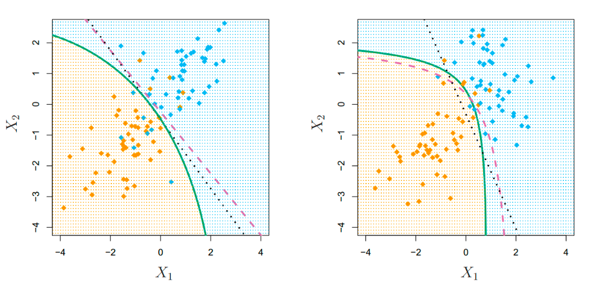
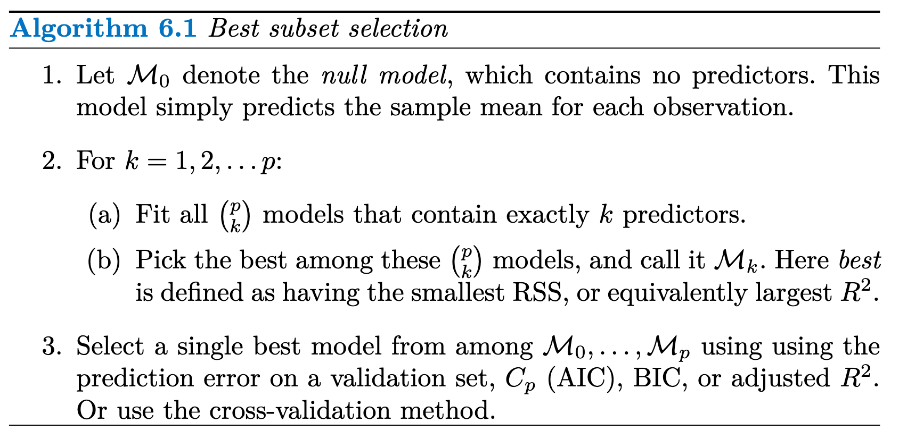
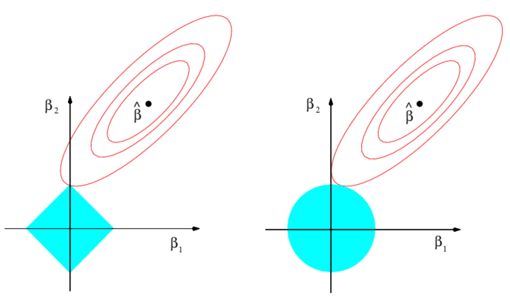

### SDSC5001

## Exploration

### Types of Data and Variables

Data Types

-   **Data Matrix**: Often structured as an $n \times p$ matrix, where $n$ is the number of objects and $p$ represents variables. Each row corresponds to an object, and each column to a variable.
-   **Other Data Forms**: Text, image, audio, video, transaction, and graph data.

Variable Types

-   **Continuous Variables** (e.g., height, time)
-   **Nominal Variables** 名义变量(e.g., gender, eye color)
-   **Ordinal Variables** 序数变量(e.g., satisfaction levels like “dislike,” “neutral,” “like”)
    和 **Nominal Variables** 不同，有顺序
-   **Interval Variables** (e.g., temperature)

### Data Quality

-   **Quality Issues**: Include noise, outliers, missing values, and sampling bias.
    数据噪声Noise指的是原始值的扰动，而异常值outliers则是与其他观察值相比显著不同的观察值
-   **Handling Missing Values**: Strategies such as imputation or using partial information.

## Overview

### General Model and Error

If we have some samples, we assume the data are generated from
$$
Y=f(x)+\epsilon
$$

-   $f$ is some unknown function 
    -   Parametric models 参数估计
        -   Linear/polynomial regression model
        -   Deep learning
    -   Nonparametric models 无参数估计
        -   **classification and regression tree**
        -   SVM
        -   Smoothing
-   $\epsilon$ is a random error with a mean of 0 and independent of X

>   Why $\epsilon$ needs mean equal 0?
>
>   1.   保证无偏估计
>   2.   简化分析

Prediciton can be represented by: $\hat{Y}=\hat{f}(X)$

### Prediction and Inference

-   **Inference**: Understanding **how** and **why** variables relate to each other.
    我们更加关系内在的逻辑关系

-   **Prediction**: Using data to **forecast** future outcomes.
    我们只关心是否能预测到正确的结构，不关心Relationship是怎么样的

For example, deep learning is actually more **focused on prediction than inference**. We only care about whether we can predict the right outputs.

### Model Assessment for Regression

MSE（均方误差）被定义为对 \(X\) 和 \(Y\) 的期望：

$$
MSE(f) = E[(Y - f(X))^2]
$$
 $\frac{1}{n} \sum_{i=1}^{n} (y_i - f(x_i))^2$是基于样本均方误差Training Error，是**估计量**

The MSE can be written as the sum of the [variance](https://en.wikipedia.org/wiki/Variance) of the estimator and the squared [bias](https://en.wikipedia.org/wiki/Bias_of_an_estimator) of the estimator, providing a useful way to calculate the MSE and implying that in the case of unbiased estimators, **the MSE and variance are equivalent**.
MSE 可以写成估计值的方差和估计值的平方偏差之和，提供了一个计算 MSE 的有用的方法，并表明在无偏估计值的情况下，**MSE 和方差是等价的**, 见Bias-Variance Decomposition
$$
\text{MSE}(\hat{\theta}) = \text{Var}_{\theta}(\hat{\theta}) + \text{Bias}(\hat{\theta}, \theta)^2
$$

### Bias-Variance Decomposition

在很多模型中，我们假设输出 \(Y\) 由以下关系生成：

$$
Y = f(X) + \epsilon
$$
在偏差-方差分解中，我们的目标是分析模型预测值 $\hat{f}(X)$ 和真实值 \(Y\) 之间的误差：

$$
E[(Y - \hat{f}(X))^2]
$$
利用 $Y = f(X) + \epsilon$ 这一事实，我们将误差分解为：

$$
E[(Y - \hat{f}(X))^2] = E[(f(X) + \epsilon - \hat{f}(X))^2]
$$
展开这个平方项：

$$
E[(f(X) - \hat{f}(X))^2] + E[\epsilon^2] + 2E[(f(X) - \hat{f}(X))\epsilon]
$$
因为 $\epsilon$ 和 $X$ 是独立的，$E[\epsilon] = 0$，最后一项消失，于是我们得到：

$$
E[(Y - \hat{f}(X))^2] = E[(f(X) - \hat{f}(X))^2] + \text{var}(\epsilon)
$$
由于MSE可以写成估计值的方差和估计值的平方偏差之和，其将误差分解：
$$
E[(Y - \hat{f}(X))^2] = \text{Bias}(\hat{f}(X)) + \text{var}(\hat{f}(X)) + \text{var}(\epsilon)
$$
**偏差与方差的解释**

-   **偏差** $\text{Bias}(\hat{f}(X))$ ：表示由于**近似真实函数 f 引入的误差**。例如，如果我们用简单的线性模型去拟合非线性的数据，偏差会很大。

-   **方差** $\text{var}(\hat{f}(X))$ ：反映模型在不同数据集上的变化。如果我们使用一个非常复杂的模型，尽管它在训练数据上表现很好，但**在不同的数据集上可能会表现得非常不同**，即方差会很大。

-   **噪声项** $\text{var}(\epsilon)$：这是不可避免的噪声，对所有模型来说都是一样的，不能通过改进模型来减小。

### **模型复杂度对偏差和方差的影响**

一般来说，当我们使用更**复杂的模型**时：

-   **偏差会减小**，因为模型能够更好地拟合训练数据。
-   **方差会增加**，因为复杂模型更容易受到训练数据中噪声的影响，从而导致过拟合。

最终，我们需要在偏差和方差之间找到平衡，以最小化总体误差。

### Test Error in Practice

1. **挑战**：

    -   **测试集不可用**：在实际中，可能缺乏足够的数据来划分出独立的测试集。

2. **解决方法**：

    -   调整训练误差估计测试误差
        -   **AIC（Akaike Information Criterion 赤池信息准则）**：考虑模型拟合度和复杂度。
        -   **BIC（Bayesian Information Criterion 贝叶斯信息准则）**：对模型复杂度施加更强的惩罚。
        -   **协方差惩罚**（Covariance Penalty）：通过惩罚项调整模型的复杂度。

    -   **通过训练集划分估计测试误差 Validation Set Approach**

### Validation Set Approach

将数据集简单分为训练集和验证集

**优点 (Advantages):**

1.  **Simple idea**
2.  **易于实现 (Easy to implement):**

**缺点 (Disadvantages):**

1.  **验证集的均方误差 (MSE) 可能高度不稳定 (Validation MSE can be highly variable):** 验证集的 MSE 取决于数据集的划分，不同的划分可能导致误差波动较大，尤其在样本量较小时。
2.  **仅使用部分数据拟合模型 (Only a subset of observations are used to fit the model):** 只有一部分数据用于训练，可能导致欠拟合，因为模型未能利用全部数据来发现潜在模式。

>   Cross-validation is used to estimate how a model generalizes to an unseendataset.

### LOOCV

留一法交叉验证 (Leave-One-Out Cross Validation, LOOCV) 基本思想：对于大小为 $n$ 的数据集，每次留出一个数据点作为验证集，其余 $n - 1$ 个数据点用于训练。

**LOOCV 的步骤**

-   **划分数据集:**

    -   **训练集**：大小为$n - 1$

    -   **验证集**：大小为 1

-   **训练模型并计算 MSE**

-   **重复 $n$ 次：** 每次留出不同的数据点

-   **计算平均 MSE：** 所有 $n$ 次实验的 MSE 平均值作为模型的最终误差估计

**优点:**

-   **使用几乎全部的数据进行训练：**避免了因数据划分导致的误差波动
-   **更好地估计模型在新数据上的表现：**每次仅留出一个数据点用于验证

**缺点:**

-   **计算成本高 (Computationally intensive)：**需要训练 $n$ 次模型，计算量大。
-   **方差较大：**验证集非常小，可能导致**高方差**，尤其在数据有噪声的情况下。

#### LOOCV vs. Validation Set Approach

**留一法交叉验证（LOOCV）**和**验证集方法（Validation Set Approach）**的优缺点

1. **LOOCV 的优点**：

- **偏差较小（Less bias）**：
  - 由于 LOOCV 的训练集包含了 \( n - 1 \) 个数据点（几乎是整个数据集），因此训练集非常接近整个数据集。这使得模型能够更充分地学习数据，因此它的偏差比验证集方法更小。

- **产生更少的均方误差波动（Less variable MSE）**：
  - LOOCV 进行 \( n \) 次验证，每次留一个数据点做验证，这意味着它能够很好地评估模型的性能，减少验证误差的波动性。相比之下，验证集方法使用单一划分进行验证，因此验证误差波动更大。

2. **LOOCV 的缺点**：

- **计算量大（Computationally intensive）**: LOOCV 的主要缺点是计算量非常大。因为它需要对每个数据点都训练一个模型，重复 \( n \) 次，因此当数据集较大时，LOOCV 会消耗大量计算资源。这是它的一个主要劣势，尤其在处理大数据集时显得不太实用。

### K-Fold CV

**概述**：将数据集分成 $K$ 个折，每次用其中 $K-1$ 个折训练，剩下的一个折验证，重复 $K$ 次

**优势**：相比 LOOCV，K 折交叉验证在保持较高准确度的同时，计算效率更高，是实际应用中常用的方法。

#### LOOCV vs. K-Fold CV

- **LOOCV 偏差小，K-Fold CV偏差大**：LOOCV 每次使用 \( n-1 \) 个样本进行训练，几乎是整个数据集，因此它的**偏差较小**，反之K-Fold CV偏差较大
- **LOOCV 方差大，K-Fold CV偏差大**：LOOCV每次只用一个数据点作为验证集，模型的表现可能在不同的数据点上有较大波动。相比之下，K-Fold CV 使用较大的验证集，因此方差较小。
- 在选择使用 LOOCV 还是 K-Fold CV 时，需要在**偏差**和**方差**之间进行权衡。
- 经验表明，5 折或 10 折交叉验证可以提供合理的测试误差估计，且计算效率相对较高，成为实践中的常用方法。

## Linear Regression

### Simple Linear Regression

Linear regression model assumes that
$$
f(x) = \beta_0 + \beta_1 x
$$
**Minimize the least square error**
$$
(\hat{\beta}_0, \hat{\beta}_1) = \arg\min_{\beta_0, \beta_1} \sum_{i=1}^{n} (y_i - \beta_0 - \beta_1 x_i)^2
$$

利用求导解，**Solution is**

$$
\hat{\beta}_1 = \frac{\sum_{i=1}^{n} (x_i - \bar{x})(y_i - \bar{y})}{\sum_{i=1}^{n} (x_i - \bar{x})^2}
$$

$$
\hat{\beta}_0 = \bar{y} - \hat{\beta}_1 \bar{x}
$$

$$
\hat{y}_i = \hat{\beta}_0 + \hat{\beta}_1 x_i \quad \text{are the fitted values.}
$$

$$
e_i = y_i - \hat{y}_i \quad \text{are the residuals.}
$$
### Multiple Linear Regression

$$
Y = \beta_0 + \beta_1 X_1 + \beta_2 X_2 + \cdots + \beta_p X_p + \epsilon
$$

### Assessing the Accuracy of the Model

#### Total sum of squares (TSS)

$$
TSS=\sum_{i=1}^n(\hat{y}-\bar{y})^2
$$

#### Residual sum of squares (RSS)

$$
\text{RSS} = e_1^2 + e_2^2 + \cdots + e_n^2,
$$

or, in Simple Linear Regression, equivalently as

$$
\text{RSS} = (y_1 - \hat{\beta}_0 - \hat{\beta}_1 x_1)^2 + (y_2 - \hat{\beta}_0 - \hat{\beta}_1 x_2)^2 + \cdots + (y_n - \hat{\beta}_0 - \hat{\beta}_1 x_n)^2.
$$
#### Residual standard error (RSE)

residual standard error 是用于衡量线性回归模型中误差项（或残差）的标准差。它表示模型预测值与实际观测值之间的平均偏差程度，也即模型未能解释的数据波动情况
- RSE 越小，意味着模型对数据的拟合越好，预测值和真实值之间的偏差越小
- 在实际分析中，母体误差项的方差$\sigma^2$往往未知，RSE 可以作为$\sigma$ 的一个估计值，从而用于计算回归系数的标准误差（SE）。例如，$\text{SE}(\hat{\beta}_1) 和 \text{SE}(\hat{\beta}_0)$ 是在用 RSE 作为 $\sigma$ 的估计值的基础上计算的

$$
RSE= \text{SE}(\epsilon)=\hat{\sigma}=\sqrt{RSS/(n-p-1)}
$$

#### $R^2$ for Regression

The **$R^2$ Statistic** is
  $$
  R^2 = \frac{TSS-RSS}{RSS} = 1 - \frac{RSS}{TSS}
  $$
- it always takes on a value between 0 and 1
- independent of the scale of $Y$
  与单位无关

In Simple Linear Regression:  $R^2 = [cor(X,Y)]^2$
In Multiple Linear Regression: $R^2 = [cor(Y,\hat{Y})]^2$

> In Simple Linear Regression $R^2 = r^2$
> In multiple regression,  $R^2$  is used to assess the **overall explanatory power** of the model with multiple predictors, while  $r^2$  typically applies to the correlation between **two individual variables**.

**Interpretation of**  $R^2$：represents the proportion of variability变异性 in  $Y$  that can be explained by the predictor variable  $X$ . 表示回归模型能够解释的因变量变化的比例

> What is the meaning of 1−R2?
> $1 - R^2$是未被模型解释的因变量变化的比例，反映了模型的不足之处

#### The problem of $R^2$

R2 will always **increase** when **more variables are added to the model**, even if those variables are only weakly associated with the response.
当模型中加入更多变量时，R2 总是会增加，即使这些变量与响应的相关性很弱

每增加一个变量，回归模型获得了一个额外的参数来更好地拟合样本数据。这些额外的参数可以进一步减少残差平方和  $\text{RSS}$ ，即使这个变量对解释响应变量几乎没有贡献。这种过拟合的趋势使得模型越来越精细地拟合训练数据，从而使  $R^2$  增大。

> 进一步理解，模型可以利用这个无关变量, **找出使得全局RSS更小的参数组合**，使得模型“过拟合”或“错误拟合”，实际上由于无关变量的影响，导致真正决定性的变量的拟合程度反而降低了，虽然$R^2$ 提高了但是性能却是降低的

解决：
$$
\text{Adjusted } R^2 = 1 - \frac{\text{RSS}/(n - p - 1)}{\text{TSS}/(n - 1)}
$$
It can be shown that in this simple linear regression setting that  where $r$ is the correlation between $X$ and $Y$, in Simple Linear Regression.

### Point Estimation

在[统计学](https://zh.wikipedia.org/wiki/统计学)中，点估计（point estimation）是指以[样本](https://zh.wikipedia.org/wiki/样本)数据来估计[总体](https://zh.wikipedia.org/wiki/总体)[参数](https://zh.wikipedia.org/wiki/母數)， 估计结果使用一个点的数值表示“最佳估计值”，因此称为点估计。由样本数据估计总体分布所含未知参数的真实值，所得到的值，称为估计值。

#### standard error of $\hat\mu$

我们可以用样本估算 $\hat{\mu}$ ，but how accurate is the sample mean $\hat{\mu}$ as an estimate of $\mu$? We answer this by computing **standard error** of $\mu$:
$$
\text{Var}(\hat{\mu}) = \text{SE}(\hat{\mu})^2 = \frac{\sigma^2}{n},
$$
- $\sigma$ is the RSE

#### Point Estimation of $\beta_0$ and $\beta_1$

Assume that
$$
y_i = \beta_0 + \beta_1 x_i + \epsilon_i
$$
where $\epsilon_i$'s are i.i.d. from $N(0, \sigma^2)$.

To compute the standard errors  associated with $β^0$ and $β^1$, we use the following formulas:
$$
\text{SE}(\hat{\beta}_0)^2 = \sigma^2 \left[ \frac{1}{n} + \frac{\bar{x}^2}{\sum_{i=1}^n (x_i - \bar{x})^2} \right], \quad \text{SE}(\hat{\beta}_1)^2 = \frac{\sigma^2}{\sum_{i=1}^n (x_i - \bar{x})^2}.
$$
where $\sigma^2=Var(\epsilon)=RSE^2$

when $\bar{x}=0$ ， $SE(\hat{\mu_1})=SE(\hat\mu)$

It can be shown that

$$
\hat{\beta}_1 \sim N\left(\beta_1, \frac{\sigma^2}{\sum_i (x_i - \bar{x})^2}\right)
$$

$$
\hat{\beta}_0 \sim N\left(\beta_0, \left(\frac{1}{n} + \frac{\bar{x}^2}{\sum_i (x_i - \bar{x})^2}\right) \sigma^2\right)
$$

#### Confidence Interval

Standard errors can be used to compute confidence intervals. 

对于任意服从正态分布的估计量（均值为 $\hat{\mu}$，标准误差为 $\text{SE}$），在95%的置信水平下，我们可以写出其置信区间为：
$$
\hat{\mu} \pm 1.96 \cdot \text{SE}
$$

同理，
$$
\left[ \hat{\beta}_1 - 2 \cdot \text{SE}(\hat{\beta}_1), \; \hat{\beta}_1 + 2 \cdot \text{SE}(\hat{\beta}_1) \right]
$$
置信区间可以用于判断参数是否显著。例如，如果 $\beta_1$ 的置信区间为 [0.042, 0.053]，且不包含0，我们可以有95%的信心认为广告支出对销售量有显著的正向影响

#### Alternative hypothesis

#### At least one of the X useful in predicting

我们想证明是否至少有一个变量 $X_n$ 是对结果有影响的，其等价与用假设检验证明
$$
y_i = \beta_0 + \beta_1 x_i + \beta_px_p+...+ \epsilon_i
$$
- **Null Hypothesis** ($H_0$): All regression coefficients are zero ($\beta_1 = \beta_2 = \dots = \beta_p = 0$), implying no relationship between any predictor and the response.
- **Alternative Hypothesis** ($H_a$): At least one $\beta_j$ is non-zero, suggesting a relationship between at least one predictor and the response.

This hypothesis test is performed by computing the **F-Statistic**:

$$
F = \frac{(TSS - RSS) / p}{RSS / (n - p - 1)}
$$
- If $H_0$ is true (no relationship exists), the F-statistic should be close to 1.
- If $H_a$ is true (at least one predictor has an effect), F is expected to be greater than 1.

### Potential Problems
#### Multicollinearity (Collinearity)

-   理想情况：在多元回归分析中，理想状态下，所有自变量（预测变量）之间应该是相互独立的，即不存在线性关系或高度相关性。
-   多重共线性multicollinearity（共线性）: 自变量之间存在高度相关性

**示例**：

**Newspaper** advertising does not have a direct effect on **sales** (p>0.0001,假设检验同意原假设$H_0$,即系数为0,无关), but due to its correlation with **radio** (which does affect sales), it appears to be associated with **sales** in simpler analyses. This demonstrates the importance of considering multicollinearity and the relationships among predictors in multiple regression analysis.

**问题**：

-   多重共线性会导致严重的问题，例如导致回归系数估计的不稳定、标准误的增大，从而影响回归模型的解释性和预测能力。
-   在出现多重共线性的情况下，可能难以确定哪些自变量对因变量有显著影响，因为它们的影响可能互相抵消。

解决：

- 使用VIP检测多重共线性问题
- 使用PCA可以减少数据集的维数
- 使用特征选择剔除高度相关的特征

#### VIF

**方差膨胀因子（Variance Inflation Factor, VIF）**，用于检测多重共线性问题
$$
(VIF)_j=\frac{1}{1-R^2_j}
$$
其中，$R_j^2$ 是当第 $j$ 个自变量对其他 $p-1$ 个自变量进行回归时得到的决定系数。$R_j^2$ 越高，表示第 $j$ 个自变量和其他自变量之间的相关性越强。一般来讲，如果[方差膨胀因子](https://baike.baidu.com/item/%E6%96%B9%E5%B7%AE%E8%86%A8%E8%83%80%E5%9B%A0%E5%AD%90/4993652?fromModule=lemma_inlink)超过10，则回归模型存在严重的多重共线性。

#### Non-linearity of the Data

**Residual plots** are a useful graphical tool for identifying non-linearity.

If the residual plot indicates that there are non-linear associations in the data, then a simple approach is to use non-linear transformations of the  predictors, such as $\log X$, $\sqrt{X}$ and $X^2$, in the regression model.

### Correlation of Error Terms

误差项是相互独立的。如果误差项彼此相关，其样本标准误差/方差的估计值往往会被低估，进而导致置信区间和预测区间过于狭窄，p值也可能会被低估，使得我们更容易误判某个参数具有统计显著性，从而对模型的可信度产生不合理的信心。

例如，如果市场在今天遭受了负面消息的影响而出现下跌，明天可能仍然会受此影响，造成预测误差偏差一致。因此，今天的误差项和明天的误差项可能是正相关的。

### Non-constancy of Error Variance (Heteroscedasticity)

误差方差不恒定（异方差性）: 在回归分析中，如果误差的方差随预测值变化而变化，就称为**异方差性**。理想情况下，模型的残差（$e_i$）的方差应该是恒定的（同方差性），即在所有拟合值 $\hat{y}_i$ 上，残差的分布应大致相同。

如果误差方差不恒定（存在异方差性），模型的预测可能会有偏差，影响回归系数的显著性检验

残差 $e_i$ 与拟合值 $\hat{y}_i$ 的散点图: 

-   在左侧图中，残差随拟合值的增大而呈现“漏斗形”分布，即误差方差在拟合值较大时增加。这种模式表明误差方差不恒定，存在异方差性
-   右侧图通过对 $Y$ **取对数变换**后，残差分布更加均匀，减少了方差膨胀的问题，这可能是对异方差性的一种有效调整

### hierarchical principle

The hierarchical principle states that if we include an interaction in a model, we should also include the main effects, even if the p-values associated with their coefficients are not significant.
分层原则指出，如果我们在模型中包含交互作用，那么我们也应包含主效应，即使与主效应系数 相关的 p 值并不显著。

## Classification

### General Setup

Assume $y \in \{1, \dots, K\}$ is a qualitative response variable and $\mathbf{x} \in \mathbb{R}^p$ represents a feature vector.

A **classifier** $G: \mathbb{R}^p \rightarrow \{1, \dots, K\}$ is designed to assign a feature vector $\mathbf{x}$ to one of the $K$ classes.

The objective of a good classifier $G(\mathbf{x})$ is to minimize the misclassification error, defined as:
$$
\text{err}(G) = P(y \neq G(\mathbf{x})) = \mathbb{E}\left[I(y \neq G(\mathbf{x}))\right]
$$
where $I(\cdot)$ is an **indicator function** that is 1 if $y \neq G(\mathbf{x})$ and 0 otherwise.

#### Concepts

**Classification Function**: Define the classification function for each class as $h_k(\mathbf{x}): \mathbb{R}^p \rightarrow \mathbb{R}$, where $k = 1, \dots, K$.
- 这个函数表示类别 $k$ 的分类函数。对于每一个类别 $k$，都存在一个独立的分类函数 $h_k$，其值用于衡量特征向量 $\mathbf{x}$ 属于该类别的“倾向”或“得分”
- 输入空间 $ $\mathbb{R}^p$ ：$\mathbf{x}$ 是一个  $p$  维的特征向量，表示为 $\mathbb{R}^p$。这意味着特征空间有  $p$  个维度（例如，可能包含不同的变量或属性）
- 输出空间  $\mathbb{R}$ ： $h_k(\mathbf{x})$  的输出是一个实数。这个输出值可以用来衡量输入$\mathbf{x}$ 属于类别 $k$ 的可能性或相关度
-  $k = 1, \dots, K$ ：这是对所有可能的类别 $k$ 的索引，表示分类任务中共有 $K$ 个类别

**Classifier**: $G(\mathbf{x}) = \arg\max_k \, h_k(\mathbf{x})$

**Estimated Classifier**: Based on the available **training data**, we estimate $h_k(\mathbf{x})$ and get the estimated classifier $\hat{G}(\mathbf{x})$:
$$
\hat{G}(\mathbf{x}) = \arg\max_k \, \hat{h}_k(\mathbf{x})
$$

**Classification Boundary**: The boundary between classes $k$ and $l$ is defined by:
$$
\{\mathbf{x} : h_k(\mathbf{x}) = h_l(\mathbf{x})\}
$$

### Linear Regression for Classification

**Bad way** to model Linear Regression:

Suppose $Y$ has three levels: type 1, type 2 and gestational

$$
Y = \begin{cases} 
1 & \text{if type 1} \\
2 & \text{if type 2} \\
3 & \text{if gestational} 
\end{cases}
$$

Why bad?
- 使用 $Y = 1, 2, 3$ 对类别进行编码，会隐含类别之间存在顺序关系，即类型 1 < 类型 2 < 妊娠糖尿病类型。实际上，**这些类别之间没有这种大小或顺序关系**，它们只是不同的分类标签。
- 若直接使用此编码进行线性回归模型训练，**模型会尝试找到类别间的线性关系**，**例如认为类型 2 的特征应位于类型 1 和妊娠糖尿病之间**。这与分类的实际要求不符，因为分类任务并不关心类别的数值顺序，只关心类别的区分。
- 这种编码方式隐含了类别之间的“**距离**”，例如类别 1 和类别 2 之间的距离是 1，而类别 2 和类别 3 之间的距离也是 1。然而，在实际中，类别之间没有定义这种距离，类型 1 和妊娠糖尿病类型之间的“差异”不等于其他类别之间的差异。

**Better way:** **独热编码（one-hot encoding）**
$$
y = \begin{cases} 
  3 \\ 
  2 \\ 
  1 
\end{cases} 
\rightarrow 
\mathbf{Y} = \begin{pmatrix} 
  0 & 0 & 1 \\ 
  0 & 1 & 0 \\ 
  1 & 0 & 0 
\end{pmatrix}
$$

Further Issues:
- 使用线性回归估计得到的分类函数  $\hat{h}_k(\mathbf{x})$  可能会出现不合理的情况，如输出值小于 0 或大于 1，导致概率估计失真。这种情况会降低模型的效率和准确性
- 掩蔽问题（Masking Problem）：在一些多类别分类问题中，可能出现一个类别被其他类别“掩盖”或“隐藏”的情况。具体而言，当多个类别的概率非常接近时，模型可能无法很好地区分它们，导致类别之间的混淆

总的来说：线性回归可以用作分类问题，但是在编码时需要使用独热编码，并且可能存在输出失真和掩盖问题

### Bayes Rule

贝叶斯法则（Bayes Rule）是概率论中的一个基本定理，用于计算在给定条件下事件发生的概率。

贝叶斯法则的数学表达式为：
$$
p_k(x)=P(Y = k | \mathbf{x}) = \frac{\pi_k f_k(x) }{\sum_{l=1}^X \pi_lf_l(x)}
$$

其中：

• $p_k(X)=P(Y = k | \mathbf{x})$  是后验概率
• $f_k(X)=P(\mathbf{x} | Y = k)$  是似然概率
• $\pi_k=P(Y = k)$  是先验概率
• $\sum_{l=1}^X \pi_lf_l(x)$ 是边际概率

> 对于分类问题可以简单比较$p_k(x)=\pi_k f_k(x)$即可

The optimal classifier is:

$$
G^*(X) = \arg\max_k \, p_k(X)
$$
- Some methods attempt to estimate $p_k(X)$
  - Discriminant analysis, logistic regression, classification tree, deep neural network
- Other methods attempt to estimate $G^*(X)$ directly
  - Support vector machine, Boosting, Bagging

### Linear Discriminant Analysis (LDA)

LDA基于以下假设： $X | y = k \sim \mathcal{N}_p(\mu_k, \Sigma)$
- 每个类别的数据在特征空间中服从**多元正态分布**
- **所有类别共享相同的协方差矩阵 $\Sigma$，即各类别数据的分布形状相同，但均值可以不同**
- 每个类别 k 的先验概率记为$\pi_k = P(Y = k)$，是类别 k 的整体比例

#### Discriminant functions 判别函数

To classify at the value $X = x$, we need to see which of the $p_k(x)$ is **largest**. Taking logs, and discarding terms that do not depend on $k$, we see that this is equivalent to assigning $x$ to the class with the largest *discriminant score*:

$$
\delta_k(x) = x \cdot \frac{\mu_k}{\sigma^2} - \frac{\mu_k^2}{2\sigma^2} + \log(\pi_k)
$$

Note that $\delta_k(x)$ is a *linear* function of $x$.

其中后验概率利用对数比较：
$$
\log \frac{p_k(X)}{p_l(X)} > 0 \iff p_k(X) > p_l(X)
$$
当对数比大于零时，表示  $p_k(X) > p_l(X)$ ，即在给定特征  $X$  的情况下，更倾向于类别  $k$ 

利用LDA展开比较函数：
$$
\log \frac{p_k(X)}{p_l(X)} = \log \left( \frac{\pi_k}{\pi_l} \right) - \frac{1}{2} (\mu_k + \mu_l)^T \Sigma^{-1} (\mu_k - \mu_l) + X^T \Sigma^{-1} (\mu_k - \mu_l)
$$

我们发现，在展开的时候，由于共享 $\Sigma$ ,导致一个 $X$ 的二次项被去除，所以这个方程是一个X的线性函数，因此LDA的决策边界是线性的（即一个超平面），可以通过找到该线性函数的最大值来确定分类

> English： The quadratic terms of 𝑋 vanish because of the equal covariance assumption across classes.

#### Gaussian density
The Gaussian density has the form
$$
f_k(x) = \frac{1}{\sqrt{2 \pi} \sigma_k} e^{-\frac{1}{2} \left( \frac{x - \mu_k}{\sigma_k} \right)^2}

$$
Plugging this into Bayes' formula, we get a rather complex expression for $p_k(x) = \Pr(Y = k | X = x)$:
$$
p_k(x) = \frac{\pi_k \frac{1}{\sqrt{2 \pi} \sigma} e^{-\frac{1}{2} \left( \frac{x - \mu_k}{\sigma} \right)^2}}{\sum_{l=1}^K \pi_l \frac{1}{\sqrt{2 \pi} \sigma} e^{-\frac{1}{2} \left( \frac{x - \mu_l}{\sigma} \right)^2}}
$$

#### Decision Boundary for K = 2 in LDA

**LDA boundary:**

Recall the definition of classification boundary:
$$
\{\mathbf{x} : h_k(\mathbf{x}) = h_l(\mathbf{x})\}
$$
Substitute the discriminant score into it:
$$
\delta_k(x) = x \cdot \frac{\mu_k}{\sigma^2} - \frac{\mu_k^2}{2\sigma^2} + \log(\pi_k)
$$
$$
\Rightarrow \delta_1(x) = \delta_2(x)
$$
$$
\Rightarrow x=\frac{\mu_1+\mu_2}{2}
$$

- On the left: the probability density functions (pdf) of the two class distributions.
- On the right: the sample histogram, with the **solid black line** representing the fitted **LDA decision boundary**, and the dashed line indicating the **Bayes rule boundary**.

Bayes rule boundary 怎么求的？

Bayes rule is defined as

$$
G^*(X) = \arg\max_k P(Y = k \mid X)
$$
To the left of the intersection point x= 0, the probability $P(Y = 0|X) >P(Y = 1|X)$ as the corresponding pdf curve is above the other. Similarly, to the right of this point, $P(Y = 0|X) >P(Y = 1|X)$.

换言之，两个函数的pdf的交点就是满足贝叶斯规则的分割点

#### Parameter estimation

Estimate $\mu_k$ by centroid质心 in class 𝑘 :
$$
\hat{\mu}_k = \frac{1}{n_k} \sum{\{i: y_i = k\}} X_i
$$
Estimate $\Sigma$ by pooled合并 within-class covariance matrix:
$$
\hat{\Sigma} = \frac{1}{n - K} \sum_{i=1}^n (X_i - \hat{\mu}_{y_i})(X_i - \hat{\mu}_{y_i})^T
$$

#### Parameter estimation Example:

假设我们有一个简单的分类任务，有两类数据，特征空间是二维的,训练数据如下：

| 类别 y | $X_1$ | $X_2$ |
| ---- | ----- | ----- |
| 1    | 5.1   | 3.5   |
| 1    | 4.9   | 3.0   |
| 1    | 5.0   | 3.2   |
| 2    | 6.1   | 2.9   |
| 2    | 6.3   | 3.3   |
| 2    | 6.5   | 3.0   |

我们需要用这些数据来估计LDA的参数。

1. 估计类别的先验概率 $\pi_k$
$$
  \hat{\pi}_1 = \frac{3}{6} = 0.5
$$
$$
  \hat{\pi}_2 = \frac{3}{6} = 0.5
$$
2. 估计均值向量 $\mu_k$

类别 $k$的均值向量 $\mu_k$ 是该类别中所有样本在特征空间中的平均值。
$$
  \hat{\mu}_1 = \begin{pmatrix} \frac{5.1 + 4.9 + 5.0}{3} \\ \frac{3.5 + 3.0 + 3.2}{3} \end{pmatrix} = \begin{pmatrix} 5.0 \\ 3.23 \end{pmatrix}
$$
$$
  \hat{\mu}_2 = \begin{pmatrix} \frac{6.1 + 6.3 + 6.5}{3} \\ \frac{2.9 + 3.3 + 3.0}{3} \end{pmatrix} = \begin{pmatrix} 6.3 \\ 3.07 \end{pmatrix}
$$

3. 估计协方差矩阵 $\Sigma$

由于LDA假设所有类别共享相同的协方差矩阵 $\Sigma$，我们需要计算“合并的类内协方差矩阵”，这是在所有样本中求协方差。公式为：
$$
\hat{\Sigma} = \frac{1}{n - K} \sum_{i=1}^n (X_i - \hat{\mu}_{y_i})(X_i - \hat{\mu}_{y_i})^T
$$
其中 $n$ 是总样本数，$K$ 是类别数，$\hat{\mu}_{y_i}$ 是 $X_i$ 所属类别的均值。
计算每个样本偏离其类别均值的量：

- 类别 1 的样本：
$$
  X_1 = \begin{pmatrix} 5.1 \\ 3.5 \end{pmatrix} - \begin{pmatrix} 5.0 \\ 3.23 \end{pmatrix} = \begin{pmatrix} 0.1 \\ 0.27 \end{pmatrix}
$$
$$
  X_2 = \begin{pmatrix} 4.9 \\ 3.0 \end{pmatrix} - \begin{pmatrix} 5.0 \\ 3.23 \end{pmatrix} = \begin{pmatrix} -0.1 \\ -0.23 \end{pmatrix}
$$
$$
  X_3 = \begin{pmatrix} 5.0 \\ 3.2 \end{pmatrix} - \begin{pmatrix} 5.0 \\ 3.23 \end{pmatrix} = \begin{pmatrix} 0.0 \\ -0.03 \end{pmatrix}
$$

- 类别 2 的样本：
$$
  X_4 = \begin{pmatrix} 6.1 \\ 2.9 \end{pmatrix} - \begin{pmatrix} 6.3 \\ 3.07 \end{pmatrix} = \begin{pmatrix} -0.2 \\ -0.17 \end{pmatrix}
$$$$
  X_5 = \begin{pmatrix} 6.3 \\ 3.3 \end{pmatrix} - \begin{pmatrix} 6.3 \\ 3.07 \end{pmatrix} = \begin{pmatrix} 0.0 \\ 0.23 \end{pmatrix}
$$$$
  X_6 = \begin{pmatrix} 6.5 \\ 3.0 \end{pmatrix} - \begin{pmatrix} 6.3 \\ 3.07 \end{pmatrix} = \begin{pmatrix} 0.2 \\ -0.07 \end{pmatrix}
$$
然后，计算协方差矩阵的各项之和并除以 $n - K = 6 - 2 = 4$：
$$
\hat{\Sigma} = \frac{1}{4} \sum_{i=1}^6 (X_i - \hat{\mu}_{y_i})(X_i - \hat{\mu}_{y_i})^T
$$
将每个差乘以它的转置，再将结果相加，最后除以4，可以得到最终的协方差矩阵（这里略去具体数值计算）

#### Linear Discriminant Analysis when p>1

暂略

### Quadratic Discriminant Analysis (QDA)

QDA 假定每个类别都有自己的协方差矩阵。也就是说，它假定来自第 k 个类别的观测值的形式为 X ∼ N (μk, Σk)，其中 Σk 是第 k 个类别的**协方差矩阵**。

> [如何直观地理解「协方差矩阵」？ - 知乎](https://zhuanlan.zhihu.com/p/37609917)

- QDA 假设每个类别的样本服从一个特定均值和协方差的**多元高斯分布**（即正态分布+协方差矩阵变换）
- 多元高斯分布会导致边界为非线性
- QDA 基于贝叶斯定理，通过最大化后验概率来决定样本的类别
- QDA 使用的是二次判别函数（包含二次项、一次项和常数项），这与 LDA 中的线性判别函数不同，从而在决策边界上形成**非线性决策边界**
- QDA 在类别之间的协方差矩阵差异较大时表现良好，因此适合类别之间的**方差和协方差差异较大的数据集**

#### Discriminant functions 判别函数

Assume $(X \mid y = k) \sim N_p(\mu_k, \Sigma_k)$ for $k = 1, \ldots, K$, then
$$

\delta_k(X) = \log (\pi_k) - \frac{1}{2} \log |\Sigma_k| - \frac{1}{2} (X - \mu_k)^T \Sigma_k^{-1} (X - \mu_k)

$$

#### Parameter estimation

The quadratic term of $X$ is now necessary. We estimate each parameter as follows:

- $\hat{\pi}_k = n_k / n$
- $\mu_k$ is estimated by the centroid in each class $k$.
$$
  \hat{\mu}_k = \frac{1}{n_k} \sum_{\{i : y_i = k\}} X_i
$$
- **$\Sigma_k$ is estimated by the sample covariance matrix in each class (diff from LDA)**
$$  \hat{\Sigma}_k = \frac{1}{n_k - 1} \sum_{\{i : y_i = k\}} (X_i - \hat{\mu}_k)(X_i - \hat{\mu}_k)^T
$$
#### LDA v.s. QDA

- Left: The Bayes (purple dashed), LDA (black dotted), and QDA (green solid) decision boundaries for a **two-class problem with $\Sigma_1 = \Sigma_2$.** The shading indicates the QDA decision rule. **Since the Bayes decision boundary is linear, it is more accurately approximated by LDA than by QDA.** 
- Right: Details are as given in the left-hand panel, **except that $\Sigma_1 \neq \Sigma_2$**. **Since the Bayes decision boundary is non-linear, it is more accurately approximated by QDA than by LDA.**

### Comparison of Classification Methods

- Scenario 1: 数据来自均值不同的Normal distribution，满足LDA假设（独立正态分布），由于满足独立性，朴素贝叶斯表现很好，KNN 表现不佳的原因是，它在方差方面付出的代价并没有被偏差的减少所抵消。QDA 的表现也比 LDA 差，因为它比必要的分类器更灵活。逻辑回归的表现相当不错，因为它假定了线性决策边界
- Scenario 2: 数据在S1的条件下存在-0.5的相关性，可以看出朴素贝叶斯的效果变差了
- Scenario 3: 数据满足t分布，t 分布的形状与正态分布相似，但它倾向于产生更多的极端点，其违反了LDA和QDA的假设，效果变差，且QDA的效果变差更严重

- Scenario 4: The data were generated from a **normal distribution**, with a correlation of 0.5 between the predictors in the first class, and correlation of −0.5 between the predictors in the second class. QDA表现非常好，因为这一设置符合 QDA 假设（多元正太分布假设），并产生了二次决策边界。
- Scenario 5: 数据由不相关预测因子的正态分布生成。然后从应用于预测因子的复杂非线性函数的对数函数中对响应进行采样。KNN-CV表现最好，但是KNN-1很差，即使数据呈现出复杂的非线性关系，如果平滑度选择不当，KNN 等非参数方法仍然会得到较差的结果。
- Scenario 6: 数据来自normal distribution，每类数据带有不同的对角协方差矩阵控制尺度的变化，但是数据量非常小。由于满足独立性，朴素贝叶斯效果较好，但是数据量小导致QDA的效果不如朴素贝叶斯，且KNN 的性能也受到了影响。

#### Summary

- True boundaries are linear -> LDA and logistic regression
- True boundaries are moderately non-linear -> QDA or naive Bayes
- more complicated decision boundaries -> KNN
- skills -> can accommodate a non-linear relationship between the predictors and the response, such as $X^2$ $X^3$

### Generalized Linear Models

The problem using linear regression in the Bike dataset:

- Between 1 AM and 4 AM, 无论天气/月份如何，使用bike的人数总是少的，方差少
- By contrast, between 7 AM and 10 AM, in April, May, and June, 天气好，大家倾向于骑车; in December, January, and February, 天气非常糟糕，很少人会骑车, 此时在同一时间中可能出现很大的差异，方差非常大
- 违反了Linear Regression中的方差一致性，Heteroscedasticity
- 且`bike`变量必须输出整数，而不能小数

By transforming the response using:

$$
\log(Y)=\sum_{j=1}^p X_j \beta_j+\epsilon
$$
can overcome much of the heteroscedasticity in the untransformed data. But it will lead to hard interpretation. And if the respond value is 0, log function cannot be applied.

#### Poisson Regression on the Bikeshare Data

$$
\Pr(Y = k) = \frac{e^{-\lambda} \lambda^k}{k!} \quad \text{for } k = 0, 1, 2, \dots.
$$
$\lambda = \mathbb{E}(Y) = \mathrm{Var}(Y)$ This means that if Y follows the Poisson distribution, then the l**arger the mean of Y , the larger its variance**.

$$
\log(\lambda(X_1, \dots, X_p)) = \beta_0 + \beta_1 X_1 + \dots + \beta_p X_p
$$
### ROC curve

A Confusion matrix

|                   | **Positive (预测)** | **Negative (预测)** |
| ----------------- | ----------------- | ----------------- |
| **Positive (真实)** | TP             | FN                |
| **Negative (真实)** | FP                | TN                |
技巧：字母的第二位都是表示**预测值**(P/N)，第一位都是表示预测值的正确与否(T/F)？

例如：FP代表  P->预测是Positive；F->预测错误，所以真实值是Negative

For TP, FN, FP, TN
- TP+FN=1
- FP+TN=1
- **对于同一个系统来说，若TP增加，则FP也增加**
	- 对于一个系统来说，预测正确的阈值下降了，虽然TP样本增加了，但是原本是Negative的样本也会更容易被预测为Positive！

ROC曲线是横坐标为FP，纵坐标为TP，取不同阈值的曲线

可以发现，越往左上偏置的曲线，在取得较好的FP（预测为Positive且正确）时FP较低（预测为Positive但错误），此时模型有较好的性能

ROC的面积为AUC指标

> 还有一种指标为EER（等错误率 Equal Error Rate），即当两类错误FP（预测为Positive但错误）和FN（预测为Negative但错误）相等的时候的错误率（或者比较TP的值）

## Resampling Method

### Cross-Validation

#### LOOCV

#### k-Fold Cross-Validation

通过随机 k 折 CV 将观测数据集分成大小大致相同的 k 组（或折叠）。第一个折叠被视为验证集，该方法适用于其余的 k - 1 个折叠。然后**对保留的折叠中的观测值计算均方误差** $MSE_1,...,MES_2,...,MSE_k$. The test error is estimated by averaging these MSE estimates.
$$
\text{CV}(k) = \frac{1}{k} \sum_{i=1}^k \text{MSE}_i.
$$
In practice, one typically performs **k-fold CV using k = 5 or k = 10**. What is the advantage of using k = 5 or k = 10 rather than k = n? The most obvious advantage is **computational.**

真实测试 MSE 显示为蓝色，LOOCV 估计值显示为黑色虚线，10 倍 CV 估计值显示为橙色。X表示每条 MSE 曲线的最小值（并且对应一个flexibility值）。尽管它们有时会低估真实的测试 MSE，但所有的 CV 曲线都接近于确定正确的flexibility值，即 CV得到的最小MSE（橙色X）对应的flexibility 与 真实最小MSE（蓝色X）对应的flexibility是相近的。

由于LOOCV使用了更多数据进行拟合，bias会比fold-CV小，而方差会更大。**用 k = 5 或 k = 10 来执行 k 倍交叉验证**，经验表明，这些值产生的测试误差率估计值既不会出现过高的偏差，也不会出现过高的方差。

#### CV on Classification Problems

上图：Test error (brown), **training error (blue)**, and **10-fold CV error (black)** on the two-dimensional classification data

对于分类问题，我们很难选择逻辑回归的多项式阶数，
$$
\log\left(\frac{p}{1-p}\right) = \beta_0 + \beta_1 X_1 + \beta_2 X_1^2 + ... +\beta_? X_1^? + \beta_3 X_2 + \beta_4 X_2^2+... +\beta_? X_2^?.
$$
对于KNN，K的选择也较困难

**如果使用training error来评估参数会失真**（蓝色的线与黄色的线**不一致**），可能因为过拟合（高阶多项式和较小的K）

此时可以利用CV来估计验证集的误差曲线，选出一个误差值最低的超参数（图中黑的线与黄色的线**一致**，可以利用CV的最小值黑色的X来寻找超参数）

### Bootstrap

方差估计的问题：
1. 传统的样本统计方法通常依赖于某些分布假设（例如正态分布）来估计总体方差，如果这些假设不成立（如总体分布未知或偏离正态分布），那么直接利用样本方差估计的结果可能是不准确的
2. 如果直接计算样本的方差  $S^2 = \frac{1}{n-1} \sum_{i=1}^n (x_i - \bar{x})^2$ 受单个样本点的影响较大

**Bootstrap** 的主要目的是衡量统计量（如均值、方差、回归系数等）在特定样本中的**变异性/波动性（variability）**

假设：
1. 样本是从总体中独立同分布（i.i.d.）抽取的，代表了总体的分布。
2. 通过对样本反复重采样，可以模拟统计量在总体中的变异性。

$$
\text{SE}_B(\hat{\alpha}) = \sqrt{\frac{1}{B - 1} \sum_{r=1}^B \left( \hat{\alpha}^{*r} - \frac{1}{B} \sum_{r'=1}^B \hat{\alpha}^{*r'} \right)^2}.
$$

## Linear Model Selection and Regularization

OLS is not the best in some situations. As we will see, alternative fitting procedures can yield better prediction accuracy and model interpretability.

### Subset Selection

#### Best Subset Selection

为了进行最佳子集选择，我们对 p 个预测因子(**predictors**/datasets features)的每种可能组合分别进行最小二乘回归最佳子集选择.
我们拥有
$$
\binom{p}{2} = \frac{p(p-1)}{2}
$$
个模型，并且找出最佳的模型

我们知道，由于**predictors**的数量增加，模型的RSS会降低，$R^2$会提升，所以我们需要使用$adjusted\ R^2$ BIC 等指标，并且考虑需要使用CV衡量average test error.

最佳子集选择在计算上不可行

#### Stepwise Selection

前向逐步选择从一个不包含任何预测因子的模型开始，然后逐次向模型中添加预测因子，直到模型中包含所有预测因子

逆向逐步选择从包含所有 p 个预测因子的全最小二乘模型开始，然后逐次迭代去除最无用的预测因子。

后向选择要求样本数 n 大于变量数 p（这样才能拟合出完整的模型）

Stepwise Selection methods are not guaranteed to yield the best model containing a subset of the $p$ predictors

#### Choosing the Optimal Model

由于OSL尽量使得训练集 $MSE$ 降低，而不是测试 $MSE$, 训练集 $MSE$ 通常会低估测试 $MSE$ (例如过拟合导致残差降低，训练$MSE$降低)

所以训练集 $RSS$ 和训练集 $R^2$ 不能用于从变量数量不同的模型中进行选择

However, a number of techniques for **adjusting** the training error for the model size are available. These approaches can be used to select among a set of models with different numbers of variables. We now consider four such approaches: $C_p$, **Akaike information criterion** (AIC), **Bayesian information criterion** (BIC), and **adjusted $R^2$. 

$$
C_p = \frac{1}{n} \left( \text{RSS} + 2d\hat{\sigma}^2 \right)
$$
$$
\text{AIC} = \frac{1}{n} \left( \text{RSS} + 2d\hat{\sigma}^2 \right)
$$
$$
\text{BIC} = \frac{1}{n} \left( \text{RSS} + \log(n)d\hat{\sigma}^2 \right)
$$
- $d$: the number of predictor
- $\sigma^2$: estimate of the variance of the error
- $2d\hat{\sigma}^2$: 对predictor数量的增加和variance的惩罚项
- $n$: the number of observations.

BIC 通常会对**变量较多的模型施加较重的惩罚**, 倾向于选择小模型

$C_p$, $BIC$, and adjusted $R_2$ are shown for the best models (X位置) of each size for the Credit data set, 可以很明显发现BIC倾向于选择小模型, 且BIC在最大最低值后面有明显的上升，而$C_p$和Adjusted $R^2$趋于平缓

K-flod CV 也可以很好的进行subset选择

### Shrinkage Methods

#### Ridge Regression

Ridge Regression（**岭回归**）是一种改良的最小二乘估计法，通过放弃最小二乘法的无偏性，以损失部分信息、降低精度为代价获得回归系数更为符合实际、更可靠的回归方法，对病态数据的拟合要强于最小二乘法

minimize the quantity:
$$
\sum_{i=1}^n \left( y_i - \beta_0 - \sum_{j=1}^p \beta_j x_{ij} \right)^2 + \lambda \sum_{j=1}^p \beta_j^2 = \text{RSS} + \lambda \sum_{j=1}^p \beta_j^2
$$
- $\lambda$: tuning parameter
- $\beta_j^2$: L2 normalisation
- $\lambda \sum_{j=1}^p \beta_j^2$: shrinkage penalty

平方偏差（黑色）、方差（绿色）和测试均方误差（紫色）
$\frac{\|\hat{\beta}^\text{R}_\lambda\|_2}{\|\hat{\beta}\|_2}$表示Ridge Regression的$\beta$ 系数和OLS下的$\beta$系数的比值，表示随着正则化参数 $\lambda$ 的变化，正则化模型中系数的缩小程度

#### Lasso

minimize the quantity:
$$
\sum_{i=1}^n \left( y_i - \beta_0 - \sum_{j=1}^p \beta_j x_{ij} \right)^2 + \lambda \sum_{j=1}^p |\beta_j| = \text{RSS} + \lambda \sum_{j=1}^p |\beta_j|
$$
与 Ridge Regression 的区别在于使用L1 Norm

使用L1范数更容易使得误差等高线触及边缘位置，即$\beta_?=0$的位置，这使得某些predictor的系数变为0，具有降维的效果

可以发现在惩罚系数增大时，某些predictor系数直接消失了

#### Ridge Regression vs. Lasso

**Lasso**: 
- 如果响应变量主要受少数几个重要预测变量驱动，而其他变量的影响可以忽略不计
- 当特征数量远大于样本量（$p \gg n$）时，Lasso 可以帮助选择对响应变量影响较大的少量特征
**Ridge Regression**:
- 高维数据（$p > n$）或多重共线性问题Multicollinearity: 对系数进行均匀收缩，从而减小共线性的影响
- 当所有变量的真实系数较小且分布均匀时（即没有显著的大系数），Ridge 能够更好地捕捉全局信息
**Elastic Net**:
 $$
\text{Elastic Net penalty} = \alpha \sum_{j=1}^p |\beta_j| + (1-\alpha) \sum_{j=1}^p \beta_j^2
$$
Cross-validation can be used in order to determine which approach is better on a particular data set.

### Dimension Reduction Methods

定义了新的变量  $Z_1, Z_2, \dots, Z_M$ ，它们是原始预测变量  $X_1, X_2, \dots, X_p$  的线性组合
$$
Z_m = \sum_{j=1}^p \phi_{jm} X_j, \quad m = 1, \dots, M
$$
基于新构造的变量  $Z_1, Z_2, \dots, Z_M$  构建线性回归模型
$$
y_i = \theta_0 + \sum_{m=1}^M \theta_m z_{im} + \epsilon_i, \quad i = 1, \dots, n
$$
通过合理地选择  $\phi_{jm}$，降低了需要估计的参数个数，从  p+1  降到  M+1 ，减少了计算复杂性

#### PCA / PCR

PCA(Principal Components Analysis) 是 PCR(Principal Component Regression)的前置处理步骤,提取 $Z_1, Z_2, \dots, Z_M$ 作为主成分

第一个主成分是原始特征  $X_1, X_2, \dots, X_p$  的线性组合
$$
Z_1 = \phi_{11} X_1 + \phi_{21} X_2 + \dots + \phi_{p1} X_p
$$
其中，$\phi_{j1}$ 是第一主成分的载荷（loading），表示第 $j$ 个原始特征对第一主成分的贡献

主成分的目标是找到使数据投影后的样本方差最大的线性组合
$$
\max_{\phi_{11}, \dots, \phi_{p1}} \left\{ \frac{1}{n} \sum_{i=1}^n \left( \sum_{j=1}^p \phi_{j1} x_{ij} \right)^2 \right\} 
\text{ subject to }   
\sum_{j=1}^p \phi_{j1}^2 = 1
$$
计算时我们使用特征值分解法解决上述优化问题，即：
1. 中心化
2. 计算协方差矩阵 $\Sigma = \frac{1}{n} X^T X  = Q \Lambda Q^T$
	- Q 是特征向量矩阵（列向量对应主成分方向）
	- $\Lambda$ 是对角矩阵，其对角线上的元素为特征值，代表每个主成分的解释方差大小
3. 从Q中取前M个较大的特征值对应的特征向量，构成投影矩阵 $Q_{\text{reduced}}$
4. 将原始数据投影到前两个主成分方向上 $Z = X \cdot Q_{\text{reduced}}$

PCA虽然可以通过**线性组合**原始变量提取主成分，但它并不能真正被视为特征提取方法，只能看做一种数据压缩的方法。从这个角度来看，主成分分析接近岭回隙(L2 norm), 而不是LASSO(L1 norm)

When performing PCR, we generally recommend **standardizing each predictor** to ensure all variables are on the same scale, prior to generating the principal components.

#### Partial Least Squares

PCA is an **unsupervised way,** since the response Y is not used to help determine the principal component directions.

Consequently, **PCR** suffers from a drawback: there is no guarantee that the directions that best explain the predictors will also be the best directions to use for predicting the response.

PLS is a supervised alternative to PCR.

### Considerations in High Dimensions

The issue of high dimensions
- OSL should not be performed
- `mse=0` but useless at all
- easy to overfitting
- $R^2$ increases to 1 as the number of features included

## Moving Beyond Linearity

### Polynomial Regression

### Step Functions

将 X 的取值范围分为 K 个**切分点 (cutpoints)** $c_1, c_2, \dots, c_K$，这些切分点将 $X$ 的范围划分为 $K+1$ 个区间
为每个区间定义 K+1 个新变量：
- $C_0(X) = I(X < c_1)$
- $C_1(X) = I(c_1 \leq X < c_2)$
- $\dots$
- $C_{K-1}(X) = I(c_{K-1} \leq X < c_K)$
- $C_K(X) = I(c_K \leq X)$

其中，$I(\cdot)$ 是指示函数，值为 1 表示条件为真，值为 0 表示条件为假

利用OSL来拟合模型：
$$
f(X) = \sum_{k=0}^K \beta_k C_k(X)
$$
### Basis Functions

- Polynomial Regression and Step Functions are special cases of a *basis function* approach
$$
y_i = \beta_0 + \beta_1 b_1(x_i) + \beta_2 b_2(x_i) + \beta_3 b_3(x_i) + \cdots + \beta_K b_K(x_i) + \epsilon_i
$$
- $b_k(x_i)$ are fixed and known

### Regression Splines

#### Piecewise Polynomials

*piecewise polynomial* regression involves fitting separate low-degree polynomials **over different regions of X**.

$$
y_i =
\begin{cases}
\beta_{01} + \beta_{11}x_i + \beta_{21}x_i^2 + \beta_{31}x_i^3 + \epsilon_i & \text{if } x_i < c, \\
\beta_{02} + \beta_{12}x_i + \beta_{22}x_i^2 + \beta_{32}x_i^3 + \epsilon_i & \text{if } x_i \geq c.
\end{cases}
$$
- $c$：切分点，用于分隔区间

#### Constraints and Splines

图中利用**三**次多项式拟合，每增加一个分割点增加**4**个自由度(考虑$\epsilon_i$)

The top left panel of Figure looks **wrong** because the fitted curve is just too flexible. 
**Solve:** add constraint that the fitted curve must be continuous.
Method:
- Top Left: constrained to be continuous at age=50
- Bottom Left：continuous value, same continuous first and second derivatives at age=50
  限定多项式在 age = 50 连续, 一阶导数和二阶导数都存在
- Bottom Right：**A linear spline**

每增加一个限制，减少一个自由度

**linear spline:** 它在age=50处连续。d阶样条的一般定义是分段 $d$ 阶多项式，同时在每个结点直到 $d-1$ 阶导数都是连续的。因此，线性样条可以通过以下方式得到：在每个区域内拟合一条直线，同时要求在各结点处满足连续性。

#### The Spline Basis Representation

三次样条(cubic spline)：该模型使用三次多项式拟合，对于K个分割点 $\xi_k$，在原有Basis Functions表达式中增加K个截断幂基 truncated power basis 函数，即：
$$
y_i = \beta_0 + \beta_1 X_i + \beta_2 X_i^2 + \beta_3 X_i^3 + \sum_{k=4}^{K+3} \beta_k h(X_i, \xi_k) + \epsilon_i
$$
$$
h(x, \xi) = (x - \xi)^3_+ =
\begin{cases} 
(x - \xi)^3 & \text{if } x > \xi \\
0 & \text{otherwise}
\end{cases}
$$

- $\beta_? h(X_i, \xi_?)$的个数取决于分割点K的数量
- 可以证明，其会导致对应的结点的函数值、一阶/二阶导数连续
- $y_i$自由度的大小为 $4+K$（$\beta$的数量）
 
 对于n次样条：
 - 将basis for a cubic polynomial的个数增加为n, 即:
 $\beta_0 + \beta_1 X_i + \cdots + \beta_3 X_i^n$
 - truncated power basis function is defined as:
 $h(x, \xi) = (x - \xi)^n_+$

## Classification and Regression Trees

### Regression Tree

#### building a regression tree.

1. Divide the predictor space into $J$ distinct and non-overlapping regions
2. 对落人区域 $R_j$ 的每个观测值作同样的预测, 预测值为训练集上的平均值

构建的步骤：

划分区域使得整体残差RSS最小，即
$$
RSS(Tree)=\sum_{j=1}^{J} \sum_{i \in R_j} \left( y_i - \hat{y}_{R_j} \right)^2
$$
一种可行的方法是：**recursive binary splitting** 递归二叉分裂：

Fine a $s$ , that splitting the predictor space $X_j$ into the regions $R_1(j,s)=\{X|X_j < s\}$ and $R_2(j,s)=\{X|X_j \geq s\}$ and minimize the equation
$$
\sum_{i: x_i \in R_1(j, s)} \left( y_i - \hat{y}_{R_1} \right)^2 
+ 
\sum_{i: x_i \in R_2(j, s)} \left( y_i - \hat{y}_{R_2} \right)^2
$$
where
- $\hat{y}_{R_1}/\hat{y}_{R_2}$ is the mean response for the training observations

- 左上：二维特征空间的划分，**不能由recursive binary splitting产生**
- 右上：二维示例上的递归二进制分裂的输出
- 左下：与右上角面板中的分区相对应的树
- 右下：与该树对应的预测表面的透视图

Terminology
- terminal nodes 终端节点
- tree is upside down, leaves are at the bottom of the tree.
- internal nodes 内部节点

**Decision trees** is Nonparametric 非参数模型 , which models do not assume a specific functional form or distribution for the data. 这种模型不假定数据有特定的函数形式或分布

#### Pruning

Using nonnegative tuning parameter $\alpha$, and make 
$$
C_\alpha(T) = \text{RSS}(T) + \alpha \cdot |T|
$$
- $|T|$ indicates the **number of terminal nodes** of the tree T
- Use K-fold cross-validation to choose α

算法步骤：
- 逐步从树中删除叶节点（或子树），每次删除后重新计算 $C_\alpha(T)$
- 剪枝时，选择 **最小化增量 RSS 的分支**，即移除对 $C_\alpha(T)$ 影响最小的分支
- 使用 k-fold CV 确定最佳的 $\alpha$

### Classification Tree

Very similar to a regression tree, except that it is used to predict a qualitative response rather than a quantitative one.

For a classification tree, we predict that each observation belongs to the **most commonly occurring class** of training observations in the region to which it belongs.

RSS cannot be used as a criterion for making the binary splits. We use **classification error rate** 
$$
E = 1 - \max_k (\hat{p}_{mk})
$$
where
- $\hat{p}_{mk}$ : 区域 $R_m$ 中，类别 $k$ 占区域的比例

example: 区域 $R_m$ 中:

| 类别（$k$） | 样本数量 | 比例 ($\hat{p}_{mk}$​) |
| ------- | ---- | -------------------- |
| $k=1$   | 30   | $\hat{p}_{m1} = 0.6$ |
| $k=2$   | 15   | $\hat{p}_{m2} = 0.3$ |
| $k=3$   | 5    | $\hat{p}_{m3} = 0.1$ |

#### Gini index

Why Gini index: **classification error rate** is not sufficiently sensitive for tree-growing, and in practice two other measures are preferable.
- 它仅关注 **占比最大的类别**，忽略了其他类别的分布情况
	- $[0.6,0.3,0.1]$ 与 $[0.6,0.2,0.2]$ 中的 $E$ 相同
- 因此，分类误差率无法区分这些更细微的分布差异

$$
G = \sum_{k=1}^{K} \hat{p}_{mk} (1 - \hat{p}_{mk}) = 1 - \sum_{k=1}^{K} \hat{p}_{mk}^2
$$

Gini index is referred to as a measure of **purity 纯度**

#### Cross-entropy
  
$$
H = -\sum_{k=1}^{K} \hat{p}_{mk} \log_2 (\hat{p}_{mk})
$$

#### Notations

- Node: $t$ or $m$
- left child node: $t_l$
- The collection of all the nodes: $T$
- The collection of all the leaf nodes: $\tilde{T}$
- A split: $s$
- the set of splits: $S$

#### Trees Vs. Linear Models

- 拥有线性结构，Linear Models效果好
- 高度非线性，Trees效果好
- Trees也有良好的可解释性和可视化效果
- 实践中需要使用 K-fold CV 评估

- 左上：线性分割模型，使用Linear Models效果好
- 右上：线性分割模型，使用Trees的效果较差
- 左下：非线性分割模型，使用Linear Models效果差
- 右下：线性分割模型，使用Trees的效果较好

#### Advantages and Disadvantages of Trees

Advantages
- Trees are very easy to explain to people.
- Trees can be displayed graphically
- Trees can easily handle qualitative定性 predictors without the need to create dummy variables.
Disadvantages
- trees *do not have the same level of predictive accuracy* as some of the other regression and classification approaches
- non-robust

### Ensemble method

#### Bagging

在树模型（如决策树）中，分支越多（即树的深度越大），模型的复杂度越高，这会导致模型的**方差**增加

> **方差（Variance）**：
> 表示模型对训练数据的敏感程度
> $\text{Var}[\hat{f}(x)] = \mathbb{E}[(\hat{f}(x) - \mathbb{E}[\hat{f}(x)])^2].$

与BootStrap的思路相似：given a set of n independent observations $Z_1, . . . , Z_n$, each with variance $\sigma^2$, the variance of mean of $\bar{Z}$  is $\sigma^2/n$. In other words, **averaging a set of observations reduces variance.** **求平均可以减小方差**

因此，要减小某种统计学习方法的方差从而增加预测准确性，有一种很自然的方法：从总体中抽取多个训练集（实际上不可行，需要使用BootStrap），对每个训练集分别建立预测模型，再对由此得到的多个预测值求平均
$$
\hat{f}_{\text{avg}}(x) = \frac{1}{B} \sum_{b=1}^B \hat{f}^{b}(x).
$$
对于qualitative定性问题，我们可以采用majority vote: the overall prediction is the most commonly occurring class among the B predictions. 
B 中出现频率最高的类作为预测值

具体流程如下：
1. 利用BootStrap创建初始训练集的多个副本
2. 训练多个基模型
3. 集成预测
	1. **回归任务**：取基模型预测的平均值
	2. **分类任务**：采用投票法，选择预测次数最多的类别作为最终预测结果

#### Out-of-Bag Error Estimation

对于BootStrap中，可以证明
- **约 63.2%** 的样本被抽中（在训练这棵树时使用）
- **剩下的约 36.8%** 的样本没有被抽中（称为“袋外样本”或 Out-of-Bag 样本）

对于每一棵树，OOB 样本可以看作是一个“**验证集**”，对所有样本，计算 OOB 样本的预测误差

$$
\text{OOB Error} = \frac{1}{n} \sum_{i=1}^n \mathbb{1}(\hat{y}_i^{\text{OOB}} \neq y_i)
$$
- $\hat{y}_i^{\text{OOB}}$  是  x_i  在 OOB 样本中的预测结果（通过未使用  x_i  的树得到）
- $y_i$  是样本的真实标签

OOB error is virtually **equivalent to** leave-one-out cross-validation error.

#### Variable Importance Measures

Method：
- In the case of **bagging regression trees**: Record the total amount that the *RSS* is **decreased** due to splits over a given predictor, averaged over all B trees.
- In the case of **bagging classification trees**: Add up the total amount that the *Gini index* is **decreased** by splits over a given predictor, averaged over all B trees.

#### Random Forests

随机森林 (random forest) 通过对树作*去相关处理*,实现了对装袋法树的改造

具体流程如下：
1. 随机森林为每棵树构建一个子样本（通过 Bootstrap 抽样）。
2. 在构建这棵树的每一个分裂节点时，从全部 $p$ 个特征中随机选择 $m$ 个特征。
3. 仅在这 $m$ 个特征中，找到一个用于当前节点分裂的最佳特征及其分裂点。

Why:
- 如果没有这种随机特征选择，每棵树都可能过于依赖强特征，导致所有树的结构相似
- 如果 $m$ 较小，每棵树的分裂更随机，树的多样性更大，模型的泛化能力更强

#### Boosting

Boosting 的核心思想是**顺序训练多个弱模型**，每个模型的重点是修正前一个模型的错误预测

Like bagging, boosting involves combining a large number of decision trees, $f^1, . . . , f^B$,  与bagging不同的是， Boosting 不使用 Bootstrap，而是通过迭代依次生成树$f^1, . . . , f^B$

Gradient Boosting 训练思想：
1. 初始化模型
2. 迭代
	1. 利用当前残差拟合树
	2. 将新树加入模型
	3. 更新整体残差
Why works? Unlike fitting a single large decision tree to the data, which amounts to fitting the data hard 对数据的严格契合 and potentially overfitting过拟合, the boosting approach learns slowly舒缓.

AdaBoost 是通过调整**权重**来调整模型，而不是残差
AdaBoost 是有效的，因为它通过调整样本权重，**让后续的弱学习器更加关注之前的错误样本**，从而逐步改进整体模型的预测性能
**AdaBoost 伪代码**：
- 训练集 $D = \{(x_1, y_1), \dots, (x_n, y_n)\}$
- 基学习器 $f(x)$
- 最大迭代次数 $M$
Algorithm:
1. 初始化样本权重 $w_i = \frac{1}{n}, \forall i = 1, \dots, n$
2. For $m = 1$ to $M$:
	1. 使用当前样本权重 $w_i$，训练基学习器 $f_m(x)$
		- 样本权重越高，其对分裂节点选择的影响越大
	2. 计算基学习器的加权错误率：$\varepsilon_m = \frac{\sum_{i=1}^n w_i \cdot \mathbb{1}(f_m(x_i) \neq y_i)}{\sum_{i=1}^n w_i}$
		- 错误分类的高权重样本对损失函数的贡献更大，基学习器会优先优化这些样本
	3. 计算基学习器的权重：$\alpha_m = \frac{1}{2} \ln\left(\frac{1 - \varepsilon_m}{\varepsilon_m}\right)$
	4. **更新样本权重**：$w_i \leftarrow w_i \cdot \exp\left(-\alpha_m y_i f_m(x_i)\right), \quad \forall i$
		- 其中  $\alpha_m$  是当前弱学习器的权重。
		- 如果  $f_m(x_i) = y_i$ （正确分类），则  $w_i$  会减小。
		- 如果 $f_m(x_i) \neq y_i$（错误分类），则 $w_i$ 会增大
3. 输出最终模型：$F(x) = \text{sign}\left(\sum_{m=1}^M \alpha_m f_m(x)\right)$
	- 每棵子树（弱学习器）的**权重**$\alpha_m$必须记录，用于预测
	- 样本权重 $w_i$ 是不记录的，只用于指导训练阶段

## Support Vector Machines

### Optimization 

原问题（Primary Problem）
- 最小化: $f(w)$
- 限制条件: 
	- $g_i(w)\leq 0\quad \forall i = 1, \dots, N$
	- $h_i(w) = 0\quad \forall i = 1, \dots, N$
原问题的定义是非常普世的定义，即
- 最小化 可以等价于 最大化
- $g_i(w)\leq 0$ 等价于 $g_i(w)\geq 0$
- $h_i(w) = 0$ 等价于 $h_i(w) = C$

对偶问题(Dual Problem)

1. 定义：
$$
\begin{align}
&L(w,\alpha,\beta)\\
&=f(w)+\alpha^Tg(w)+\beta^T h(w)
\end{align}
$$
2. 对偶问题的定义：
$$
\text{maximum }[\theta(\alpha,\beta)=inf_{\text{for all }w}\left(L(w,\alpha,\beta)\right)], \quad \text{subject to: } \alpha \geq 0
$$
- $inf_{\text{for all }w}\left(L(w,\alpha,\beta)\right)$ 意思是：遍历所有的$w$, 并固定$\alpha,\beta$后，求$L$ 的最小值
- 内部最小，外部最大

强对偶定理：
 - f(w)  是一个 **凸函数**；
- 约束条件  $g(w) = Aw + b$  是 **线性等式约束**；
- 约束条件  $h(w) = Cw + d$  是 **线性不等式约束**，
假设 $w^*$ 是原问题的最优解，$\alpha^*, \beta^*$是对偶问题的解，则
$$
f(w^*) = \theta(\alpha^*, \beta^*),
$$

### Maximal Margin Classifier

#### Hyperplane

In a $p$-dimensional space, a *hyperplane 超平面* is a flat affine subspace 平面仿射子空间 of dimension $p − 1$.
- 二维空间中的超平面是一条直线
- 三维空间的超平面是一个面

p-dimensional space's *hyperplane* is defined by the equation：
$$
\beta_0 + \beta_1 X_1 + \beta_2 X_2 + \cdots + \beta_p X_p = 0
$$

- **margin** (箭头): distance from the observations to the hyperplane
- **maximal margin classifier/optimal separating hyperplane** (黑线): maximal margin hyperplane

If $β0, β1, . . . , β_p$ are the coefficients of the **maximal margin hyperplane**, then the maximal margin classifier classifies the test observation $x^∗$ based on the sign of $f(x^∗) = β_0 + β_1x_1^∗ + β_2x_2^∗ + · · · + β_px^∗_p$

#### Construction of the Maximal Margin Classifier

Given a dataset of  n  training observations:
$$
\{(x_1, y_1), (x_2, y_2), \dots, (x_n, y_n)\}, \quad x_i \in \mathbb{R}^p, \quad y_i \in \{-1, 1\}
$$
Maximal Margin Classifier is a Linear Model:
$$
w^TX+b=0
$$
$$
w =
\begin{bmatrix}
w_1 \\
w_2 \\
\vdots \\
w_n
\end{bmatrix}\\
\quad
X =
\begin{bmatrix}
x_1 \\
x_2 \\
\vdots \\
w_n
\end{bmatrix}
$$
We have to parameter W and X

to make sure separable 保证线性可分:

$$
y_i ( w^TX+b ) \geq 1, \quad \forall i = M, \dots, n
$$
- $y_i=1$ $\to$ $W^TX+b\geq 0$ 代表真例在超平面值域大于0的部分
- $y_i=-1$ $\to$ $W^TX+b<0$ 代表负例在超平面值域小于0的部分
- 满足上式的条件即线性可分

The distant of margin from $x_i$:
$$
d=\frac{|w^Tx_0+b|}{||w||}
$$
To maximize $d$:
$$
\min_w \frac{1}{2} \|w\|^2
$$
在 SVM 中，为了简化优化问题，约束被标准化为：
$$
y_i \left(w \cdot x_i + b\right) \geq 1 \quad \forall i.
$$
这个约束固定了 $w$ 的尺度，间接消除了 $w$ 和 $b$ 的缩放自由度。因此，优化问题只需要关注 $||w||$ 的大小, 为了求导方便，加上$\frac{1}{2}$

综上，SVM是一个二次规划问题（凸优化问题）：
$$
\min_w \frac{1}{2} \|w\|^2, \quad \text{subject to: } y_i \left( w \cdot x_i + b \right) \geq 1, \quad \forall i
$$
对于这个问题，可以找到一个唯一的解（线性可分时），或者解不存在（线性不可分时）

### Support Vector Classifiers

Maximal Margin Classifier 对于对单个观测值的变化极其敏感，容易过拟合

we might be willing to consider a classifier based on a hyperplane that **does not perfectly** separate the two classes

**优化目标**
$$
\min \frac{1}{2} \|w\|^2 + C \sum_{i=1}^N \xi_i
$$
-  $w$: 决策超平面的法向量的范数，表示间隔大小（间接优化间隔）
- $C$: 惩罚系数，平衡间隔最大化和对分类错误样本的容忍
- $\xi_i$: 松弛变量（Slack Variable），允许一些样本违反间隔约束
**约束条件**（Subject to）
1. $y_i \left( w^T x_i + b \right) \geq 1 - \xi_i, \quad \forall i = 1, \dots, N$
2. $\xi_i \geq 0, \quad \forall i = 1, \dots, N$

注意：
- $\xi_i$ 也是需要学习的部分
- $C$ 是自己配置的超参数

$C \sum_{i=1}^N \xi_i$ 可以看做正则项，保证一些线性不可分的值变成可分的

### Support Vector Machines

Left: The observations fall into two classes, with a **non-linear boundary** between them. Right: The *support vector classifier* seeks a linear boundary, and consequently **performs very poorly.**

SVM通过将原始数据映射为高维数据，并查找其高维数据中的线性*support vector classifier*，而不破坏线性条件
$$
X \to \phi(X)
$$
---
Q: 为什么升维可以使得低维non-linear数据线性可分？

经典**XOR**问题：

- $C_1$（类别 1，输出为 1）：(0, 1), (1, 0)
- $C_2$（类别 2，输出为 0）：(0, 0), (1, 1)

$$
\phi(x) = \begin{bmatrix} a \\ b \end{bmatrix} \longrightarrow \phi(x) = \begin{bmatrix} a^2 \\ b^2 \\ ab \end{bmatrix}.
$$

将数据点映射到三维空间后：

| 原始点$(a,b)$ | 新特征$(a^2,b^2,ab)$ | 类别    |
| ---------- | ----------------- | ----- |
| (0,0)      | (0,0,0)           | $C2$​ |
| (0,1)      | (0,1,0)           | $C1$​ |
| (1,0)      | (1,0,0)           | $C1$​ |
| (1,1)      | (1,1,1)           | $C2$​ |
在新特征空间中 $C_1$ 可以被一个**平面**与  $C_2$ 分开

---
Q: 如何选取$\phi(X)$

可以证明：*当$X$升维至无限大，任何随机的数据都线性可分*；但是尝试线性分割时，会导致$W$的维度也无限大，实际不可行

解决：可以证明，我们可以不知道**无限维**$\phi(X)$的具体表达，只需要知道一个核函数(**Kernel Function**)
$$
K(X_1,X_2)=\phi(X_1)^T\phi(X_2)
$$
则优化目标
$$
\begin{align}
&\min \frac{1}{2} \|w\|^2 + C \sum_{i=1}^N \xi_i 
\\
&\text{subject to }\\
&\quad \text{1. } y_i \left( w^T \phi(x_i) + b \right) \geq 1 - \xi_i, \quad \forall i = 1, \dots, N
\\
&\quad \text{2. }\xi_i \geq 0, \quad \forall i = 1, \dots, N
\end{align}
$$
依然线性可分

常见的Kernel Function
$$
K(X_1,X_2)=\exp(-\frac{||X_1-X_2||^2}{2\sigma^2})=\phi(X_1)^T\phi(X_2)
$$

补充条件：
$K(X_1,X_2)=\phi(X_1)^T\phi(X_2)$的充要条件：
- 交换性 $K(X_1, X_2) = K(X_2, X_1),$
- **Mercer’s Theorem**
	- 半正定型 $\forall \mathbf{a} \in \mathbb{R}^n, \; \mathbf{a}^T K \mathbf{a} \geq 0,$
	-  $K(X_1, X_2)$  在样本空间  $\mathcal{X} \times \mathcal{X}$  上连续；
	- 对于任意平方可积函数 $g(X)$ ：
		- $\int_{\mathcal{X}} \int_{\mathcal{X}} g(X_1) K(X_1, X_2) g(X_2) \, dX_1 \, dX_2 \geq 0.$
---
Q: 如何利用Kernel Function解SVM问题

利用强对偶定理求SVM优化问题的等价对偶问题，此时对偶问题可以得到消去$\phi(X_1)^T\phi(X_2)$而得到$K$的式子

SVM 算法：
1. 训练流程
	- 输入：
$$
\{(X_i, y_i)\}_{i=1}^N
$$
2. 解优化问题
	- 最大化：
$$
\Theta(a) = \sum_{i=1}^N a_i - \frac{1}{2} \sum_{i=1}^N \sum_{j=1}^N a_i a_j y_i y_j K(X_i, X_j)
$$
	- 约束条件：
$$
\begin{aligned}

1. & \quad 0 \leq a_i \leq C, \quad \forall i = 1, \dots, N, \\

2. & \quad \sum_{i=1}^N a_i y_i = 0.

\end{aligned}
$$
3. 计算$b$
	- 找到一个 $0 < a_i < C$，然后计算：
$$
b = \frac{1 - y_i \sum_{j=1}^N a_j y_j K(X_i, X_j)}{y_i}.
$$
SVM 测试流程：
$$
\begin{cases} 
\text{If } \sum_{i=1}^N a_i y_i K(X_i, X) + b \geq 0, & \text{then } y = +1, \\
\text{If } \sum_{i=1}^N a_i y_i K(X_i, X) + b < 0, & \text{then } y = -1.
\end{cases}
$$
#### SVMs with More than Two Classes

SVM 事实上是针对二分类制定的模型，多变量上的效果并不是很好

- One-Versus-One Classification
	1. A  vs  B 
	2. A  vs  C 
	3. B  vs  C
- One-Versus-All Classification
	1. A  vs B C
	2. B  vs A C
	3. C  vs A B

#### Relationship to Logistic Regression

- 逻辑回归与SVM比较相似
- SVM不会受到正确分类间隔中的离群点的影响，只受到分类间隔附近的点的影响；而逻辑回归会对计算分类正确部分依然计算损失