# SDSC5003

## ER Design

### constraints策略

#### One or Many?

ER图的一对一、多对多关系箭头怎么画？

**假设A->B中，A只能对应一个B，那么A画到关系中需要加箭头，反过来相同**

#### Participation Constraints

参与是可以是完全（存在约束）或部分（无约束）的

**完全参与的关系必须使用双实线进行连接**

>   eg：Children attend pre-school, assume that
>
>   -   Children can only attend one pre-school
>   -   A pre-school must have children
>
>   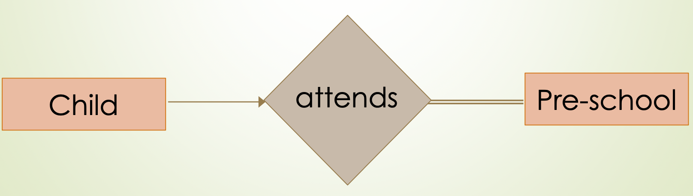

>eg:Employees work for companies
>
>-   An employee must be employed by someone (or they wouldn’t be an
>
>employee) 每个员工都必须有公司，必须实现works_for
>
>-   People often have more than one job 每个员工都必须有员工
>-   二者没有one
>-   的限制，即多对多
>
>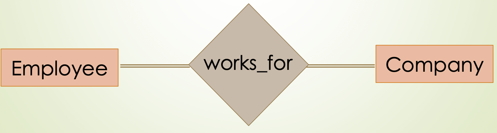

### Extended ER Model

#### Weak Entities 弱实体

弱实体简单来说就是完全依赖另一方的实体

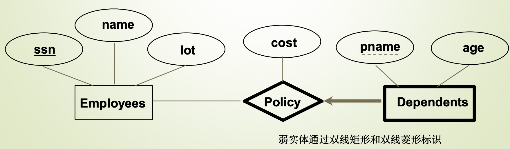

#### ISA (‘is a’) Hierarchies 继承

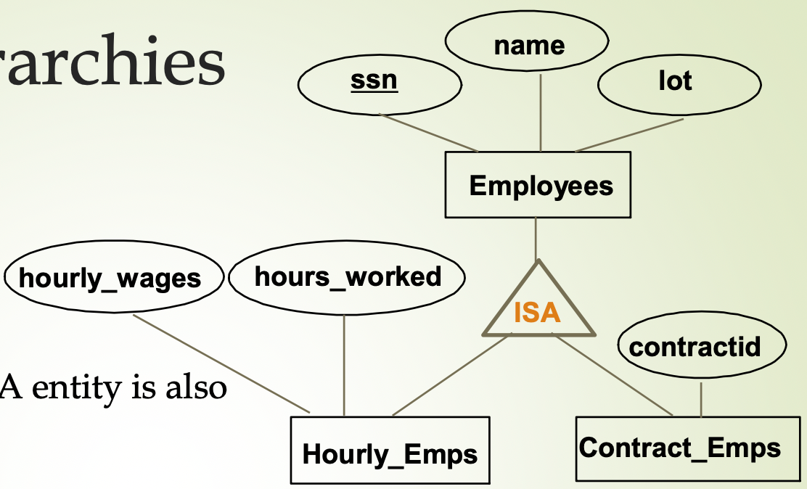

#### Aggregation 聚和

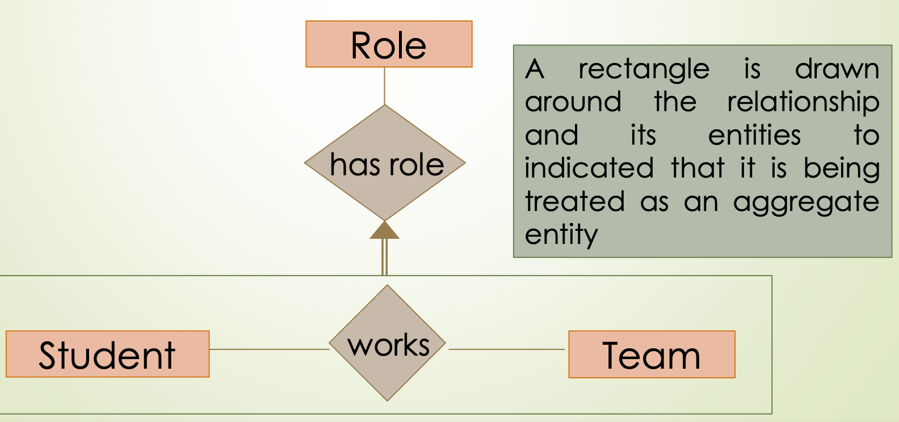

## ER-to-SQL

### 删除策略

```sql
CREATE TABLE 子表 (
    id INTEGER PRIMARY KEY,
    main_id INTEGER,
    -- 外键约束，联级删除
    FOREIGN KEY (main_id) REFERENCES 主表(id) ON DELETE CASCADE
);
```

+ CASCAD  
`ON DELETE CASCADE`
+ SET NULL   
`ON DELETE SET NULL`
+ SET DEFAULT  +
`ON DELETE SET DEFAULT`
+  RESTRICT 如果从表中有引用该记录的数据，删除操作会被阻止  
`ON DELETE RESTRICT`

### 基本方法

对于强制是否存在，主要靠外键是否为空+删除策略来规定

**一对一 两方必须存在/一对一 一方必须存在**

每一个实体都对应转化为一张SQL表，并选择“可以容忍自己没有对应元素”作为主表（因为主表不存外键），把它的主键放入另一个实体对应的SQL表中作为外键，外键不允许为空，联级删除选择CASCAD

**一对一 两方都可选**

任意选择一张表为主表，把它的主键放入另一个实体对应的SQL表中作为外键，外键允许为空，联级删除选择 SET NULL

**一对多 两实体都为强制存在 / WEAK ENTITES**

将 多 的实体（例如在部门员工表中：一个员工只能指向一个部门，一个部门可以被多个员工指，此时部门就是“多”）设置为主表，把它的主键放入另一个实体对应的SQL表中作为外键，外键不允许为空，联级删除选择CASCAD

**一对多 两方都可选**

将 多 的实体设置为主表，把它的主键放入另一个实体对应的SQL表中作为外键，外键允许为空，联级删除选择 **SET NULL**

**多对多**

需要一张新关系表包含两个实体的主键。无论两边实体是否为可选存在的，其转化形式一致，关系表中的外键列不能为NULL。

## Relational Algebra

### Relational Algebra Operations

- **Basic operations**:
  - **Selection** ($\sigma$): Selects a subset of rows from a relation.
      - $\sigma_{Iname=Summer}(Customer)$
  - **Projection** ($\pi$): Selects a subset of columns from a relation.
      选择列
  - **Cross-product** ($\times$): Allows us to combine two relations.
  - **Set-difference** ($-$): Tuples in relation 1, but not in relation 2.
  - **Union** ($\cup$): Tuples in relation 1 and in relation 2.
- **Additional derived operations**:
  - **Intersection**
  - **join** （$\bowtie$）
    eg：$S1 \bowtie_{S1.sid < R1.sid} R1$
    from S1, R1 where S1.sid<R1.sid
  - **division** ($\div$)
  - **renaming** ($C$/$\rho$ )
    eg:  $\rho_{newName/oldName}(Relation)$
    - Not essential, but very useful.
- **Note**: Since each operation returns a relation, operations can be *composed*!
    注意：每个操作都返回关系，因此可以组合操作！

### Natural Join

Equi-join on all common fields. 在所有共同字段上进行等值连接。

### Division

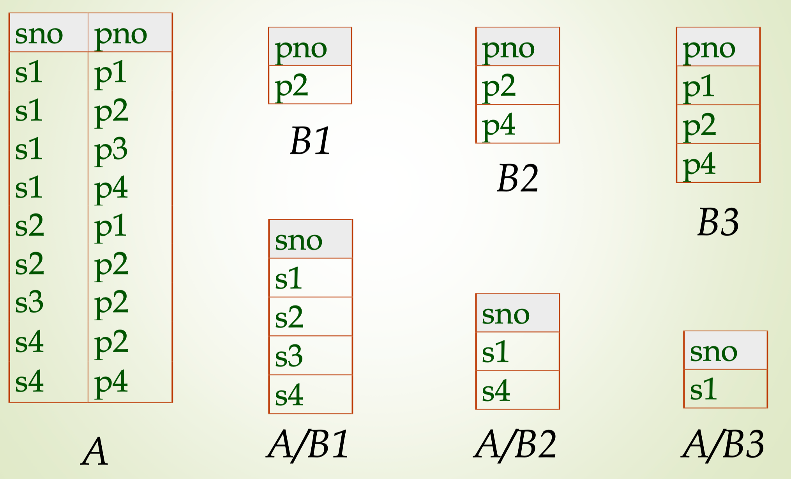

**eg: Find the names of sailors who’ve reserved all boats**

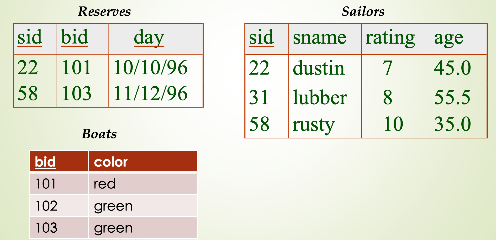

利用除法实现查找“所有”的功能

$\pi_{\text{sid}} (\text{Reserves}) \div \pi_{\text{bid}} (\text{Boats})$

### Skills

**How to use algebra to expree `select max(value) from T group by name` ?**

使用笛卡尔积+减
$$
A:=\pi_{name,value}(T)\\
B:=\rho_{(name,value,name',value')} (T \times T)\\
C:=\pi_{name,value}(\sigma_{name=name' \and value<value'}(B))\\
Result=A-C
$$
**How to translate algebra $\div$ to SQL?**

1.   **Table A** (EmployeeSkills): Stores EmployeeID and Skill each employee possesses.

2.   **Table B** (RequiredSkills): Stores Skill values that represent the required skills.

```sql
SELECT DISTINCT A.EmployeeID
FROM EmployeeSkills A
WHERE NOT EXISTS (
    SELECT *
    FROM RequiredSkills B
    WHERE NOT EXISTS (
        SELECT *
        FROM EmployeeSkills A2
        WHERE A2.EmployeeID = A.EmployeeID
          AND A2.Skill = B.Skill
    )
);
```

or using inner join and count(distinct )

```sql
SELECT A.EmployeeID
FROM EmployeeSkills A
JOIN RequiredSkills B ON A.Skill = B.Skill
GROUP BY A.EmployeeID
HAVING COUNT(DISTINCT A.Skill) = (SELECT COUNT(*) FROM RequiredSkills);
```


## Design Theory

### Target

Avoid anomalies 避免异常

### Anomaly Kinds

-   数据冗余 redundant
-   更新异常 update anomaly
-   删除异常 delete anomaly
-   插入异常 insert anomaly

### Normal Forms

-   1NF: All table are flat
-   2NF: 1NF & No non-prime attribute FD part candidate key
    要求实体的属性完全依赖于主关键字
-   3NF: 2NF & no Transitive Dependency
    无传递依赖
-   BCNF: no bad FDs

### Functional Dependency (FD)

We write $A \to  B$ or say $A$ functionally determines $B$ if, 

for **any tuples** $t1$ and $t2$ :

$t1 [A] = t2 [A] \ implies \  t1 [B] = t2 [B]$

and we call $A \to  B$ a functional dependency

A的值可以直接决定B的是什么，则B依赖于A

#### example

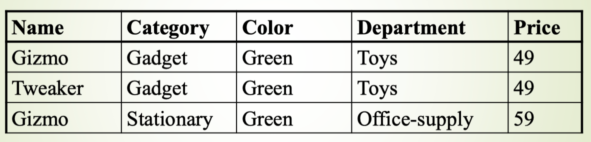

-   Name -> Color : FD holds
-   Name -> Price : FD dose not hold
    eg: Gizmo have two diff Departments
-   Category -> Department : DF holds
-   Color, Category -> Price

Because of `Name -> Color`  `Category -> Department`  `Color, Category -> Price` We can infer that `Name, Category -> Price`, 可以看出一种传递依赖

### Inferred FDs

#### Split/Combine

$$
\begin{align*}
&A_1, \ldots, A_m \rightarrow B_1, \ldots, B_n \\
&\text{is equivalent to the following } n \text{ FDs:} \\
&A_1, \ldots, A_m \rightarrow B_i \quad \text{for } i=1, \ldots, n
\end{align*}
$$

And vice-versa
$$
\begin{align*}
&A_1, \ldots, A_m \rightarrow B_i \quad \text{for } i=1, \ldots, n \\
&\text{is equivalent to the following } n \text{ FDs:} \\
&A_1, \ldots, A_m \rightarrow B_1, \ldots, B_n
\end{align*}
$$


#### Reduction/Tricial

$$
A_1, \ldots, A_m \rightarrow A_j \quad \text{for any } j=1, \ldots, m
$$


#### Transitive

$$
\begin{align*}
&A_1, \ldots, A_m \rightarrow B_1, \ldots, B_n \text{ and } B_1, \ldots, B_n \rightarrow C_1, \ldots, C_k
\\
&\text{implies}\\
&A_1, \ldots, A_m \rightarrow C_1, \ldots, C_k
\end{align*}
$$

#### example

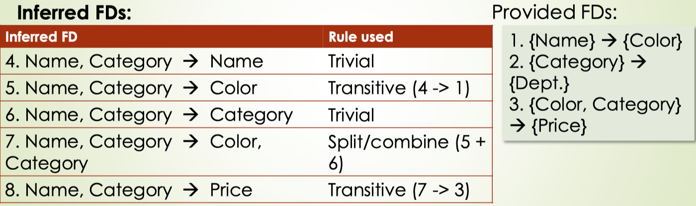

### Closure 

#### example

$$
\textbf{Example:} \quad F = 
\begin{cases}
    \text{name} \rightarrow \text{color} \\
    \text{category} \rightarrow \text{department} \\
    \text{color, category} \rightarrow \text{price}
\end{cases}
$$

$$
\textbf{Closures:}\\
\begin{align*}
&\{ \text{name} \}^+ = \{ \text{name, color} \} \\
&\{ \text{name, category} \}^+ = \{ \text{name, category, color, dept, price} \} \\
&\{ \text{color} \}^+ = \{ \text{color} \}
\end{align*}
$$

#### Algorithm to find $X^+$

$$
\begin{align*}
&\textbf{Start } with \text{ } X = \{ A_1, \ldots, A_n \}, \text{ FDs } F. \\
&\textbf{Repeat until} \text{ X doesn't change;} \\
&\textbf{do:} \\
&\quad \textbf{if} \{ B_1, \ldots, B_n \} \rightarrow C \text{ is in } F \\
&\quad \textbf{and} \{ B_1, \ldots, B_n \} \subseteq X: \\
&\quad \quad \textbf{then} \text{ add } C \text{ to } X. \\
&\textbf{Return} \text{ } X \text{ as } X^+.
\end{align*}
$$

#### Non-trivial FD

非平凡函数依赖（non-trivial functional dependency）是指函数依赖 $X \rightarrow Y$ 中的右手边  Y  不包含在左手边  X  中的情况。换句话说，Y 中的元素不在 X 中出现

### Exercise - find all FDs implied by the given FDs

Find all **non-trivial functional dependency** implied by
$$
\begin{align*}
A, B &\rightarrow C \\
A, D &\rightarrow B \\
B &\rightarrow D
\end{align*}
$$
**Requirements:**

1.  Non-trivial FDs (we avoid reflexive dependencies like $A,B→A$ ).
2.  Each FD must have a **single attribute** on the right-hand side.

Solove:

1.   Compute Attribute Closures, and get new FDs from Closures by `Inferred FDs` methods, especially using `Split`

2.   Identify Non-Redundant FDs

https://chatgpt.com/share/671ffa9a-e5b8-8008-820b-ddbb74006e93

### FDs to Candidate keys

按以下步骤求Candidate keys：

1.   只在FD右部出现的属性，不属于候选码;
2.   只在FD左部出现的属性，一定存在于某候选码当中;
3.   其他属性逐个与2,3的属性组合，求属性闭包，直至X的闭包等于U(全部元素),若等于U,则X为候选码。

 ### “Good” vs. “Bad” FDs

What is “Bad” FDs? and what is 2NF/3NF/BFNF? 

-   Partial Dependency 部分依赖 (2NF) ：

某些非主属性依赖于主键的一部分，而不是整个主键
$$
\begin{align*}
A, B &\rightarrow C \\
B &\rightarrow D \text{ (Bad FDs)}
\end{align*}
$$

-   Transitive Dependency 传递依赖 (3NF)：

**3NF:**

-   First, it should be in 2NF 
-   No **non-prime attribute**非主属性 should be transitively dependent on the Key of the table.

**非主属性**依赖于**另一个非主属性**，而这个非主属性又依赖于主键

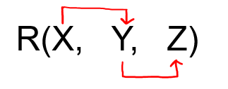

X is prime attribute, Y Z is non-prime attribute:
$$
\begin{align*}
X & \text{ is Primary key}\\
X &\rightarrow Y \\
Y &\rightarrow Z \text{ (Bad FDs)}
\end{align*}
$$

-   Non-Candidate Key Dependencies 存在非候选键依赖项 （BCNF）：

存在非平凡函数依赖的左手边（决定因素）不是是候选键的情况
$$
\begin{align*}
\\
A, B &\rightarrow C \text{  (A and B} \text{ is Primary key)}\\
C &\rightarrow A 
\text{  (Bad FDs, because C is not Primary key)}
\end{align*}
$$

### BCNF Decomposition Algorithm

$$
\begin{align*}
&\textbf{BCNFDecomp(R):}  \\
&\quad \text{Find a non-trivial bad FD: }  X \rightarrow Y \\
&\quad \textbf{if} \, \text{(not found) } \\ 
&\quad \quad \textbf{then Return} \, R \\
&\quad \textbf{Split} \, R \, \text{ into } \, X^+ \,  \text{and } \, [X+[\text{rest attributes}] ] \\
& \quad \quad \text{ as } R_1 \text{ and }R_2\\
&\quad \textbf{Return } \,  \text{BCNFDecomp}(R_1), \, \text{BCNFDecomp}(R_2)
\end{align*}
$$

#### example

$$
\begin{align*}
R(A,B&,C,D,E)\\
\{C\} &\rightarrow \{D\} \\
\{A\} &\rightarrow \{B, C\} 
\end{align*}
$$

```
BCNFDecomp(R(A, B, C, D, E)):
for FD:
  1.try {C} -> {D}
    C+ = {C, D} 
    as for R(A, B, C, D, E)
      {C, D} in C+, {A, B, E} not in C+ 
    split R(A, B, C, D, E) into
      R(C, D) and R(C, A, B, E)
    return BCNFDecomp(R(C, D)) 
      and BCNFDecomp(R(A, B, C, E))
      		
      		
BCNFDecomp(R(C, D)):
for FD:
  1.try {C} -> {D}
    C+ = {C, D} 
    as for R(C, D)
    	{C, D} in C+, {} not in C+ 
    can't split
    
  2.try {A} -> {B,C}
  	A+ = {A, B, C, D}
  	as for R(C, D)
  		{C, D} in A+, {} not in A+ 
  		can't split
  		
  return R(C, D)
  
  
BCNFDecomp(R(A, B, C, E)):
for FD:
  1.try {C} -> {D}
    C+ = {C, D} 
    as for R(A, B, C, E)
      {C} in C+, {A, B, E} not in C+ 
    can't split, because split is meanless
    
  2.try {A} -> {B,C}
  	A+ = {A, B, C, D}
  	as for R(A, B, C, E)
  		{A, B, C} in A+, {E} not in A+ 
    split R(A, B, C, D, E) into
      R(A, B, C) and R(A, E)
    return BCNFDecomp(R(A, B, C)) 
      and BCNFDecomp(R(A, E))
      
      
BCNFDecomp(R(A, B, C)):
for FD:
  1.try {C} -> {D}
    C+ = {C, D} 
    as for R(A, B, C):
    	{C} in C+, {A, B} not in C+ 
    can't split, because split is meanless
    
  2.try {A} -> {B,C}
  	A+ = {A, B, C, D}
  	as for R(A, B, C):
  		{A, B, C} in A+, {}
			can't split
			
  return R(A, B, C)
			
			
BCNFDecomp(R(A, E)):
  1.try {C} -> {D}
    C+ = {C, D} 
    as for R(A, E):
    	{} in C+, {A, E} not in C+ 
    can't split
    
  2.try {A} -> {B,C}
  	A+ = {A, B, C, D}
  	as for R(A, E):
  		{A} in A+, {E} not in A+
			can't split, because split is meanless
			
  return R(A, E)
```


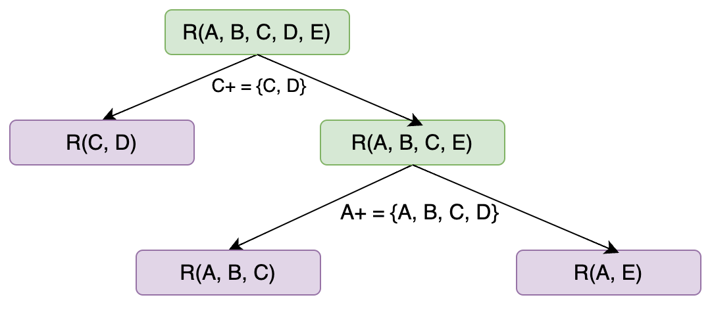

Answer: {C, D} {A, B, C} {A, E}

### A Problem with BCNF

$$
\begin{align*}
A &\rightarrow B \\
B,C &\rightarrow A 
\end{align*}
$$

If we use `BCNFDecomp(R(A, B, C))` : {A, B} {A, C}

We lose the FD : $B,C \rightarrow A$

THE ANSWER IS THAT: One can always losslessly decompose to 3NF while preserving FDs **but BCNF might not preserve them**.
3NF的转换可以做到无损，但是BCNF可能会丢失依赖

>   Refrence: https://stackoverflow.com/questions/23965143/converting-3nf-to-bcnf-when-there-is-a-circular-dependency