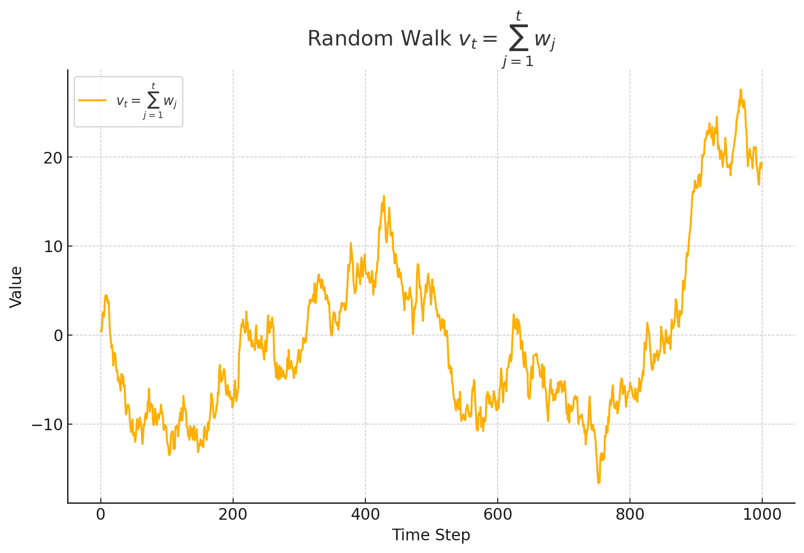
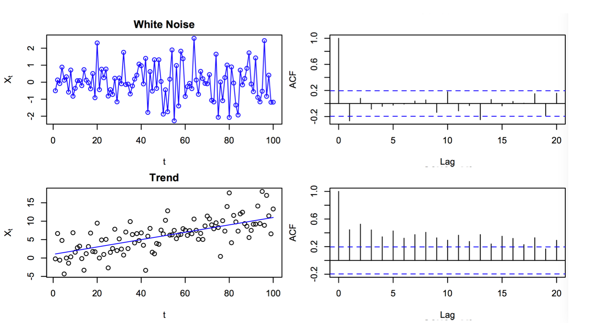
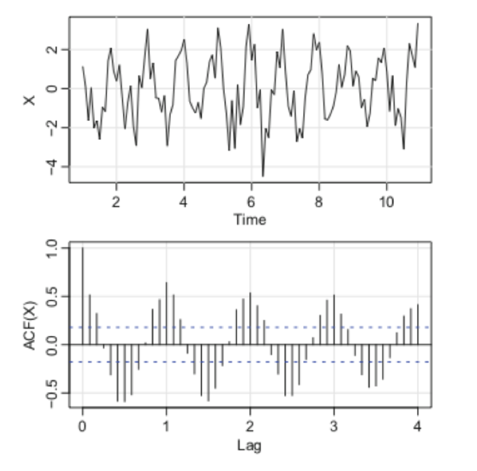
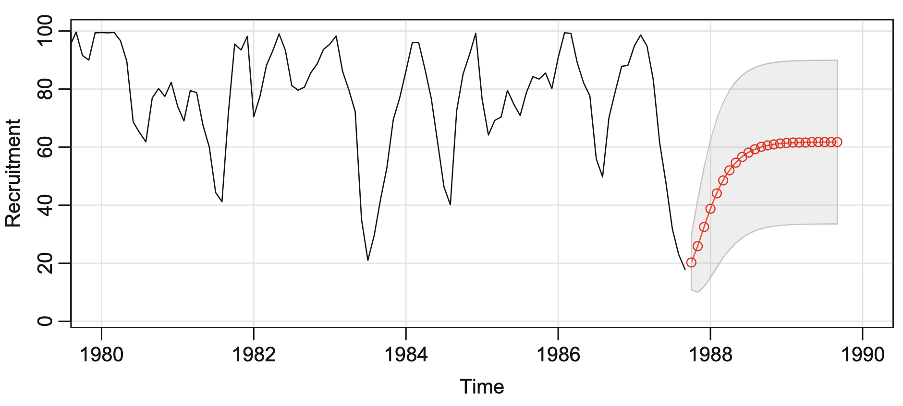
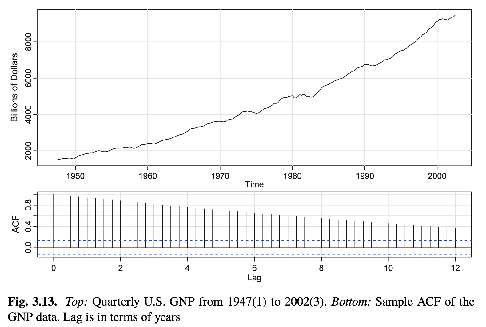
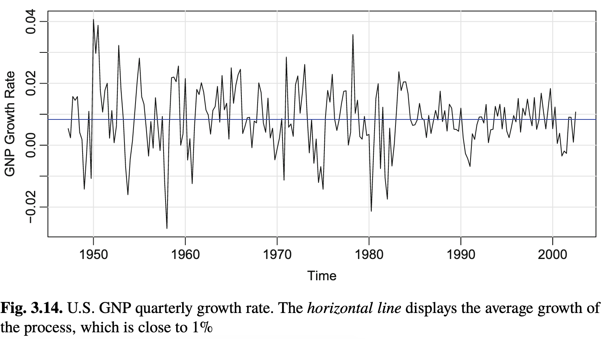
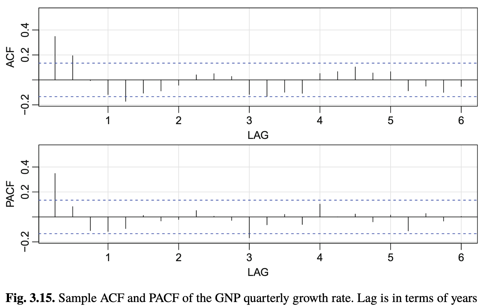

# SDSC6012

## References

-   Shumway, R. H., & Stoffer, D. S. (2017). *Time Series Analysis and Its Applications : With R Examples* (4th ed. 2017.). Springer International Publishing. https://doi.org/10.1007/978-3-319-52452-8

>   CityU library 可以下载PDF版本 [点击直达](https://julac-cuh.primo.exlibrisgroup.com/permalink/852JULAC_CUH/vit3jk/alma991029209361403408)

-   Course SDSC6012 slides
-   ChatGPT 4o
-   My Thinking …

## Lecture1

时间序列分析的目标：描述、预测、控制和假设检验

### 时序中的随机变量

- 随机变量: 随机变量 $X$ 是一个函数，它将一个样本空间中的事件映射到实数（或其他数值）。其值是随机的，即它的取值受某个概率分布的控制
- 在时间序列分析中，**随机变量 $X_t$** 是指时间序列的每一个观察值，**它在每个时间点上是随机的，并且其值遵循某个概率分布**

### Stochastic process 随机过程

- ${X_t}$ 按照时间索引的过程就是随机过程
- 是一种建模方法，研究不同时间点的关系
- The observed values of a stochastic process are referred to as a _realization_ of the stochastic process. 也就是说，我们在某个时间序列中看到的数据只是随机过程的一个实现realization
- An _observed time series_ is considered to be _one realization_ of a stochastic process. 观测到的时间序列是随机过程的一种实现

> 什么叫“随机过程”？这个随机和random有关系吗？
>
> GPT：
>
> “随机过程”中的“随机”确实与“random”（随机）有关。它指的是一个随时间演变的系统或现象，其中的结果不是确定的，而是随机的。每个时刻的数据点（或状态）是由一组随机变量表示的。
> 
> 具体来说，“随机过程”是指一个按时间顺序排列的随机变量集合，表示某个系统或现象在时间上的变化。由于这些随机变量的结果是不可预知的，所以我们说它是“随机”的。这与“random”一词的含义一致，指的是结果或状态是通过某种概率分布产生的，而不是确定的。
> 
> 例如，股票价格、天气变化、人口增长等都可以用随机过程来描述。它们在不同时间点的值是由多个因素影响的，并且这些值无法完全预测，因此被视为“随机”的。
> 
> 总结来说，随机过程是描述系统或现象如何在时间上以随机方式变化的数学模型，其中的“随机”与“random”密切相关，表示不确定性和概率性。

### 随机过程 vs. 随机变量：

在时间序列分析中，我们通常处理的是**随机过程$\{X_t\}$ (注意有大括号,是多个变量)**，**它是随时间变化的随机变量序列$X_t$ (注意这是一个变量,没有大括号)**

> 换言之: 多个会变化的**随机变量$X_t$**,并且变化是以时间为维度的,就变成了**随机过程$\{X_t\}$**

假设有一个随机过程$\{X_t\}$ ，每个时间点$t$上我们都观察到一个随机变量$X_t$ 

#### 相关符号

- $\{X_t\}$ 随机过程
- $X_t$ 在随机过程$t$中的一个**随机变量**
- $x_t$ 是一个随机过程$t$中的一个**观测值**

### White noise 白噪声

白噪声是一种随机信号，其中各个时间点上的值都是彼此不相关的，也就是这些随机变量之间没有相关性。

它的**自相关函数是零**，表示在不同时间点的信号是完全独立的。

$w_t \sim \text{wn}(0, \sigma_w^2)$

### Gaussian white noise 高斯白噪声

一种特殊的白噪声,保证噪声的分布满足正态分布

$w_t \sim \text{N}(0, \sigma_w^2)$

#### 相关符号
- $w_t$ 白噪声
- $\sigma_w^2$ 方差
- $wn$ 白噪声
- $N(0, \sigma_w^2)$ 正态分布

### Time series modeling 时间序列模型

时间序列模型的基本结构可以表示为：

$$
x_t = m_t + s_t + e_t
$$

其中：
- $x_t$ 表示时间序列的**观测值**；
> 注意是观测值, 这就是为什么是小x而不是大X
- $m_t$ 是**趋势成分**（trend component），表示时间序列的长期变化趋势；
- $s_t$ 是**季节性成分**（seasonal component），表示时间序列的周期性波动（如季节、月度变化等）；
- $e_t$ 是**残差**（residual），表示无法通过趋势或季节性成分解释的随机噪声或误差, 例如$w_t$。

这个模型将时间序列分解为三个部分，以便更好地理解和预测时间序列的行为。

> 噪声属于什么部分？
> 
> GPT:
> 
> 在时间序列模型中，**噪声**属于公式中的**残差部分**（residual），即 $e_t$ 。残差代表的是时间序列中无法通过趋势（$m_t$）和季节性成分（$s_t$）解释的部分。
>
> 具体来说：
> - **噪声（noise）** 是指时间序列中由于随机因素产生的波动或误差，通常被视为不可预测的随机变化。
> - **残差（residual）** 是实际观测值与模型预测值之间的差异，包括噪声成分。
>
> 因此，在时间序列模型 $x_t = m_t + s_t + e_t$ 中，**噪声就是 $e_t$**，它通常表示为服从某种概率分布的随机变量（如白噪声、高斯白噪声等），是建模过程中用来描述不规则波动的重要部分。

### 均值性质

- 均值具有线性性(线性性)

$E(aX+bY)=aE(X)+bE(Y)$

- 常数的期望即本身(常数性)

$E(c)=c$

- **独立随机变量和**的 _均值_ == **独立随机变量均值**的 _和_ (独立性)

$E\left( \frac{1}{n} \sum_{i=1}^{n} X_i \right) = \frac{1}{n} \sum_{i=1}^{n} E(X_i)$

-   **独立随机变量积**的 *均值* == **独立随机变量均值**的 *积* (独立性)

$E(X_1 X_2 \dots X_n) = E(X_1) \cdot E(X_2) \cdot \dots \cdot E(X_n)$

### 均值与随机过程

#### Moving Average Series

$v_t=\frac{1}{3}(w_{t-1}+w_{t}+w_{t+1})$

$E(v_t)?$

根据均值的线性性,可得:

$$
\begin{align}
E(v_t) &= \frac{1}{3} E(w_{t-1} + w_t + w_{t+1}) \\
       &= \frac{1}{3} E(w_{t-1}) + \frac{1}{3} E(w_t) + \frac{1}{3} E(w_{t+1}) \\
       &= 0
\end{align}
$$

**性质：⽆论多少个⽆关噪声求和，期望都是0**

#### Random Walk with Drift

$x_t = \delta t + \sum_{j=1}^{t} w_j$

$E(x_t)?$

**注意这里$t$是一个固定的时间索引,需要看成常数!**

根据均值的线性性与常数型,可得

$$
\begin{align}
E(x_t) &= E\left( \delta t + \sum_{j=1}^{t} w_j \right) \\
       &= \delta t + \sum_{j=1}^{t} E(w_j) \\
       &= \delta t
\end{align}
$$

**性质:在具有线性趋势的时间序列模型中，期望值反映的是时间序列的趋势部分，而不受随机噪声的影响**

#### Signal Plus Noise

$x_t = A \cos(2 \pi \omega t + \phi) + w_t$

$E(x_t)?$

与上个Example一样,同样t也是看成常数

$$
\begin{align}
E(x_t) &= E\left( A \cos(2 \pi \omega t + \phi) + w_t \right) \\
&= A \cos(2 \pi \omega t + \phi) + E(w_t)\\
&= A \cos(2 \pi \omega t + \phi)
\end{align}
$$

**噪声不会影响时间序列的期望值**

### 协方差

#### 协方差的定义

协方差 $\text{Cov}(X, Y)$ 是一种用来衡量两个随机变量之间线性关系的统计量。它反映了两个变量如何一起变化。

$\text{Cov}(X, Y) = \mathbb{E}[(X - \mathbb{E}[X])(Y - \mathbb{E}[Y])]$

- $\mathbb{E}[X]$ 和 $\mathbb{E}[Y]$ 分别是随机变量 $X$ 和 $Y$ 的期望值
- $(X - \mathbb{E}[X])$ 表示随机变量 $X$ 偏离其期望值的程度
- $(Y - \mathbb{E}[Y])$ 表示随机变量 $Y$ 偏离其期望值的程度
- 协方差实际上是对 $(X - \mathbb{E}[X])$ 和 $(Y - \mathbb{E}[Y])$ 这两个偏差的乘积的期望

#### 均值的平方转换为方差/协方差

在  $\mathbb{E}[X] = 0$  时，可以将  $\mathbb{E}[X^2]$  转换为  $\text{Var}(X)$

尤其在：  

$$
\mathbb{E}[w_t^2] = \sigma_w^2
$$

#### 协方差的意义

- 如果协方差为正，意味着这两个变量趋向于同方向变化
- 如果协方差为负，意味着它们趋向于相反方向变化
- 如果协方差接近 0，意味着两个变量之间没有线性关系

### 协方差的性质

1. 对称性

$\text{Cov}(X, Y) = \text{Cov}(Y, X)$

2. 退化方差

方差是协方差的特例。当 $X = Y$ 时，协方差就是随机变量的方差：

$\text{Cov}(X, X) = \text{Var}(X)$

3. 缩放不变性

假设 $a$ 和 $b$ 是常数，则：

$\text{Cov}(aX + b, Y) = a \cdot \text{Cov}(X, Y)$

这意味着，如果对一个随机变量进行线性变换，它的协方差会按比例缩放

同样的，**常数不会影响协方差和的值**

4. 分配性质

对于三个随机变量 $X$、$Y$ 和 $Z$

$\text{Cov}(X + Y, Z) = \text{Cov}(X, Z) + \text{Cov}(Y, Z)$

$\text{Cov}(X, Y + Z) = \text{Cov}(X, Y) + \text{Cov}(X, Z)$

### Autocovariance function 自协方差函数 $\gamma(s,t)$

用于衡量相关性

$\mathbf{\gamma(s,t)} = \text{Cov}(X_s, X_t) = E[(X_s - \mu_s)(X_t - \mu_t)]$ 

是用来衡量**同一随机过程**中不同**时间点**对应的**随机变量**之间的线性相关性

> 为什么时间点之间可以衡量协方差？衡量协方差不应该是利用随机变量，代表的是多个值吗？
>
>
> 虽然 $s$ 和 $t$ 表示的是时间点, 但是对于随机过程$\{X_t\}$来说, $s$ 和 $t$ 代表的是 $X_s$ 和 $X_t$ 随机变量, 但是实际上我们关心的是$X_s$ 和 $X_t$ 随机变量之间的协方差

- 当$\gamma(s,t) = 0$ 代表无相关性
- 当 $s=t$ ，协方差退化为方差

> 为什么当 $s=t$ ，协方差退化为方差?
>
> 从公式理解:
>
> $\mu_s = E[X_s]$
> 
> $Var(X_s)=E[(X_s-E[X_s])^2]=E[(X_s - \mu_s)(X_s - \mu_s)=Cov(X_s,X_s)$
>
> 从意义理解:
>
> 协方差衡量的是两个不同随机变量之间的关系。当我们讨论同一个随机变量的协方差（即 $s = t$），这个度量变成了它**自身**随机变量的波动性，即方差

### 协方差与随机过程

####  Example1 - white noise

$\text{white noise } \{w_t\}$  

$\gamma(s,t)?$

- 当$s=t$ 时, 方差退化成**协方差**

$\gamma(s,s)=Cov(w_s,w_s)=Var(w_s)=\sigma ^2$

- 当$s\neq t$ 时, **由于白噪声在不同时间点中是互相独立的**
  

$\gamma(s,r)=Cov(w_s,w_r)=0$

> 或者我们利用公式推导:
>
> $Cov(w_s,w_r)=E[(w_s - \mu_s)(w_r - \mu_r)]$
>
> 由于$w_s = \mu_s$, $w_r = \mu_r$
>
> $Cov(w_s,w_r)=0$

#### Example2 

$v_t=\frac{1}{3}(w_{t-1}+w_{t}+w_{t+1})$

$\gamma(s,t)?$

$$
\begin{align}
\gamma(s,t)&=\text{cov}(v_s,v_t)\\
&=\text{cov} \{\frac{1}{3}(w_{s-1}+_{s}+w_{s+1}),\frac{1}{3}(w_{t-1}+w_{t}+w_{t+1})\}\\ 
\end{align}
$$

根据缩放不变形,各提取$\frac{1}{3}$

$$
\begin{align}
\gamma(s,t)
&=\text{cov} \{\frac{1}{3}(w_{s-1}+_{s}+w_{s+1}),\frac{1}{3}(w_{t-1}+w_{t}+w_{t+1})\}\\ 
&=\frac{1}{9}\text{cov} \{(w_{s-1}+w_{s}+w_{s+1}),(w_{t-1}+w_{t}+w_{t+1})\}
\end{align}
$$

根据协方差的分配性质

$$
\gamma(s, t) = \frac{1}{9} \left( \text{Cov}(w_{s-1}, w_{t-1}) + \text{Cov}(w_{s-1}, w_t) + \text{Cov}(w_{s-1}, w_{t+1}) + \cdots \right)
$$

这是一个对所有组合 $(w_{s-1}, w_{t-1})$、$(w_s, w_t)$ 等的协方差求和的过程

由 [Example1](#CovExample1) 我们知道, **对于白噪声, 任意不同时刻的协方差都为0**, 换言之, 在所有组合中, **只有时间相等的协方差为非0, 且为$\sigma^2$**

- 当 $s=t$ 时

$$
\gamma(t, t) = \frac{1}{9} \left( \text{cov}(w_{t-1}, w_{t-1}) + \text{cov}(w_t, w_t) + \text{cov}(w_{t+1}, w_{t+1}) \right)
= \frac{3}{9} \sigma_w^2
$$

- 当$s=t+1 / s=t-1$ 时

$$
\gamma(t + 1, t) = \frac{1}{9} \left[ \text{cov}(w_t, w_t) + \text{cov}(w_{t+1}, w_{t+1}) \right]
= \frac{2}{9} \sigma_w^2
$$

- 当$s=t+2 / s=t-2$ 时

$$
\gamma(t + 2, t)
= \frac{1}{9} \text{cov}(w_{t+1}, w_{t+1})
= \frac{1}{9} \sigma_w^2
$$

综上:

$$
\gamma(s, t) = \begin{cases} 
\frac{3}{9} \sigma_w^2 & s = t, \\
\frac{2}{9} \sigma_w^2 & |s - t| = 1, \\
\frac{1}{9} \sigma_w^2 & |s - t| = 2, \\
0 & |s - t| > 2 
\end{cases}
$$

####  Example3 - random walk

$\text{random walk }v_t = \sum_{j=1}^{t} w_j$

$\gamma(s,t)?$

$v_t$ 是多个白噪声的求和, $s , t$ 代表求和的时间长度

由 [Example2](#CovExample2) 我们知道, 要求多个白噪声对应随机变量的协方差, 只需要看在数轴上重合了多少个点

$$
\gamma(s, t) = \text{cov}(x_s, x_t) = \text{cov} \left( \sum_{j=1}^{s} w_j, \sum_{k=1}^{t} w_k \right)
= \min\{s, t\} \sigma_w^2
$$

直观理解 *随机游走 random walk* ：

某个变量（如价格、位置等）从一个初始点开始，每一步都根据一个随机增量进行更新。这个增量可能是正的也可能是负的，因此随机游走的轨迹看起来像是一条无规则的曲线。

**随机游走的方差随着时间增加而增大。因此，随机游走的统计特性不是恒定的**。

## Lecture2

### Strict stationarity 严格平稳性

定义：当满足$\forall h , \forall k$（任意h、k）:
$$
(x_{t_1}, \dots, x_{t_k}) \quad \text{and} \quad (x_{t_1+h}, \dots, x_{t_k+h})
$$
有相同的联合分布的时候，时间序列 ${X_t}$ 被称为严格平稳（或强平稳）

通常利用公式：
$$
\mathbb{P}\{x_{t_1} \leq c_1, \dots, x_{t_k} \leq c_k\} = \mathbb{P}\{x_{t_1+h} \leq c_1, \dots, x_{t_k+h} \leq c_k\}
$$
来表示。

这种时间平移不影响联合分布的性质，**这也意味着时间序列的所有统计特性（如均值、方差、协方差等）不会随着时间的变化而改变**。

>   为什么 $\mathbb{P}$ 中仅仅要求“小于某个值 $c$”？
>
>   GPT:
>
>   这是因为在概率论中，事件通常是用不等式表示的。比如说，表示随机变量xt，落在某个范围之内的概率，我们通常用 $x_{t_1}≤ c1$  这样的不等式来描述。它表示“时间点 $t_1$ 处的随机变量 $X_{t_1}$，小于等于 $c_1$ 的概率“。类似地，公式中表达的是多个随机变量同时满足某些不等式的概率。
>
>   对于严格平稳性来说，关心的是这些随机变量在不同时间点是否有相同的联合分布。通过不等式 $\mathbb{P}\{x_{t_1} \leq c_1, \dots, x_{t_k} \leq c_k\}$，我们可以测量在多个时间点上这些变量同时满足条件的概率。如果这些概率在任何时间偏移$h$下都相等，那么我们就说这个时间序列是严格平稳的。

>   为什么严格平稳性是要求联合分布的概率相同，⽽不是⽅差和均值？
>
>   GPT：
>
>   严格平稳性要求联合分布的概率相同，而不仅仅是均值和方差相同，是因为它关注随机过程的完整统计特性。均值和方差只是部分特征，无法完全描述过程的行为，而联合分布包含了所有可能的统计信息，确保了过程在时间上的一致性。严格平稳性因此为分析和预测随机过程提供了一个更强大和全面的框架。

严格平稳性和相关性的关系：

推导过程：从多维联合分布到二维联合分布（$k=2$）
$$
\begin{align}

\mathbb{P}\{x_{t_1} \leq c_1, \dots, x_{t_k} \leq c_k\} &= \mathbb{P}\{x_{t_1+h} \leq c_1, \dots, x_{t_k+h} \leq c_k\} \\
&\Downarrow (k=2,t_1=s,t_2=t)\\
\mathbb{P}\{x_s \leq c_1, x_t \leq c_2\} &= \mathbb{P}\{x_{s+h} \leq c_1, x_{t+h} \leq c_2\} \\
&\Downarrow\\
\gamma(s, t) &= \gamma(s+h, t+h)
\end{align}
$$

### Weak stationarity 弱平稳性

与严格平稳性相比，弱平稳性对时间序列的约束条件较少，而不需要每个时间点的联合分布都保持不变。

定义：时间序列 $\{X_t\}$ 被称为弱平稳的，如果满足以下条件：

1.   均值独立于时间

$$
E[X_t]=μ\ ,\ \forall t
$$

2.   协方差只依赖于时间间隔

$$
\gamma(s, t) = \gamma(s+h, t+h)
$$

### 自协方差函数 $\gamma(h)$

**假设时间序列是平稳的**

公式定义：
$$
\gamma(h) = \gamma (t,t+h)= \text{Cov}(X_t, X_{t+h}) = \mathbb{E}[(X_t - \mu)(X_{t+h} - \mu)]
$$
其中：

-   $h$ 是时间差（lag），表示两个时刻之间的时间间隔
-   $\mu$ 是时间序列的均值，假设时间序列是**弱平稳**的（均值不随时间变化）

###  $\gamma(h)$ 的性质

1.   $\gamma(0) \geq 0$
2.     $|\gamma(h)|\leq r(0)$  
     协方差永远不可能与自己的协方差(方差)更大， 换言之自己与自己的相关性永远更大
3.   $\gamma(h)=\gamma(-h)$
     由于协方差性质$Cov(X,Y)=Cov(Y,X)$，可得自协方差具有对称性

#### 时间序列乘积转换为$\gamma(h)$ 

时间序列 $x_t$ 满足弱平稳性条件时，$E(x_tx_{t+h})=\gamma(h)$

> 在PACF的时候会利用这个公式
### Autocorrelation Function 自相关函数 ACF

定义：

随机过程$\{X_t\}$的自相关函数 **ACF**  $\rho(h)$ 衡量的是**平稳时间序列**在滞后h个时间单位时的相关性。其定义如下：
$$
\rho(h)=\frac{\gamma(t + h, t)}{\sqrt{\gamma(t + h, t + h) \gamma(t, t)}} = \frac{\gamma(h)}{\gamma(0)}
$$

>   为什么不是$\rho(h)=\frac{\gamma(t+h)}{\gamma(t)}$？
>
>   从公式上看，$\gamma(h) = \text{Cov}(X_t, X_{t+h})$ 后面的 $\text{Cov}$ 已经带了 $t$
>
>   从定义上看，由于我们假定了**随机过程满足平稳性**，自协方差函数只依赖于时间滞后 $h$，而不是具体的时刻  $t$

由[性质](#rhleq0) $|\gamma(h)|\leq r(0)$可得：
$$
-1 \leq \rho(h) \leq 1
$$

### 平稳性、ACF与随机过程

#### white noise

$\text{white noise} \{w_t\},\ Stationary?$

**Step1:** 考察方差是否独立于$t$?
$$
\mathbb{E}(w_t) = 0 \quad (\text{independent of } t)
$$

**Step2:** 考察协方差是否只依赖于时间间隔 $h$ ？

由 [随机噪声协方差](#CovExample1) 的性质我们知道：
$$
\gamma(s, t) = \text{Cov}(w_s, w_t) = 
\begin{cases} 
\sigma_w^2 & s = t \quad (s-t=0) \\
0 & s \neq t  \quad (s-t\neq 0)
\end{cases} \\ (\text{depends only on } |s - t|)
$$
**故白噪声 $\text{white noise} \{w_t\}$ 满足弱平稳性**
$$
\gamma (h)=
\begin{cases} 
\sigma_w^2 & h=0 \\
0 &  h\neq 0
\end{cases}
$$

我们可以得到ACF图像

#### random walk

$\text{random walk } x_t = \sum_{j=1}^{t} w_j,\ Stationary?$ 

**Step1:** 考察方差是否独立于$t$?
$$
\mathbb{E}(w_t) = \mathbb{E}(\sum_{j=1}^{t} w_t)=\sum_{j=1}^{t} \mathbb{E}(w_t)=0 \quad (\text{independent of } t)
$$

**Step2:** 考察协方差是否只依赖于时间间隔 $h$ ？

由[random walk 的协方差性质](#CovExample3) ：
$$
\gamma(s, t) = = \min\{s, t\} \sigma_w^2 \quad \\(\text{depends on both } s \text{ and } t)
$$
由于随机游走的协方差依赖与$s、t$ ，**故随机游走 $\text{random walk } x_t = \sum_{j=1}^{t} w_j$ 不满足弱平稳性**

#### MA(1) process

MA(1) process (moving average)

$x_t = w_t + \theta w_{t-1} \quad \{w_t\} \sim \text{wn}(0, \sigma^2)$

$Stationary?$ 

**Step1:** 考察方差是否独立于$t$?
$$
\mathbb{E}(x_t) = \mathbb{E}(w_t+\theta w_{t-1})=\mathbb{E}(w_t) + \theta\ \mathbb{E}(w_{t-1})=0 \quad (\text{independent of } t)
$$

**Step2:** 考察协方差是否只依赖于时间间隔 $h$ ？
$$
\begin{align}
\gamma(s, t) &= \text{Cov}(x_s, x_t) \\
& = \text{Cov}( w_s + \theta w_{s-1},  w_t + \theta w_{t-1}) \\
&=\text{Cov}(w_s,w_t) + \theta\ \text{Cov}(w_{s},w_{t-1}) + \theta\ \text{Cov}(w_{s-1},w_t) + \theta^2\ \text{Cov}(w_{s-1},w_{t-1})
\end{align}
$$

由 [白噪声的协方差性质](#CovExample1) 可得：当时间相同时，协方差为 $\sigma^2$ ，否则为0 

-   当 $s=t$ 时：

$\gamma(t, t) =\text{Cov}(w_t,w_t)  + \theta^2\ \text{Cov}(w_{t-1},w_{t-1})=(1+\theta^2)\sigma^2$

-   当 $s=t-1$ 或 $t=s-1$ 时：

$\gamma(t-1, t) =\theta\ \text{Cov}(w_{t-1},w_{t-1})=\theta\sigma^2$

$\gamma(s, s-1) =\theta\ \text{Cov}(w_{s-1},w_{s-1})=\theta\sigma^2$

-   当 $|s-t|\geq 2$

$\gamma(s, t)=0$

综上
$$
\gamma (s, t) = 
\begin{cases} 
(1 + \theta^2) \sigma^2, & s = t \\
\theta \sigma^2, & |s - t| = 1 \\
0, & |s - t| \geq 2
\end{cases} \quad (\text{depends only on } |s - t|)
$$
**故 MA(1) process 是弱平稳的**
$$
\gamma(h) = 
\begin{cases} 
(1 + \theta^2) \sigma^2, & h=0 \\
\theta \sigma^2, & |h| = 1 \\
0, & |h| \geq 2
\end{cases}
$$

#### 知识补充：无穷级数

[无穷级数 (shuxuele.com)](https://www.shuxuele.com/algebra/infinite-series.html)

对于无穷级数$S = a + ar + ar^2 + ar^3 + \cdots$ , 求 $S$ ?

当  $|r| < 1$  时，几何级数的和可以求得有限值，即这个级数收敛。如果  $|r| \geq 1$ ，则该级数不收敛

**$\text{当} \ |r| < 1$ 几何级数的推导**：

1.   假设级数的和为 $S$

$S = a + ar + ar^2 + ar^3 + \cdots$

2.   将该表达式乘以 $r$

$rS = ar + ar^2 + ar^3 + ar^4 + \cdots$

3.   将  S  和  rS  相减，并提取公因子

$S(1 - r) = a$ 

4.   解得  S 

$S = \frac{a}{1 - r} \quad \text{when} \ |r| < 1$

#### 知识补充：几何级数

$S_n = a + ar + ar^2 + \dots + ar^{n-1}$

$S_n = \frac{a(1 - r^n)}{1 - r}, \quad \text{if } r \neq 1$

####  AR(1) process

AR(1) process (autoregressive)

$x_t = \phi x_{t-1} + w_t, \quad 0 < |\phi| < 1 , \quad \{w_t\} \sim \text{wn}(0, \sigma^2)$

$w_t \text{ is uncorrelated with } x_s \text{ for } s < t$

$Stationary?$ 

先展开递归公式：
$$
\begin{align}
x_t &= \phi x_{t-1} + w_t \\&= \phi (\phi x_{t-2} + w_{t-1}) + w_t \\
&= \phi^2 x_{t-2} + \phi w_{t-1} + w_t \\&= \cdots \\
&= \sum_{j=0}^{\infty} \phi^j w_{t-j}
\end{align}
$$
**Step1:** 考察方差是否独立于$t$?

易得：$\mathbb{E}(x_t) =0 \quad (\text{independent of } t)$

**Step2:** 考察协方差是否只依赖于时间间隔 $h$ ？

$\gamma (s,t)= \text{Cov}(\sum_{j=0}^{\infty} \phi^j w_{s-j},\sum_{j=0}^{\infty} \phi^j w_{t-j})$

-   当 $s=t$ 时：

$$
\begin{align}
r(t, t)& = \text{cov} \left( \sum_{j=0}^{\infty} \phi^j w_{t-j}, \sum_{i=0}^{\infty} \phi^i w_{t-i} \right) \\ 
&= \sum_{j=0}^{\infty} \phi^{2j} \text{cov}(w_{t-j}, w_{t-j}) \\
&= \frac{\sigma^2}{1 - \phi^2}
\end{align}
$$

在连续求和中，由于协方差的分配性质，前一个求和项都会后一个求和项形成组合，只有下标相等的为非0项，得到$\sum_{j=0}^{\infty} \phi^{2j} \text{cov}(w_{t-j}, w_{t-j})$

利用无穷级数:

$S = \frac{a}{1 - r}\quad a=\text{cov}(w_{t-j}, w_{t-j}) \quad r=\phi^2$

$S=\frac{\sigma^2}{1 - \phi^2}$

-   当$s\neq t$ 时，$s=t+h$：

$s$ 比 $t$ 多递归了 $h$ 项，得：

$x_{t+h}=\sum_{j=0}^{h-1} \phi^j w_{t+h-j}+\sum_{j=h}^{\infty} \phi^j w_{t+h-j}$

对于 $x_t$的求和项 $\sum$ 是从0开始的，我们对从 $h$ 开始的 $\sum$ (上式的第二项)进行符号替换
$$
\begin{align}
\sum_{j=h}^{\infty} \phi^j w_{t+h-j} 
&\overset{\text{ j=>k+h }}{==} \sum_{k+h=h}^{\infty} \phi^{k+h} w_{t+h-(k+h)} \\
&==\sum_{k=0}^{\infty} \phi^{k+h} w_{t-k}  \\
&==\phi^h\sum_{k=0}^{\infty} \phi^{k} w_{t-k}  \\
&\overset{\text{ k=>j }}{==}\phi^h\sum_{j=0}^{\infty} \phi^{j} w_{t-j} \\
& == \phi^h x_t
\end{align}
$$
即

$x_{t+h}=\sum_{j=0}^{h-1} \phi^j w_{t+h-j}+\phi^h x_t$

可得
$$
\begin{align}
r(t + h, t) &= \text{cov}(x_{t+h}, x_t) \\
&= \text{cov} \left(\sum_{j=0}^{h-1} \phi^j w_{t+h-j} + \phi^h x_t, x_t \right)\\
\end{align}
$$
由于白噪声在时间 $t\to t+h$ 与 $0\to t$ 没有相等的下标，即$\sum_{j=0}^{h-1} \phi^j w_{t+h-j}$ 与  $x_t$ 之间组合的所有项都为0，可得
$$
\begin{align}
r(t + h, t) &= \text{cov} \left(\sum_{j=0}^{h-1} \phi^j w_{t+h-j} + \phi^h x_t, x_t \right)\\
&= \text{cov} \left(\phi^h x_t, x_t \right)\\
&= \phi^h \text{cov}(x_t, x_t) \\
&= \frac{\phi^h \sigma^2}{1 - \phi^2} \quad (h > 0)
\end{align}
$$
**故 AR(1) process 是弱平稳的**
$$
\gamma(h) = 
\begin{cases}
\frac{\sigma^2}{1 - \phi^2}, & h = 0 \\
\phi^h \frac{\sigma^2}{1 - \phi^2}, & |h| \geq 1
\end{cases}
$$

### 相关性估计

对于观测值 $x_1, ... , x_n$ 来说，我们利用ACF对其相关性进行估计

方法：

1.   计算均值

$$
\bar{x} = \frac{1}{n} \sum_{t=1}^{n} x_t
$$

2.   利用滑动窗口思想，将窗口中的 $t$ 和 $t+h$ 为一组送入公式求出协方差

$$
\hat{\gamma}(h) = \frac{1}{n} \sum_{t=1}^{n - |h|} (x_{t+|h|} - \bar{x})(x_t - \bar{x}), \quad -n < h < n
$$

3.   计算ACF

$$
\hat{\rho}(h) = \frac{\hat{\gamma}(h)}{\hat{\gamma}(0)}, \quad -n < h < n
$$

>   由于 $\gamma(h)=\gamma(-h)$ ，所以对于确定满足弱平稳性的随机过程来说在 $h>0$ 和 $h<0$ 上是对称的

对于观测值来说，均值为$\mathbb{E}(\bar{x}) = \mu$ ，方差为 :
$$
\quad \text{Var}(\bar{x}) = \frac{1}{n} \sum_{h=-n}^{n} \left( 1 - \frac{|h|}{n} \right) \gamma(h)
$$
结论：当 $n$ 增大时，方差会减小；进一步意味着，当观察越来越多的样本的时候，**均值**会越来越准确

>   Why这个公式？详细请GPT……

### 利用ACF判断白噪声

**白噪声**的 $\rho (h)$ 有如下性质：
$$
\begin{pmatrix}
    \hat{\rho}(1) \\
    \hat{\rho}(2) \\
    \vdots \\
    \hat{\rho}(K)
\end{pmatrix}
\sim AN \left( 0, \frac{1}{n} I \right)
$$
这说明当样本量较大时，自相关系数估计量会趋于类正态分布（AN）

意味着可以利用正态分布的性质来推断这些估计值是否为**白噪声**

样本ACF可以帮助我们识别许多非白噪声(甚至非平稳)时间序列

样本ACF可以帮助我们识别许多非白噪声(甚至非平稳)时间序列

### Backshift and forward-shift operator

Backshift operator：
$$
Bx_t=x_{t-1}
$$

$$
B^kx_t=x_{t-k}
$$

Forward-shift operator:
$$
x_t=B^{-1}x_{t-1}
$$
First difference operator:
$$
\nabla x_t = x_t - x_{t-1}
\\
\nabla x_t = (1 - B) x_t
$$
Differences with order d:
$$
\nabla^d = (1 - B)^d
$$

### 差分

对于时间序列模型的基本结构 $x_t = m_t + s_t + e_t$ 来说，我们想要去除趋势项 $m_t$ 的方法就是差分

The first difference eliminates a linear trend 一阶差分消除了线性（一次）趋势:

eg:
$$
x_t = \beta_0 + \beta_1 t + y_t
$$

$$
\begin{align*}
\nabla x_t &= x_t - x_{t-1} \\
\quad &= \beta_0 + \beta_1 t + y_t - (\beta_0 + \beta_1 (t - 1) + y_{t-1}) \\
\quad &= \beta_1 + y_t - y_{t-1}
\end{align*}
$$

The second order difference eliminates a quadratic trend 二阶差分消除了二次趋势:

eg：
$$
x_t = \beta_0 + \beta_1 t + \beta_2 t^2 + y_t
$$

$$
\begin{align*}
\nabla x_t &= x_t - x_{t-1} \\
\quad &= \beta_1 - \beta_2 + 2 \beta_2 t + y_t - y_{t-1} \\
\nabla^2 x_t &= \nabla (\nabla x_t) \\
\quad &= 2 \beta_2 + y_t - 2 y_{t-1} + y_{t-2}
\end{align*}
$$

求二阶差分的方法是先求出一阶差分，对于一阶差分的表达式再求一次差分

如果我们想要去除季节项 $e_t$ 我们也可以使用差分
$$
x_t = s_t + y_t \quad (\text{where } s_t = s_{t-p} \text{ for all } t)
$$
季节的时间差为 $p$ 
$$
\nabla_p x_t = x_t - x_{t-p} = (1 - B^p) x_t \\
\nabla_p x_t = (s_t + y_t) - (s_{t-p} + y_{t-p}) \\
\quad = y_t - y_{t-p} = \nabla_p y_t
$$

## Lecture3 / Lecture4

### Linear process

**Linear process（线性过程）** 是时间序列分析中的一个基本概念，用于描述当前时间序列值与过去白噪声项的线性组合
$$
x_t = \mu + \sum_{j=-\infty}^{\infty} \psi_j w_{t-j}, \\
\text{where } \{ w_t \} \sim \text{wn}(0, \sigma_w^2) \\
\text{and } \mu, \psi_j \text{ are parameters satisfying } \sum_{j=-\infty}^{\infty} |\psi_j| < \infty
$$
Linear process 的分布为：
$$
\begin{align*}
\mathbb{E}[x_t] &= \mu + \sum_{j=-\infty}^{\infty} \psi_j \mathbb{E}[w_{t-j}] = \mu + 0 = \mu
\\

\gamma(h) &= \text{Cov} \left( \sum_{j=-\infty}^{\infty} \psi_j w_{t-j}, \sum_{k=-\infty}^{\infty} \psi_k w_{t+h-k} \right)=
 \sigma^2 \sum_{j=-\infty}^{\infty} \psi_{j+h} \psi_j
\end{align*}
$$
我们知道$\text{random walk } x_t = \sum_{j=1}^{t} w_j$ 是不平稳的，为了平稳我们需要保证$\sum_{j=-\infty}^{\infty} |\psi_j| < \infty$ 

平稳的时间序列在进行线性变化后也是平稳的，同样的将一个平稳的随机过程作用于线性过程中，整个线性过程也会保持平稳

### AR(p)

假设当前值和过去值之间存在关系，当前时间 $x_t$ 可以被解释为一个包含为 $x_{t-1}, x_{t-2},...,x_{t-p}$ 的线性关系，允许根据观测数据(当前和过去的值)预测未来的值，记为 $AR(p)$

用数学表示为：
$$
\begin{align*}
&x_t = \phi_1 x_{t-1} + \phi_2 x_{t-2} + \cdots + \phi_p x_{t-p} + w_t \\
&w_t \sim \text{wn}(0, \sigma_w^2) \\
&\phi_1, \phi_2, \dots, \phi_p \text{ are constants } (\phi_p \neq 0)
\end{align*}
$$
同时：$W_t \text{ uncorrelated with } X_s \ (t>s)$

也可以形式表示为：$\hat{P_t} = E(x_t|x_{t-1},...,x_{x-p})$

利用Backshift operator表示为：
$$
\begin{align*}
x_t = \phi_1 x_{t-1} + \phi_2 x_{t-2} + \cdots + \phi_p x_{t-p} & + w_t \\
&\Downarrow \\
\left( 1 - \phi_1 B - \phi_2 B^2 - \cdots - \phi_p B^p \right) x_t &= w_t \\
&\Downarrow \\
\phi(B) x_t &= w_t
\end{align*}
$$

**Mean and autocovariance function:**

$$
\mu = 0,\ \gamma(h) = \phi_1 \gamma(h-1) + \phi_2 \gamma(h-2) + \dots + \phi_P \gamma(h-P)
$$

> 详情请搜索Yule-Walker方程及矩阵

$$
\begin{pmatrix}
\gamma(0) \\
\gamma(1) \\
\gamma(2) \\
\vdots \\
\gamma(P-1)
\end{pmatrix}
=
\begin{pmatrix}
1 & \phi_1 & \phi_2 & \dots & \phi_P \\
\phi_1 & 1 & \phi_2 & \dots & \phi_{P-1} \\
\phi_2 & \phi_1 & 1 & \dots & \phi_{P-2} \\
\vdots & \vdots & \vdots & \ddots & \vdots \\
\phi_{P-1} & \phi_{P-2} & \dots & \phi_1 & 1
\end{pmatrix}
\begin{pmatrix}
\gamma(0) \\
\gamma(1) \\
\vdots \\
\gamma(P-1)
\end{pmatrix}
+
\begin{pmatrix}
\sigma_w^2 \\
0 \\
\vdots \\
0
\end{pmatrix}
$$

#### AR(1) model

当 Autoregressive models $p=1$ , 模型变为 **AR(1) model** :
$$
x_t = \phi_1 x_{t-1} + w_t \text{ ,  } 0<|\phi|<1
$$
根据 AR1 平稳性推理的[结论](#AR1_stationary)，我们知道：

将 $x$ 递归展开
$$
x_t = \sum_{j=0}^{\infty} \phi^j w_{t-j}
$$

> 感受递归推导的复杂性, 这也是为什么我们要引入Backshift op来简化计算   

**Mean and autocovariance function:**
$$
\mu = 0; \quad \gamma(h) = \frac{\sigma_w^2 \phi^h}{1 - \phi^2}
$$

In terms of the backshift operator:
$$
\begin{align*}
x_t = \phi_1 x_{t-1}  &+ w_t \\
&\Downarrow \\
\left( 1 - \phi_1 B \right) x_t &= w_t \\
\end{align*}
$$

$$
\begin{align*}
\phi(B)  x_t &= w_t \\
&\Downarrow \\
\phi(B) &= 1- \phi B
\end{align*}
$$

Linear process 表示：
$$
\begin{align*}
x_t &= \sum_{j=0}^{\infty} \phi^j w_{t-j} \\
&\Downarrow \\
x_t &= \psi(B) w_t \\
&\Downarrow \\
\psi(B) &= \sum_{j=0}^{\infty} \phi^j B^j\\
&=\frac{1}{(1-\phi B)}
\end{align*}
$$
注意 $B^j$ 是对于 $w_t$ 的偏移，由于递推公式展开时会展开 $w_t \to w_{t-j}$ 项，所以可以看成 $\sum_{j=0}^{\infty} B^j w_t$

#### Explosive AR Models and Causality

As AR(1) process with $|\phi|$ > 1, such processes are called **explosive** because the values of the time series quickly become large in magnitude.

We can, however, modify that argument to obtain a stationary model as follows. Write $x_{t+1} = \phi x_t +w_{t+1}$ , in which case, 

$$
x_t = -\sum_{j=0}^{\infty} \phi^{-j} w_{t+j}
$$

which means the process is stationary, **but it is also future dependent**.

When a process does not depend on the future, such as the AR(1) when $|\phi| < 1$, we will say the process is **causal**.

#### 判断 AR(n) Causality 的方法

$AR(p)$:

$$
\begin{align*}
y_t &= \phi_1 y_{t-1} + \phi_2 y_{t-2} + \dots + \phi_n y_{t-n} + \epsilon_t
\\
y_t - \phi_1 y_{t-1} - \phi_2 y_{t-2} - \dots - \phi_n y_{t-n} &=  \epsilon_t
\end{align*}
$$

写成Autoregressive operator:

$$
\phi(B) = 1 - \phi_1 B - \phi_2 B^2 - \dots - \phi_p B^p,
$$

写出特征方程:

$$
1 - \phi_1 z - \phi_2 z^2 - \dots - \phi_n z^p = 0 
$$

**我们解出所有的解析解,如果所有的解都满足$|z|>1$,即$AR(p)$是Causality的,否则不是**

> 怎么理解解析解都必须大于1?
>
> 不知道,还在想....

#### Every Explosion Has a Cause

必须理顺各种表达形式:

- autoregressive operator: $\phi(B)x_t = w_t$
- MA($\infty$) Representation: $x_t = \psi(B) w_t$

结论：

$\psi(B) = \phi^{-1}(B)$

Why？观察公式：
$$
\begin{align*}
\phi(B)  x_t &= w_t \\
x_t &= \psi(B) w_t \\
\end{align*}
$$

易证 $\psi(B) * \phi(B) =1$

推导的核心就是将 $B$ 看成多项式即可，这也是为什么需要引入 $B$ 的原因

#### $\phi(B)$ to $\psi(B)$ by matching

$\psi(B) \phi(B) = 1$

$(\psi_0 + \psi_1 B + \psi_2 B^2 + \cdots)(1 - \phi_1 B - \cdots - \phi_p B^p) = 1$

Coefficient of:

- $B^0$: $\psi_0 = 1$
- $B^1$: $\psi_1 - \phi_1 \psi_0 = 0$
- $B^2$: $\psi_2 - \phi_1 \psi_1 - \phi_2 \psi_0 = 0$
- $B^3$: $\psi_3 - \phi_1 \psi_2 - \phi_2 \psi_1 - \phi_3 \psi_0 = 0$
- $\vdots$

简单来说,依次找$B^0...B^n$项, 与右边的系数进行匹配, 后续的MA, ARMA模型的转换也是同样的思想

### MA(q)

$MA(q)$ model 定义为:

$$
\begin{align*}
&x_t = w_t + \theta_1 w_{t-1} + \theta_2 w_{t-2} + \cdots + \theta_q w_{t-q}
\\
&w_t \sim wn(0, \sigma_w^2)
\\
&\theta_1, \theta_2, \dots, \theta_q (\theta_q \neq 0) \text{ are parameters}
\end{align*}
$$

**Moving average operator:**

$$
\begin{align*}
x_t = w_t + \theta_1 w_{t-1} &+ \theta_2 w_{t-2} + \cdots + \theta_q w_{t-q} \\
&\Downarrow \\
x_t = (1 + \theta_1 B +& \theta_2 B^2 + \cdots + \theta_q B^q) w_t \\
&\Downarrow \\
x_t = &\theta(B) w_t
\end{align*}
$$

**Mean and autocovariance function:**

$$
\mu = 0, \quad \gamma(h) = 
\begin{cases} 
\sigma_w^2 \sum_{j=0}^{q - |h|} \theta_j \theta_{j + |h|}, & |h| \leq q \\
0, & |h| > q
\end{cases}
$$

#### MA(1)

将$q=1$变为**MA(1) model:**

$$
x_t = w_t + \theta w_{t-1}
$$

易得: Mean, autocovariance, and autocorrelation function:

$$
\mu = 0;
\quad
\gamma(h) = 
\begin{cases} 
(1 + \theta^2)\sigma_w^2, & h = 0 \\
\theta \sigma_w^2, & h = 1 \\
0, & h > 1 
\end{cases}
$$

$$
\rho(h) = 
\begin{cases} 
\frac{\theta}{1 + \theta^2}, & h = 1 \\
0, & h > 1 
\end{cases}
$$

先移项,然后按照类似于AR(1)的方法

$$
w_t = -\theta w_{t-1}  + x_t
$$

递归展开,得到

$$
\begin{align*}
w_t &= \sum_{j=0}^{\infty} (-\theta)^j x_{t-j}\\
&=\sum_{j=0}^{\infty} \pi _j x_{t-j}\\
&=\pi (B) x_t
\end{align*}
$$

易证:

$$
\pi(B)\theta(B)=1
$$

#### Non-uniqueness of MA Models and Invertibility

对于MA模型来说, 可能会出现这种情况:

We note that for an MA(1) model, $\rho(h)$ is the same for $\theta$ and $\frac{1}{\theta}$; try $5$ and $\frac{1}{5}$, for example. In addition, the pair $\sigma_w^2 = 1$ and $\theta = 5$ yield **the same autocovariance function** as the pair $\sigma_w^2 = 25$ and $\theta = \frac{1}{5}$: 

$$
\gamma(h) = 
\begin{cases} 
26 & h = 0, \\
5 & h = 1, \\
0 & h > 1.
\end{cases}
$$

对于拥有观测值并尝试预测模型来说,这是一种灾难,因为同样的数据有可能会出现两个模型都匹配; 因此我们需要挑选出一个模型: **We will choose the model with an infinite AR representation. Such a process is called an *invertible(可逆)* process.**

换言之, 我们挑选出的MA模型必须可以转换为AR模型

从公式角度上看, 例如MA(1), $w_t = -\theta w_{t-1}  + x_t$; 我们都知道AR模型是只有一个$w_t$的, 当需要从 $w_t = -\theta w_{t-1}  + x_t$ 变成类似 $w_t = \sum_{j=0}^{\infty} (-\theta)^j x_{t-j}$ 需要利用递归展开$w_{w-j}$, 若需要保证递归和展开后的式子是**收敛的**, 我们必须保证 $|\theta|<1$; 换言之, 只有$|\theta|<1$才能顺利计算 $\pi(B) = \theta ^{-1}(B)$ 得到 $w_t=\pi (B) x_t$ 这种"AR形式".

#### 判断 MA(q) Invertibility 的方法

对于一个 MA(q) 模型：
$$
x_t = w_t + \theta_1 w_{t-1} + \theta_2 w_{t-2} + \dots + \theta_q w_{t-q}
$$
其中 $w_t$ 是独立同分布的白噪声序列，我们可以通过其特征方程的根来判断是否可逆。

得到 $\theta(B)$
$$
\theta(B) = 1 + \theta_1 B + \theta_2 B^2 + \dots + \theta_q B^q 
$$

根据特征方程的根来判断：

$$
1 + \theta_1  + \theta_2 z^2 + \dots + \theta_q z^q = 0
$$

- **如果特征方程的根模都大于1**，则该 MA 模型是**可逆的 (Invertible)**。
- **如果某些根模小于或等于 1**，则该 MA 模型是**不可逆的 (Non-invertible)**。

#### $\theta(B)$ to $\pi(B)$ by matching

与$\phi(B)$ to $\psi(B)$ by matching 的方法一致, 利用matching

## Lecture5
### ARMA(p,q)

$$
\begin{align*}
x_t - \phi_1 x_{t-1} - \cdots - \phi_p x_{t-p} &= w_t + \theta_1 w_{t-1} + \cdots + \theta_q w_{t-q} \\
&\Downarrow \\
\phi(B)x_t &= \theta(B) \\
&\Downarrow \\
x_t = \psi(B) w_t &= \frac{\theta(B)}{\phi(B)} w_t = w_t
\end{align*}
$$

#### Avoid parameter redundancy

为了确保 ARMA 模型是最佳的表达形式，并避免使用不必要的参数，AR 部分和 MA 部分的多项式必须是互质的（没有共同因子）

example: 

假设：
$$
x_t = 1.5 x_{t-1} - 0.5 x_{t-2} + w_t - w_{t-1}
$$

对应的 AR 多项式和 MA 多项式分别是：
- $\phi(z) = 1 - 1.5z + 0.5z^2=(1 - z)(1 - 0.5z)$
- $\theta(z) = 1 - z$

我们可以通过除去这个公因子来简化模型。原本的 ARMA(2,1) 模型实际上可以简化为一个 ARMA(1,0) 模型（即一个 AR(1) 模型）

$$
x_t = 0.5 x_{t-1} + w_t
$$

#### Stationarity

If $\phi$ and $\theta$ have no common factors, **a stationary solution to $\phi(B)x_t = \theta(B)w_t$ exists if and only if all the roots of $\phi(z)$ satisfy $|z|\neq 1$**

#### Causality

The ARMA(p,q) process is causal **if and only if all the roots of $\phi(z)$ satisfy $|z|> 1$**

#### Invertibility

The ARMA(p,q) process is invertible **if and only if all the roots of $\theta(z)$ satisfy $|z|> 1$**

#### Example of Stationarity, Causality, Invertibility

$x_t = \frac{5}{6} x_{t-1} - \frac{1}{6} x_{t-2} + w_t - 0.25 w_{t-2}$

**Step1:** 移项AR的$\phi(B)$ 和MA的$\theta(B)$

$\phi(B)=1-\frac{5}{6}B+\frac{1}{6}B^2$

$\theta(B)=1-\frac{1}{4}B^2$

> 注意移项的时候不要弄错符号！

**Step2:** 写出求根公式，进行因式分解

$1-\frac{5}{6}z+\frac{1}{6}z^2=0 \implies z_1=2;\quad z_2=3 \implies  \frac{1}{6}(x-2)(x-3)=0$

$1-\frac{1}{4}z^2=0 \implies z_1=2;\quad z_2=-2 \implies  \frac{1}{4}(x-2)(x+2)=0$

得：
$\frac{1}{6}(x-2)(x-3)x_t=\frac{1}{4}(x-2)(x+2)w_t$

**注意**: 由于我们需要[Avoid parameter redundancy](#Avoid%20parameter%20redundancy), 对于相同的因式需要消除

$\frac{1}{6}(x-3)x_t=\frac{1}{4}(x+2)w_t \implies ARMA(1,1)$

**Step3:** 进行Causal 和 Invertible 的判断

The roots of $\phi(B)$: $z_1=3$, all roots $|z|$ greater than 1, so ARMA is Causal

The roots of $\theta(B)$: $z_1=-2$, all roots $|z|$ greater than 1, so ARMA is Invertible

#### Convert to MA process

For a causal ARMA(p,q) model, we may write:

$$
x_t = \sum_{j=0}^{\infty} \psi_j w_{t-j} = \psi(B) w_t
$$

can use matching coefficients to find $\psi(B)$

$$
\psi(B) = \frac{\theta(B)}{\phi(B)} \implies \phi(B)\psi(B) = \theta(B)
$$
**Example: convert ARMA to MA:**

$$
x_t = 0.9 x_{t-1} + 0.5 w_{t-1} + w_t
$$
$$
(1 - 0.9B) x_t = (1 + 0.5B) w_t
$$
$$
(1 - 0.9B)(\psi_0 + \psi_1 B + \psi_2 B^2 + \psi_3 B^3 + \cdots) = 1 + 0.5B
$$

Coefficient of:

- $B^0$: $\psi_0 = 1$
- $B^1$: $\psi_1 - 0.9 \psi_0 = 0.5 \quad \Rightarrow \quad \psi_1 = 1.4$
- $B^2$: $\psi_2 - 0.9 \psi_1 = 0 \quad \Rightarrow \quad \psi_2 = 1.26$
- $B^3$: $\psi_3 - 0.9 \psi_2 = 0 \quad \Rightarrow \quad \psi_3 = 1.134$
- $\vdots$

#### ARMA 的自相关函数

方法1: convert ARMA to MA
$$
\gamma(h) = \sigma_w^2 (\psi_0 \psi_h + \psi_1 \psi_{h+1} + \psi_2 \psi_{h+2} + \cdots)
$$

方法2:  利用 $\gamma(h)$ 递推表达式

### PACF

引入 PACF 的核心动机是为了克服 ACF 在分析 AR 或 ARMA 模型时的局限性：
- For MA(q) models, **the ACF will be zero for lags greater than q**, and will not be zero at lag $q$.
- For ARMA(q) models,  the diagram of ACF will appear *Tails off*, **a gradual decay** in the autocorrelation values over time lags.

For example, $x_{t}$ is dependent on $x_{t-2}$ $x_{t-1}$ , we have to build $\text{COV}(x_t - \phi x_{t-1}, x_{t-2} - \phi x_{t-1}) = 0$, by removing (or partial out) the effect $x_{t-1}$, which break this chain of dependence.

> 为什么对于$x_{t-2}$也要减去$x_{t-1}$, $x_{t-2}$是发生在$x_{t-1}$之前的，理论上应该是无关的！？
> 虽然  $x_{t-2}$  在时间上发生在  $x_{t-1}$  之前，但由于 $x_{t-1}$  作为 $x_t$  的一个线性预测变量存在，$x_{t-2}$  和  $x_t$  的相关性并非独立的，而是通过  $x_{t-1}$  这个中介变量传递。为了消除这种中介效应，我们通过去除  $x_{t-1}$  对  $x_t$  和  $x_{t-2}$  的影响来部分掉这个线性关系，这就是“将  $x_t - \phi x_{t-1}  与  x_{t-2} - \phi x_{t-1}$  进行协方差分析”的原因。这一步骤的目的是**破除依赖链**，从而仅考察与白噪声  w_t  的直接相关性。

**Definition:**

对于$x_{t+h}$和$x_t$来说，需要“解除依赖项”是$\{x_{t+h-1}, x_{t+h-2}, \dots, x_{t+1}\}$，我们可以得到regression项：

- $\hat{x}_{t+h} = \beta_1 x_{t+h-1} + \beta_2 x_{t+h-2} + \cdots + \beta_{h-1} x_{t+1}$
- $\hat{x}_t = \beta_1 x_{t+1} + \beta_2 x_{t+2} + \cdots + \beta_{h-1} x_{t+h-1}$

$\beta_1 \to \beta_{t-1}$在 $\hat{x}_{t+h}$ 和 $\hat{x}_{t}$ 是相同的；对于依赖项的排列： $\hat{x}_{t+h}$ 是从后往前； $\hat{x}_{t+h}$ 是从前往后

> “解除依赖项”是$x_{t+h}$和$x_t$中间的元素！

The partial autocorrelation function (PACF) of a stationary process, $x_t$, denoted $\phi_{hh}$, for $h = 1, 2, \dots$, is

$$
\phi_{11} = \text{corr}(x_{t+1}, x_t) = \rho(1),
$$
$$
\phi_{hh} = \text{corr}(x_{t+h} - \hat{x}_{t+h}, x_t - \hat{x}_t), \quad h \geq 2
$$
> 注意这里是 $\rho(1)$  而不是 $\gamma(1)$ , 这里是 $corr$ 而不是 $cov$ !

参考 $\rho$ 的公式：
$\rho(h)=\frac{\gamma(t + h, t)}{\sqrt{\gamma(t + h, t + h) \gamma(t, t)}}$

我们可以得到

$$
\phi_{hh} = \text{corr}(x_{t+h} - \hat{x}_{t+h}, x_t - \hat{x}_t)=\frac{cov(x_{t+h} - \hat{x}_{t+h}, x_t - \hat{x}_t)}{\sqrt{var(x_{t+h} - \hat{x}_{t+h} )}\sqrt{var(x_t - \hat{x}_t)}}, \quad h \geq 2
$$

##### PACF of an AR(1)

Consider the PACF of the AR(1) process given by $x_t = \phi x_{t-1} + w_t$, with $|\phi| < 1$.  
By definition, $\phi_{11} = \rho(1) = \phi$. To calculate $\phi_{22}$, consider the regression of $x_{t+2}$ on $x_{t+1}$, say, $\hat{x}_{t+2} = \beta x_{t+1}$. We choose $\beta$ to minimize

$$
minimize \ \mathbb{E}(x_{t+2} - \hat{x}_{t+2})^2 = \mathbb{E}(x_{t+2} - \beta x_{t+1})^2 = \gamma(0) - 2 \beta \gamma(1) + \beta^2 \gamma(0).
$$
> 利用 $E(x_t x_{t+h}), \mu=0 \to E(x_t x_{t+h})=\gamma(h)$ 这个性质

> 二次方程的最优化问题利用求导找零点即可解决

> 为什么要进行minimize? 以AR(1)举例：
> 我们的目的是 将 $x_{t+2}$去除 $x_{t+1}$ 的影响, 从而实现更高的独立性
> 而  $x_{t+2}$ 是由 $x_{t+1}$ 通过某种“变化”而来，用公式表示为$x_{t+2}=\phi x_{t+1} +w_{t+2}$, 我们**求 $\beta$ 本质上就是在逼近这个 $\phi$** , 尽可能去除 $\phi x_{t+1}$ 而保留$w_{t+2}$, 从公式来看就是$minimize\ \mathbb{E}(x_{t+2} - \hat{x}_{t+2})^2$
> 所以我们可以看到，**在AR(1)最小化问题中， $\beta$ 最终是等于 $\phi$  的**，但是在更加复杂的AR模型中，我们就需要利用minimize来求解！

Hence,
$$
\begin{align*}
\phi_{22} &= \text{corr}(x_{t+2} - \hat{x}_{t+2}, x_t - \hat{x}_t) \\
          &= \text{corr}(x_{t+2} - \phi x_{t+1}, x_t - \phi x_{t+1}) \\
          &= \text{corr}(w_{t+2}, x_t - \phi x_{t+1}) = 0
\end{align*}
$$
Thus, $\phi_{22}=0$. 我们可以推广到 AR(p) 模型中：
$$
\phi_{hh}=0 \quad \text{for all }h>p
$$

#### PACF of an Invertible MA(q)

For an invertible MA($q$), we can write $x_t = -\sum_{j=1}^{\infty} \pi_j x_{t-j} + w_t$. **Moreover, no finite representation exists.** From this result, it should be apparent that the **PACF will never cut off (and always Tails off)**. 换言之，我们没法用过某个 $\hat{x}$ 破除拥有无数依赖的依赖链.

For an MA(1), $x_t = w_t + \theta w_{t-1}$, with $|\theta| < 1$, calculations similar to **Example The PACF of an AR(1)** will yield $\phi_{22} = -\theta^2 / (1 + \theta^2 + \theta^4)$. For the MA(1) in general, we can show that

$$
\phi_{hh} = \frac{-(\theta)^h (1 - \theta^2)}{1 - \theta^2(h+1)}, \quad h \geq 1.
$$

#### ACF & PACF for models

|          | AR($p$)                    | MA($q$)                    | ARMA($p, q$) |
| -------- | -------------------------- | -------------------------- | ------------ |
| **ACF**  | Tails off                  | **Cuts off after lag $q$** | Tails off    |
| **PACF** | **Cuts off after lag $p$** | Tails off                  | Tails off    |
## Lecture 6 / 7 /8

### Forecasting

**目标 Objective:**

**Predict future values of a time series, $x_{n+m}$, $m = 1, 2, \dots$, based on the data collected to present, $x_{1:n} = \{x_1, x_2, \dots, x_n\}$.**

**Mean square error (MSE):**
$$
\mathbb{E}\left( x_{n+m} - g(x_{1:n}) \right)^2
$$
其中 $g(x_{1:n})$  是一个根据观察值 $x_{1:n}$ 的函数

**Minimum mean square error (MSE) predictor:**
$$
x_{n+m}^n = \mathbb{E}\left( x_{n+m} \mid x_{1:n} \right)
$$
换言之，对于MSE误差来说来说，条件期望(是一个函数)是最优的函数，可以达到“minimum MSE”

> 基于 **infinite past** 的预测，通常不会写成 $x_{n+1}^n$，而是直接用条件期望的表示形式来表达预测值  $\hat{x}_{t+1}$

**Minimum mean square error (MSE)**
$$
\mathbb{E}\left( x_{n+m} - x_{n+m}^n \right)^2
$$

> 证明待补充，还没看懂
#### Linear predictor

**Predictors of the form:**

Given data $\{x_1, x_2, \dots, x_n\}$

$$
x_{n+m}^n = \alpha_0 + \sum_{k=1}^{n} \alpha_k x_k
$$

$x_{n+m}^n$ 的意义：
- if $n = m = 1$, then $x_2^1$ is the one-step-ahead linear forecast of $x_2$ given $x_1$
	- $x_2^1 = \alpha_0 + \alpha_1 x_1$
- if $n = 2$, $x_3^2$ is the one-step-ahead linear forecast of $x_3$ given $x_1$ and $x_2$.  
	- $x_3^2 = \alpha_0 + \alpha_1 x_1 + \alpha_2 x_2$
- In general, the $\alpha$s in $x_2^1$ and $x_3^2$ will be different.

#### Best linear predictors (BLPs) for Stationary Processes

对于MSE的minimize，我们只需要对变量求导并求出零点即可

对于BLPs，我们需要调整 $\alpha_k$ 的值使得整个MSE最小，故得：

Minimize $\mathbb{E}(x_{n+m} - x_{n+m}^n)^2$ ：
$$
\frac{\partial \mathbb{E}(x_{n+m} - x_{n+m}^n)^2}{\partial \alpha_k} = \mathbb{E}[(x_{n+m} - x_{n+m}^n) x_k] = 0 , \quad k = 1, 2, \dots, n
$$
Assume $x_0=1$, for $a_0,a_1,..., a_n$:
$$
\frac{\partial \mathbb{E}(x_{n+m} - x_{n+m}^n)^2}{\partial \alpha_k} = \mathbb{E}[(x_{n+m} - x_{n+m}^n) x_k] = 0 , \quad k = 0, 1, \dots, n
$$
We generally consider $E(x_t)=\mu=0$ and $a_0=0$, there is the prove:

when $k=0$, $E(x_{n+m}-x^m_{n+m})=0$, $E(x^m_{n+m})=E(x_{n+m})=\mu$, bringing in  $x_{n+m}^n = \alpha_0 + \sum_{k=1}^{n} \alpha_k x_k$  yield $\mu = \alpha_0 + \sum_{k=1}^n \alpha_k \mu$.

Hence, the form of the BLP is 
$$
x_{n+m}^n = \mu + \sum_{k=1}^n \alpha_k (x_k - \mu) = \sum_{k=1}^n \alpha_k x_k = \sum_{k=0}^n \alpha_k x_k(\text{when }a_0=0)
$$

#### One-step ahead prediction

The BLP of $x_{n+1}$:

$$
x_{n+1}^n = \phi_{n1} x_n + \phi_{n2} x_{n-1}+ \cdots + \phi_{nn} x_1 
$$
Using BLPs' s minimize property: 
$$
\begin{align*}
\mathbb{E}[(x_{n+1} - x_{n+1}^n) x_{n+1-k}] &= 0 , \quad k = 1, 2, \dots, n \\
&\Downarrow \\
\mathbb{E} \left( \left( x_{n+1} - \sum_{j=1}^{n} \phi_{nj} x_{n+1-j} \right) x_{n+1-k} \right)& = 0, \quad k = 1, 2, \dots, n \\
&\Downarrow \\
\sum_{j=1}^{n} \phi_{nj} \gamma(k - j) = \gamma(k),& \quad k = 1, 2, \dots, n
\end{align*}
$$
> 注意写成 $\mathbb{E}[(x_{n+1} - x_{n+1}^n) x_{n+1-k}]$ 而不是 $\mathbb{E}[(x_{n+1} - x_{n+1}^n) x_{k}]$ 主要是展开后可以很方便写成$\gamma(k)$ 形式:
> $\mathbb{E}[(x_{n+1} - x_{n+1}^n) x_{n+1-k}] \to \mathbb{E}[x_{n+1}x_{n+1-k} - x_{n+1}^n  x_{n+1-k}] \to \gamma(k)-E(x_{n+1}^n  x_{n+1-k})$

**matrix form:**
$$
\begin{bmatrix}
\gamma(0) & \gamma(1) & \cdots & \gamma(n-1) \\
\gamma(1) & \gamma(0) & \cdots & \gamma(n-2) \\
\vdots    & \vdots    & \ddots & \vdots      \\
\gamma(n-1) & \gamma(n-2) & \cdots & \gamma(0)
\end{bmatrix}
\begin{bmatrix}
\phi_{n1} \\
\phi_{n2} \\
\vdots \\
\phi_{nn}
\end{bmatrix}
=
\begin{bmatrix}
\gamma(1) \\
\gamma(2) \\
\vdots \\
\gamma(n)
\end{bmatrix}
$$

notation as:
$$
\begin{align*}
\Gamma_n \phi_n = \gamma_n \tag{3.64}\\
\phi_n=\Gamma_n^{-1} \gamma_n
\end{align*}
$$
where $\Gamma_n$：
- is a positive definite matrix 是正定矩阵
- is a non-singular matrix 是非奇异矩阵（只有一个解）
where $\phi_n$ $\gamma_n$：
 - $\phi_n$ is an $n\times 1$ vector is an $1 \times n$ vector $(\phi_{n1},...,\phi_{nn})'$
 - $\gamma_n$ is an $n\times 1$ vector is an $1 \times n$ vector $(\gamma(1),...,\gamma(n))'$

> 正定矩阵作用：
> 1. 有唯一的最小值，其导数也是正定的，可以通过求导进行优化
> 2. 可以进行内积，$<x,y>:=x^tAy$ 
> 
> 正定矩阵$A$的判别：
> 1. 利用二次型 $x^tAx$ 恒大于0
> 2. 特征值都大于0
> 3. 各阶顺序主子式都大于0

It is sometimes convenient to write the one-step-ahead forecast in vector notation
$$
x_{n+1}^n=\phi_n'x
$$
where:
- $x = (x_n, x_{n−1}, . . ., x_1)'$
- $\phi_n'$ is an $1 \times n$ vector $(\phi_{n1},...,\phi_{nn})$

> 不加 $'$ 的都是列向量，反之是行向量

The mean square *one-step-ahead prediction error* is:
$$
P_{n+1}^n = \mathbb{E}(x_{n+1} - x_{n+1}^n)^2 = \gamma(0) - \gamma_n' \Gamma_n^{-1} \gamma_n
$$
#### Prediction for an AR(2)

AR2: $x_t = \phi_1 x_{t-1} + \phi_2 x_{t-2} + w_t,$

The one-step-ahead prediction of $x_{2}$ base on $x_1$, using equation 3.64:

$$
x_2^1 = \phi_{11} x_1 = \frac{\gamma(1)}{\gamma(0)} x_1 = \rho(1) x_1
$$

$x_3$ based on two observations $x_1$ and $x_2$:  $x_3^2 = \phi_{21} x_{2} + \phi_{22} x_{1}$, to solve $\phi_{21}$ and $\phi_{22}$:

$$
\begin{align*}
\phi_{21} \gamma(0) + \phi_{22} \gamma(1) &= \gamma(1) \\
\phi_{21} \gamma(1) + \phi_{22} \gamma(0) &= \gamma(2)
\end{align*}
$$

or:
$$
\begin{pmatrix} \phi_{21} \\ \phi_{22} \end{pmatrix} = \begin{pmatrix} \gamma(0) & \gamma(1) \\ \gamma(1) & \gamma(0) \end{pmatrix}^{-1} \begin{pmatrix} \gamma(1) \\ \gamma(2) \end{pmatrix},
$$
As for AR(2), it should be apparent from the model that $x_3^2= \phi_1x_2+\phi_2x_1$, that is, $\phi_{n1} = \phi_1$, $\phi_{n2} = \phi_2$
because 

$$
\begin{align*}
\mathbb{E}\{[x_3 - (\phi_1 x_2 + \phi_2 x_1)] x_1\} = \mathbb{E}(w_3 x_1) = 0
\\
\mathbb{E}\{[x_3 - (\phi_1 x_2 + \phi_2 x_1)] x_2\} = \mathbb{E}(w_3 x_2) = 0
\end{align*}
$$

If the time series is a causal AR($p$) process, then, for $n \geq p$, $$x_{n+1}^n = \phi_1 x_n + \phi_2 x_{n-1} + \cdots + \phi_p x_{n-p+1}. \tag{3.67}$$
### Durbin–Levinson Algorithm

**Computes** $x_{n+1}^n$ and $P_{n+1}^n$ recursively as

$$
\phi_{00} = 0, \quad P_1^0 = \gamma(0)
$$
For $n \geq 1$:
$$
\phi_{nn} = \frac{\rho(n) - \sum_{k=1}^{n-1} \phi_{n-1,k} \rho(n - k)}{1 - \sum_{k=1}^{n-1} \phi_{n-1,k} \rho(k)}, \quad P_{n+1}^n = P_n^{n-1} (1 - \phi_{nn}^2)
$$
For $n \geq 2$:
$$
\phi_{nk} = \phi_{n-1,k} - \phi_{nn} \phi_{n-1,n-k}, \quad k = 1, 2, \ldots, n - 1
$$
#### example - Using the Durbin–Levinson Algorithm

To use the algorithm, start with $\phi_{00} = 0$, $P_1^0 = \gamma(0)$. Then, for $n = 1$,
$$
\phi_{11} = \rho(1), \quad P_2^1 = \gamma(0)[1 - \phi_{11}^2].
$$

For $n = 2$,
$$
\phi_{22} = \frac{\rho(2) - \phi_{11} \rho(1)}{1 - \phi_{11} \rho(1)}, \quad \phi_{21} = \phi_{11} - \phi_{22} \phi_{11},
$$
$$
P_3^2 = P_2^1 [1 - \phi_{22}^2] = \gamma(0)[1 - \phi_{11}^2][1 - \phi_{22}^2].
$$

For $n = 3$,
$$
\phi_{33} = \frac{\rho(3) - \phi_{21} \rho(2) - \phi_{22} \rho(1)}{1 - \phi_{21} \rho(1) - \phi_{22} \rho(2)},
$$
$$
\phi_{32} = \phi_{22} - \phi_{33} \phi_{21}, \quad \phi_{31} = \phi_{21} - \phi_{33} \phi_{22},
$$
$$
P_4^3 = P_3^2 [1 - \phi_{33}^2] = \gamma(0)[1 - \phi_{11}^2][1 - \phi_{22}^2][1 - \phi_{33}^2],
$$

and so on. Note that, in general, the standard error of the one-step-ahead forecast is the square root of
$$
P_{n+1}^n = \gamma(0) \prod_{j=1}^n [1 - \phi_{jj}^2].
$$
#### example - The PACF of an AR(2)

AR2: $x_t = \phi_1 x_{t-1} + \phi_2 x_{t-2} + w_t,$

$$
\begin{align*}

\phi_{11} &= \rho(1) = \frac{\phi_1}{1 - \phi_2} \\

\phi_{22} &= \frac{\rho(2) - \rho(1)^2}{1 - \rho(1)^2} = \frac{\left[\phi_1 \left(\frac{\phi_1}{1 - \phi_2}\right) + \phi_2\right] - \left(\frac{\phi_1}{1 - \phi_2}\right)^2}{1 - \left(\frac{\phi_1}{1 - \phi_2}\right)^2} = \phi_2 \\

\phi_{21} &= \rho(1)[1 - \phi_2] = \phi_1 \\

\phi_{33} &= \frac{\rho(3) - \phi_1 \rho(2) - \phi_2 \rho(1)}{1 - \phi_1 \rho(1) - \phi_2 \rho(2)} = 0.

\end{align*}
$$
In fact, in AR(p) model, because of the property of `Prediction for an AR(2)`,
$$
\begin{align*}

x_{p+1}^p &= \phi_{p1} x_p + \phi_{p2} x_{p-1} + \cdots + \phi_{pp} x_1 \\

&= \phi_1 x_p + \phi_2 x_{p-1} + \cdots + \phi_p x_1.

\end{align*}
$$
This result shows that for an AR($p$) model, the *partial autocorrelation coefficient* at lag $p$, $\phi_{pp}$, is also the last coefficient in the model, $\phi_p$.

可以说 **AR模型的Linear predictor 就是AR模型本身**

### The Innovations Algorithm

The one-step-ahead predictors, $x_{t+1}^t$, and their mean-squared errors, $P_{t+1}^t$, can be calculated iteratively as
$$
x_1^0 = 0, \quad P_1^0 = \gamma(0)
$$
$$
x_{t+1}^t = \sum_{j=1}^t \theta_{tj} (x_{t+1-j} - x_{t+1-j}^{t-j}), \quad t = 1, 2, \ldots
$$
$$
P_{t+1}^t = \gamma(0) - \sum_{j=0}^{t-1} \theta_{t,t-j}^2 P_{j+1}^j, \quad t = 1, 2, \ldots
$$
where, for $j = 0, 1, \ldots, t - 1$,
$$
\theta_{t,t-j} = \left( \gamma(t - j) - \sum_{k=0}^{j-1} \theta_{j,j-k} \theta_{t,t-k} P_{k+1}^k \right) / P_{j+1}^j.
$$
Given data $x_1, \ldots, x_n$, the innovations algorithm can be calculated successively for $t = 1$, then $t = 2$ and so on, in which case the calculation of $x_{n+1}^n$ and $P_{n+1}^n$ is made at the final step $t = n$. **The $m$-step-ahead predictor** and its *mean-square error* based on the innovations algorithm are given by

$$
x_{n+m}^n = \sum_{j=m}^{n+m-1} \theta_{n+m-1,j} \left( x_{n+m-j} - x_{n+m-j-1}^{n+m-j} \right),
$$

$$
P_{n+m}^n = \gamma(0) - \sum_{j=m}^{n+m-1} \theta_{n+m-1,j}^2 P_{n+m-j-1}^{n+m-j},
$$

where the $\theta_{n+m-1,j}$ are obtained by continued iteration of $\theta_{t,t-j}$.
#### example - Prediction for an MA(1)

The innovations algorithm lends itself well to prediction for **moving average processes**.

MA(1): $x_t=w_t+\theta w_{t-1}$ , $\gamma(0)=(1+\theta^2)\phi_w^2$ , $\gamma(1)=\theta\gamma_w^2$ and $\gamma(h)=0 \text{ for h>1}$ 

Using Innovations Algorithm:
$$
\begin{align*}
\theta_{n1} &= \theta \sigma_w^2 / P_{n-1}^n \\
\theta_{nj} &= 0, \quad j = 2, \ldots, n \\
P_1^0 &= (1 + \theta^2) \sigma_w^2 \\
P_{n+1}^n &= (1 + \theta^2 - \theta \theta_{n1}) \sigma_w^2
\end{align*}
$$

Finally, the one-step-ahead predictor is
$$
x_{n+1}^n = \theta \left( x_n - x_n^{n-1} \right) \frac{\sigma_w^2}{P_n^{n-1}}
$$

### Forecasting ARMA models

#### Forecasting AR(p) and MA(q)

- The **Durbin-Levinson algorithm** is convenient for AR(p) processes
- The **innovations algorithm** is convenient for MA(q) processes.

#### Review causality and invertibility

1. **因果性（Causality）**：指的是当前值  $x_t$  仅依赖于当前及之前的随机扰动项（白噪声项）  $w_t, w_{t-1}, \dots$ ，而不依赖未来的  $w_{t+1}, w_{t+2}, \dots$ 。这就意味着，对于未来的时刻  $t > n$ ，我们对  $w_t$  的条件期望  $\tilde{w}_t = E(w_t | x_n, x_{n-1}, \dots)=0$  应该是零

2. **可逆性（Invertibility）**：指的是可以将当前的白噪声项  $w_t$  用过去的观测值  $x_t, x_{t-1}, \dots$  表示出来。这表明，对于任何过去的扰动项  $w_t$ （其中  $t \leq n$ ），我们可以通过过去的观测值来估计或重构  $w_t$ ，因此条件期望  $\tilde{w}_t = E(w_t | x_n, x_{n-1}, \dots) = w_t$ 

Thus:
$$
\tilde{w}_t = E(w_t | x_n, x_{n-1}, \dots) =
\begin{cases}
0, & t > n \\
w_t, & t \leq n
\end{cases}
\tag{3.81}
$$

#### Forecasting ARMA Processes

We assume $x_t$ is a **causal and invertible** ARMA($p$, $q$) process, $\phi(B)x_t = \theta(B)w_t$, where $w_t \sim \text{iid } N(0, \sigma_w^2)$. In the non-zero mean case, $\mathbb{E}(x_t) = \mu_x$, simply replace $x_t$ with $x_t - \mu_x$ in the model. 

First, we consider two types of forecasts. We write $x_{n+m}^n$ to mean the *minimum mean square error predictor* of $x_{n+m}$ based on the data $\{x_n, \ldots, x_1\}$, that is,

$$
x_{n+m}^n = \mathbb{E}(x_{n+m} | x_n, \ldots, x_1).
$$

For ARMA models, it is easier to calculate the predictor of $x_{n+m}$, assuming we have the complete history of the process $\{x_n, x_{n-1}, \ldots, x_1, x_0, x_{-1}, \ldots\}$. We will denote the predictor of $x_{n+m}$ **based on the infinite past** as

$$
\tilde{x}_{n+m} = \mathbb{E}(x_{n+m} | x_n, x_{n-1}, \ldots, x_1, x_0, x_{-1}, \ldots).
$$

In general, $x_{n+m}^n$ and $\tilde{x}_{n+m}$ are not the same, but the idea here is that, **for large samples, $\tilde{x}_{n+m}$ will provide a good approximation to $x_{n+m}^n$.**

Now, write $x_{n+m}$ in its *causal and invertible* forms:

$$
x_{n+m} = \sum_{j=0}^{\infty} \psi_j w_{n+m-j}, \quad \psi_0 = 1 \tag{3.82}
$$
$$
w_{n+m} = \sum_{j=0}^{\infty} \pi_j x_{n+m-j}, \quad \pi_0 = 1. \tag{3.83}
$$

将公式（3.82）中 $x_{n+m}$ 的表示代入到条件期望中(taking conditional expectations)：
$$
\tilde{x}_{n+m} = E\left( \sum_{j=0}^{\infty} \psi_j w_{n+m-j} \, \bigg| \, x_n, x_{n-1}, \dots \right)
$$
由于期望的线性性质，可以将求和符号和常数  $\psi_j$  移到期望外面：
$$
\tilde{x}_{n+m} = \sum_{j=0}^{\infty} \psi_j E(w_{n+m-j} | x_n, x_{n-1}, \dots).
$$
根据性质 (3.81) 对于 $j < m$ 的项，条件期望为 0；而对于 $j \geq m$ 的项，条件期望就是 $w_{n+m-j}$ 本身, 得到
$$
\tilde{x}_{n+m} = \sum_{j=0}^{\infty} \psi_j \tilde{w}_{n+m-j} = \sum_{j=m}^{\infty} \psi_j w_{n+m-j}. \tag{3.84}
$$
Similarly, taking conditional expectations in (3.83), we have
$$ 0 = \tilde{x}_{n+m} + \sum_{j=1}^\infty \pi_j \bar{x}_{n+m-j}, \tag{3.85}$$
Using (3.82) (3.84), we can write
$$ x_{n+m} - \tilde{x}_{n+m} = \sum_{j=0}^{m-1} \psi_j w_{n+m-j}, $$
so the *mean-square prediction error* can be written as
$$ P^m_{n+m} = \mathbb{E}(x_{n+m} - \tilde{x}_{n+m})^2 = \sigma_w^2 \sum_{j=0}^{m-1} \psi_j^2. \tag{3.86} $$
#### Long-Range Forecasts

Replacing $x_{n+m}$ with $x_{n+m} − \mu_x$ in (3.82)

$$
\tilde{x}_{n+m} = \mu_x + \sum_{j=m}^\infty \psi_j w_{n+m-j}.
\tag{3.88}
$$
Noting that the $\psi$-weights dampen to zero exponentially fast, it is clear that
$$
\tilde{x}_{n+m} \to \mu_x
\tag{3.89}
$$
exponentially fast (in the mean square sense) as $m \to \infty$. 

Moreover, by (3.86), the mean square prediction error

$$
P_{n+m}^n \to \sigma_w^2 \sum_{j=0}^\infty \psi_j^2 = \gamma_x(0) = \sigma_x^2,
\tag{3.90}
$$

exponentially fast as $m \to \infty$.

It should be clear from (3.89) and (3.90) that ARMA forecasts quickly **settle to the mean** with a **constant prediction error** as the forecast horizon, $m$, grows.
从 (3.89) 和 (3.90) 中可以清楚地看出，随着预测范围 $m$ 的增长，ARMA 预测很快就会趋于**均值**，**预测误差保持不变**。

#### Truncated Prediction for ARMA

截断预测是一种用于时间序列分析的方法，指的是在模型预测未来值时，因为只能利用有限的历史数据而无法观测无限的过去数据，或者无法利用未来的观测值，因此对模型的计算进行简化和近似

ARMA模型：
$$
x_t = \phi_1 x_{t-1} + \phi_2 x_{t-2} + \dots + \phi_p x_{t-p} + \theta_1 w_{t-1} + \theta_2 w_{t-2} + \dots + \theta_q w_{t-q} + w_t,
$$
- 我们仅有数据 $x_1, x_2, \dots, x_n$
- AR 部分的回归结构（依赖于过去的 $x_t$）天然支持递归预测
- 对于 $t > n$ 或 $t \leq 0$，设 $w_t = 0$，因为这些噪声项不可观测
此时，截断预测通过以下假设简化计算：
- 假设未知噪声项 $w_t = 0$ （对于 $t > n$ or $t\leq 0$）
- 递归地使用过去的预测值代替未来的未知值。

The truncated prediction formula is given as:
$$
\tilde{x}_{n+m}^n = \phi_1 \tilde{x}_{n+m-1}^n + \cdots + \phi_p \tilde{x}_{n+m-p}^n + \theta_1 \tilde{w}_{n+m-1}^n + \cdots + \theta_q \tilde{w}_{n+m-q}^n.
\tag{3.92}
$$
Where:
-  $\tilde{x}_t^n$:
   - $\tilde{x}_t^n = x_t$ for $1 \leq t \leq n$ (observed values).
   - $\tilde{x}_t^n = 0$ for $t \leq 0$ (before the start of the series).
- Truncated prediction errors $\tilde{w}_t^n$:
   - $\tilde{w}_t^n = 0$ for $t \leq 0$ or $t > n$ (unobserved noise outside the series range).
   - For $1 \leq t \leq n$, $\tilde{w}_t^n$ is calculated as:
$$
     \tilde{w}_t^n = \phi(B) \tilde{x}_t^n - \theta_1 \tilde{w}_{t-1}^n - \cdots - \theta_q \tilde{w}_{t-q}^n.
$$
### Example to drive MMSE predictor and its MSE

#### Example1

MA(1) $x_t = w_t + \theta w_{t-1}$. 
Derive the minimum mean-square error one-step forecast based on the infinite past, and determine the mean-square error of this forecast.

对于一般的MA模型，我们并不使用Durbin–Levinson Algorithm和The Innovations Algorithm，而使用定义求解

**Minimum mean square error (MSE) predictor:**
$$
x_{n+m}^n = \mathbb{E}\left( x_{n+m} \mid x_{1:n} \right)
$$

解：
$$
\begin{align*}
\hat{x}_{t+1} &= E(x_{t+1} | X_{-\infty:t}) \\&
= E(w_{t+1} + \theta w_t | X_{-\infty:t}) \\&
= E(\theta w_t | X_{-\infty:t}) = \theta w_t
\end{align*}
$$
上面的过程是**错误**的，我们需要将预测公式写成**已知观测值的形式**，而 $w_t$ 是不可观测的噪声项!
正确的方法是通过递归公式将 $w_t$ 展开为 $x_t, x_{t-1}, \dots$ 的函数，确保最终的预测公式只依赖于已知的观测值

根据 MA(1) 模型定义：
$$
x_{t+1} = w_{t+1} + \theta w_t.
$$
将 $w_t$ 用展开公式表示为：
$$
w_t = \sum_{j=0}^\infty (-\theta)^j x_{t-j}.
$$
代入 $x_{t+1}$ 的表达式，得到：
$$
x_{t+1} = w_{t+1} - \sum_{j=0}^\infty (-\theta)^{j+1} x_{t-j}
$$
取条件期望：
$$
\hat{x}_{t+1} = E(x_{t+1} | X_{-\infty:t}) = E(w_{t+1} - \sum_{j=0}^\infty (-\theta)^{j+1} x_{t-j} | X_{-\infty:t})=-\sum_{j=0}^\infty (-\theta)^{j+1} x_{t-j}
$$
MSE:
$$
E\left( x_{t+1} - \hat{x}_{t+1} \right)^2 = E\left( w_t^2 \right) = \sigma_w^2
$$
#### Example2

For an AR(1) model, determine the general form of the $m$-step-ahead forecast $x_{t+m}^t$ and MSE

AR(1) Model: $x_t = \phi x_{t-1} + w_t$

$$
x_{t+m}=\phi^m x_t + \sum_{j=0}^{m-1} \phi^j w_{t+m-j}
$$
$$
\begin{align}
x_{t+m}^t &= E(x_{t+m} | x_{1:t}) \\&
=E\left( \phi^m x_t + \sum_{j=0}^{m-1} \phi^j w_{t+m-j} \mid x_{1:t} \right) \\&
=\phi^m x_t
\end{align}
$$
Mean Squared Error (MSE):
$$
\begin{align}
\text{MSE} &= E\left[ (x_{t+m} - x_{t+m}^t)^2 \right] \\&
=E\left( \sum_{j=0}^{m-1} \phi^j w_{t+m-j} \right)^2 \\&
=\sigma_w^2 \sum_{j=0}^{m-1} \phi^{2j} \\&
=\frac{1 - \phi^{2m}}{1 - \phi^2} \sigma_w^2
\end{align}
$$

### Estimation

We assume
- we have $n$ observations, $x_1, \dots, x_n$
- from a causal and invertible Gaussian ARMA($p, q$) process
- The data has zero mean

Our goal is 
- estimate the parameters, $\phi_1, \dots, \phi_p, \theta_1, \dots, \theta_q$, and $\sigma_w^2$
- determining $p$ and $q$ later in this section.

#### Yule-Walker estimation

Yule-Walker 方程是自回归模型（AR 模型）参数估计的一种方法，基于样本自协方差和理论自协方差的一致性。

对于$AR(p)$
$$
x_t = \phi_1 x_{t-1} + \phi_2 x_{t-2} + \dots + \phi_p x_{t-p} + w_t,
$$
- $\phi_1, \dots, \phi_p$ 是需要估计的参数；
- $w_t$ 是零均值白噪声，具有方差 $\sigma_w^2$

其矩阵**Yule-Walker**形式如下 
$$
\Gamma_p \boldsymbol{\phi} = \gamma_p.
$$
$$
\begin{bmatrix}
\gamma(0) & \gamma(1) & \gamma(2) & \cdots & \gamma(p-1) \\
\gamma(1) & \gamma(0) & \gamma(1) & \cdots & \gamma(p-2) \\
\gamma(2) & \gamma(1) & \gamma(0) & \cdots & \gamma(p-3) \\
\vdots & \vdots & \vdots & \ddots & \vdots \\
\gamma(p-1) & \gamma(p-2) & \gamma(p-3) & \cdots & \gamma(0)
\end{bmatrix}
\begin{bmatrix}
\phi_1 \\
\phi_2 \\
\phi_3 \\
\vdots \\
\phi_p
\end{bmatrix}
=
\begin{bmatrix}
\gamma(1) \\
\gamma(2) \\
\gamma(3) \\
\vdots \\
\gamma(p)
\end{bmatrix}.
$$
具体展开形式
假设 $p = 3$，则矩阵形式为：
$$
\begin{bmatrix}
\gamma(0) & \gamma(1) & \gamma(2) \\
\gamma(1) & \gamma(0) & \gamma(1) \\
\gamma(2) & \gamma(1) & \gamma(0)
\end{bmatrix}
\begin{bmatrix}
\phi_1 \\
\phi_2 \\
\phi_3
\end{bmatrix}
=
\begin{bmatrix}
\gamma(1) \\
\gamma(2) \\
\gamma(3)
\end{bmatrix}.
$$

**For MA and ARMA models, the Yule–Walker estimators are not optimal**

BLPs 中也使用了Yule–Walker estimators 的矩阵来估计Linear predictor 的参数，但是目标是不一样的。BLPs目标是通过观测值预测未来，而Yule–Walker estimators用于估计求参数

在计算 Yule-Walker 方程时，直接求解线性方程组 $\Gamma_p \phi = \gamma_p$ 通常需要矩阵求逆，这在高阶 (p 很大) 的情况下计算复杂度较高，而**Durbin-Levinson 算法**，通过递归方式计算 Yule-Walker 方程的解，无需直接求逆协方差矩阵

#### Maximum likelihood estimator

Assume {$x_t$} is Gaussian ($w_t$ is i.i.d. Gaussian forARMA process)

For the causal AR(1) model, the process is defined as: 
$$x_t = \mu + \phi (x_{t-1} - \mu) + w_t, \tag{3.106} $$where $|\phi| < 1$ and $w_t \sim \text{iid } N(0, \sigma_w^2)$. Given data $x_1, x_2, \dots, x_n$, the likelihood is: $$ L(\mu, \phi, \sigma_w^2) = f(x_1, x_2, \dots, x_n \mid \mu, \phi, \sigma_w^2). $$Likelihood Decomposition For an AR(1) process, the likelihood can be written as: $$ L(\mu, \phi, \sigma_w^2) = f(x_1) f(x_2 \mid x_1) \cdots f(x_n \mid x_{n-1}), 
$$
Since $x_t \mid x_{t-1} \sim N(\mu + \phi (x_{t-1} - \mu), \sigma_w^2)$, we have: 
$$ f(x_t \mid x_{t-1}) = f_w \left( (x_t - \mu) - \phi (x_{t-1} - \mu) \right)
$$
where $f_w(\cdot)$ is the density of $w_t$, the normal density with mean zero and variance $\sigma_w^2$

Final Likelihood The likelihood can be written as: 
$$
L(\mu, \phi, \sigma_w) = f(x_1) \prod_{t=2}^n f_w \left( (x_t - \mu) - \phi (x_{t-1} - \mu) \right). $$Using the causal representation: $$ x_1 = \mu + \sum_{j=0}^\infty \phi^j w_{1-j},
$$
we see that $x_1$ is normally distributed with mean $\mu$ and variance $\frac{\sigma_w^2}{1 - \phi^2}$.

**Full Likelihood Function**
The likelihood for the AR(1) process is: 
$$
L(\mu, \phi, \sigma_w^2) = (2 \pi \sigma_w^2)^{-n/2} (1 - \phi^2)^{1/2} \exp \left[ -\frac{S(\mu, \phi)}{2 \sigma_w^2} \right], \tag{3.107}
$$
where: 
$$
S(\mu, \phi) = (1 - \phi^2)(x_1 - \mu)^2 + \sum_{t=2}^n \left[ (x_t - \mu) - \phi (x_{t-1} - \mu) \right]^2. \tag{3.108}
$$

---
For a normal ARMA(p,q) model, the likelihood expression can be simplified in terms of the **innovations**

- Model parameters: 
$$
\beta = (\phi_1, \dots, \phi_p, \theta_1, \dots, \theta_q)'
$$
-  Likelihood function:
$$
L(\beta, \sigma_w^2) = \prod_{t=1}^n f(x_t \mid x_{t-1}, \dots, x_1)
$$
The conditional distribution of $x_t$ given the past values is: 
$$
x_t \mid x_{t-1}, \dots, x_1 \sim N(x_t^{t-1}, P_t^{t-1})
$$ where: 
- $P_t^{-1} = \gamma(0) \prod_{j=1}^{t-1} (1 - \phi_{jj}^2)$
- $\gamma(0) = \sigma_w^2 \sum_{j=0}^\infty \psi_j^2$ is the autocovariance at lag 0.

**Full Likelihood Function**
$$
L(\beta, \sigma_w^2) = (2\pi \sigma_w^2)^{-n/2} \left[ r_1(\beta) r_2(\beta) \cdots r_n(\beta) \right]^{-1/2} \exp \left[ -\frac{S(\beta)}{2 \sigma_w^2} \right]
$$

$$
S(\beta) = \sum_{t=1}^n \left[ \frac{\left( x_t - x_t^{-1}(\beta) \right)^2}{r_t(\beta)} \right]
$$
---
**Large sample distribution**

For an ARMA($p, q$) process, the maximum likelihood estimators (MLE) and unconditional/conditional least squares estimators satisfy: 
$$
\begin{pmatrix} \hat{\phi} \\ \hat{\theta} \end{pmatrix} - \begin{pmatrix} \phi \\ \theta \end{pmatrix} \sim AN \left( 0, \frac{\sigma_w^2}{n} \begin{pmatrix} \Gamma_{\phi\phi} & \Gamma_{\phi\theta} \\ \Gamma_{\theta\phi} & \Gamma_{\theta\theta} \end{pmatrix}^{-1} \right),
$$
where $AN$ represents "**asymptotically normal**."

The covariance matrix is given as: $$ \begin{pmatrix} \Gamma_{\phi\phi} & \Gamma_{\phi\theta} \\ \Gamma_{\theta\phi} & \Gamma_{\theta\theta} \end{pmatrix} = \text{Cov}((x, y), (x, y)), $$ where: 
- $x = (x_1, \dots, x_p)'$, corresponding to the AR($p$) terms, 
- $y = (y_1, \dots, y_q)'$, corresponding to the MA($q$) terms.

结论：
- 在样本量 $n \to \infty$ 时，估计量（如 MLE 或最小二乘估计量）服从正态分布
- 随着 $n$ 增加，估计量的精度提升
- 可以利用渐近分布，可以检验参数的显著性，判断模型是否合理

#### Overfitting

Variance of the Estimator for an AR(1) Process with Large Sample Size

**If we estimate an AR(1) model:**
The variance of \(\hat{\phi}_1\) is approximately:
$$

\text{Var}(\hat{\phi}_1) \approx \frac{1 - \phi_1^2}{n}.

$$
**If we estimate an AR(2) model:**
The variance of \(\hat{\phi}_1\) is approximately:
$$

\text{Var}(\hat{\phi}_1) \approx \frac{1 - \phi_2^2}{n} = \frac{1}{n}.

$$
结论
- 过度拟合模型不会影响模型的正确性
	- 例如，如果对 AR(1) 拟合 AR(2)，当样本很大时，多余的参数 $\phi_2 = 0$，但拟合结果与真实模型不会冲突
- 过度拟合可能降低估计精度
	- 如果对实际为 AR(1) 的过程拟合 AR(2) 模型，增加的参数（如 $\phi_2$）实际为零，但是会导致 $\phi_1$ 的方差会增大

## Lecture 9

### ARIMA models

A process $x_t$ is said to be ARIMA($p, d, q$) if:
$$
\nabla^d x_t = (1 - B)^d x_t
$$
is ARMA($p, q$).

The general ARIMA($p, d, q$) model is written as:
$$
\phi(B)(1 - B)^d x_t = \theta(B)w_t, \tag{3.144}
$$
### Building ARIMA Models

#### Diagnostics

诊断，确定模型是否使用与数据，包含残差分析和模型比较

Standardized Residuals: 
$$
e_t = \frac{x_t - \hat{x}_t^{-1}}{\sqrt{\hat{P}_t^{-1}}}
$$
where: 
- $\hat{x}_t^{-1}$: One-step-ahead prediction. 
- $\hat{P}_t^{-1}$: Estimated one-step-ahead prediction error variance.

Model Evaluation Metrics:
- **AIC**: $AIC = -2 \ln(L) + 2k$
- **BIC**: $BIC = -2 \ln(L) + k \ln(n)$,
where:
- $L$ is the likelihood of the model
- $k$ is the number of parameters
- $n$ is the sample size.

#### General Steps to Build ARIMA Models

1. **Plot the data**:
   - Visualize the time series data to check for trends, seasonality, and any anomalies.
   - Determine whether transformations (e.g., log or differencing) are necessary.

2. **Transform the data (if needed)**:
   - Apply transformations to stabilize variance (e.g., Box-Cox transformations).
   - For instance, if variability increases over time, consider taking logarithms or differencing.

**Example:**

**需要对数化处理得到稳定的过程**

3. **Identify the dependence orders ($p, d, q$)**:
   - Use **Autocorrelation Function (ACF)** and **Partial Autocorrelation Function (PACF)** plots to identify:
     - $p$: Order of the autoregressive (AR) part.
     - $d$: Number of differences required to make the series stationary.
     - $q$: Order of the moving average (MA) part.

**Example:** 

我们可以该模型适合$ARIMA(0,1,2)$ 或 $ARIMA(1,1,0)$

4. **Estimate parameters**:
   - Fit the model to estimate the parameters of ARIMA$(p, d, q)$.

**Example:** 
拟合 $ARIMA(0,1,2)$ 函数得到对应的参数
$$ \hat{x}_t = 0.008_{(0.001)} + 0.303_{(0.065)} \hat{w}_{t-1} + 0.204_{(0.064)} \hat{w}_{t-2} + \hat{w}_t, $$

5. **Perform diagnostics**:
   - Check the residuals to ensure they resemble white noise.
   - Evaluate model fit and adjust as necessary.

6. **Model selection**:
   - Compare different models using criteria such as Akaike Information Criterion (AIC) or Bayesian Information Criterion (BIC).

